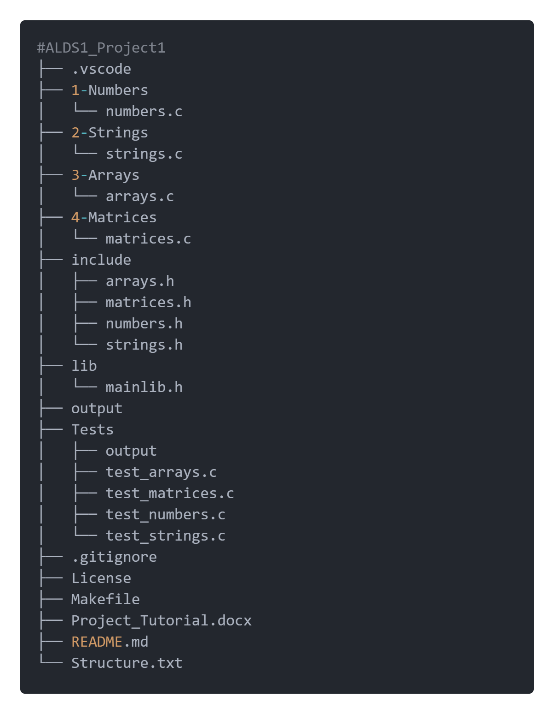

**ALDS END SEMESTER PROJECT**

ARTICLE TYPE: DOCUMENTATION

PREPARED BY: REFFAS CHOUAIB

Jan.26, 2025

- **Table Of Contents**

1. [Introduction](#bookmark=id.gjdgxs)

……………………………………………………………………………………

2. [Project Overview](#bookmark=id.30j0zll)

……………………………………………………………………………………

3. [Analysis](#bookmark=id.4f8qti2qqef1)

……………………………………………………………………………………

4. [Tutorial](#bookmark=id.cjnrj5khwgsu)

……………………………………………………………………………………

5. [Implementation](#bookmark=id.lrqn2mjz1z41)

……………………………………………………………………………………

6. [Example of Usage](#bookmark=id.r80qbc5axry0)

……………………………………………………………………………………

7. [Conclusion](#bookmark=id.i1gf92t92aj7)

 # 1. _Introduction_

Algorithm isn’t just about thinking; it may also encounter some smart acts because yes, you can work hard and achieve your goal. However, you get tired every time you try hard and to avoid this you need to apply the DRY process “Don’t Repeat Yourself”. In which you work smart but not hard and you know when you write your first programme you will get happy but after that you will face some problems and challenges our digital world isn’t that easy it's like a forest where the weak gets destroyed .So for my fellow programmes especially the new one’s I facilitated the work for you and I created a library in C language that has 4 sub-libraires (numbers,arrays,matrices and strings) in which you have different operations in those fields and that’s going to make programming easier than before.Yeah this library helps you in your projects like you need some operations or checks to perform an action and in order to don’t repeat yourself and recreate a function from the scratch that does the needed operation I gave you the keys to the treasure so you don’t need to rage quit if you didn’t find the solution or consume more time finding the module structure instead of working on the main project it’s like customizing a car too look good and high class instead of working to improve its functionality. But don’t forget you need to be a good programmer, and you need to know the structure of those functions to understand when you call it what happens inside it. Thus, I wrote this documentation for me first and for you to help me and you understand those functions and procedures. This counts as an experience for me and the first gate into the world of projects. I hope I didn’t take your time and let’s start our Adventure\!

 # 2.  _Project Overview_

Our project is a workspace that contains the main folder called “ALDS1_Project1” which then contains some branches starting with:

1. the numbers folder “1-Numbers” which has the ‘numbers.c’ file (the source code of numbers functions) that has multiple functions and procedure classified by its difficulty level we have beginner, intermediate and advanced functions/procedures. Those are code written in the C language and they can solve some problems such that finding whether the number is prime using ”isPrime(num)” function or calculating the sum of digits of a function using ”sumOfDigits(num)” function more of them in the “Analysis” and “Implementation” sections

2. the strings folder “2-Strings” which has the ‘strings.c’ file (the source code of strings functions) that has multiple functions and procedure classified by its difficulty level we have beginner, intermediate and advanced functions/procedures. Those are code written in the C language and they can solve some problems such that finding whether the string is palindrom using ”isPalindrom(str)” function or calculating the length of a string using “stringLength(str)” function ,more of them in the “Analysis” and “Implementation” sections

3. the arrays folder “3-Arrays” which has the ‘arrays.c’ file (the source code of arrays functions) that has multiple functions and procedure classified by its difficulty level we have beginner, intermediate and advanced functions/procedures. Those are code written in the C language and they can solve some problems such that finding whether the array is sorting in cascading order using ”isSorted(arr,size)” function or finding the missing number in an array of size n-1 starting from 1 to n using ”findMissingNumber(arr,size)” function. It also includes sorting algorithm like buble sort using ”bubleSort(arr,size)”procedure ….etc ,more of them in the “Analysis” and “Implementation” sections

4. the matrices folder “4-Matrices” which has the ‘matrices.c’ file (the source code of matrices functions) that has multiple functions and procedure classified by its difficulty level we have beginner, advanced and special functions/procedure. Those are code written in the C language and they can solve some problems such that finding whether the matrix is square using ”isSquare(rows,cols)” function or do matrix addition using ”addMatrices(rows,cols,mat1,mat2)” procedure …etc, more of them in the “Analysis” and “Implementation” sections

5. Include folder that has the header file of the four ‘.c’ files we have ‘numbers.h’ , ‘arrays.h’ , ‘strings.h’ , ‘matrices.h’ they contain the declaration of functions and procedures written on each ‘.c’ file such that ‘numbers.h’ has for instance the ”sumOfDigits(num)” function declared on it like this ” int sumOfDigits(num);”

6. Lib folder that has the “mainlib.h” file and when you compile the file and create an object file of the library that will be putted in the Lib folder due to declaring Lib folder as the one who we put the object files on it, more info in the “Tutorial” section. The “mainlib.h” file has the declaration of the sub-libraries in order to make it easy for you and me to only include the main library then work with the functions you want because you may encounter a case where you need a function from strings library and function from number library and you don’t know you may use those functions to create other beautiful one below there is an image that shows what’s inside “mainlib.h”:

7. Output folder that has the compiled file

8. Test file that has 4 sub-test files starting from the test for numbers, strings, arrays and matrices it has all the functions commented to test it quickly rather than creating a new file so you will uncomment the line you want to test and test it. Also, it includes an output file for the ‘.exe’ test files

9. Other files like .gitignor that has the type of files and the folder that I don’t want to be shown on the repository and Makefile that has the commands to turn into object files and others fill free to discover it

10. WE can give its structure as shown below :



 # 3. _Analysis_

- ### **In this section, we will talk about the function and the procedures like what we should input to them what they do and what they should output however we won’t complicate things or move into details for more details go to** “Implementation”.**Let’s start:**

1. ## _Numbers_

1. #### **_Basic Functions_**

- [ ] sumOfDigits(num);
- inputs: number of type integer
- output: sum of the number digits of type integer

---

- [ ] reverseNumber(num);
- inputs: number of type integer
- output: the same number with reversed digits of type integer

- [ ] isPalindrom(num);
- inputs: number of type integer
- possible outputs: the result of whether the number is equal to its inverse so it either outputs 1 or 0 (of type boolean)

---

- [ ] isPrime(num);
- inputs: number of type integer
- possible outputs: if the number is prime the output is 1 else it will be 0 the output of type boolean

---

- [ ] gcd(a,b);
- inputs: two numbers a and b of type integer
- output: the greatest common divisor of a and b of type integer

- [ ] Max(a,b);
- inputs: two numbers a and b of type integer
- output: the biggest number between a and b of type integer (returns a or b)

---

- [ ] lcm(a,b);
- inputs: two numbers a and b of type integer
- output: least common multiplier of a and b of type integer

---

- [ ] factorial(num);
- inputs: number of type natural
- output: the factorial of that number ‘num\!’ of type natural

- [ ] isEven(num);
- inputs: number of type integer
- possible outputs:

  1- if the number is even

  0- if the number is odd

  of type boolean

---

2. #### **_Intermediate Functions/procedures_**

- [ ] primeFactors(num);
- input: number of type integer
- outputs: The prime numbers that when multiplied will give the

---

- [ ] isArmstrong(num);
- input: number of type integer
- possible outputs: of type boolean

* 1-\> The sum of digits of a number raised to the power of the number of digits is equal to the number itself
* 0-\> The above condition isn’t true

---

- [ ] fibonacci(num);
- input: number of type natural
- output: The fibonacci number like the fibonacci(number) function of type natural

---

- [ ] numberOfDivisors(num);
- input: number of type integer
- output: The number of possible divisors of a number of type integer

---

- [ ] reverse_negative(num,check);
- inputs: number of type integer,check parameter of type boolean
- output: The same number without a negative sign (check \=1)

  else the same number will be the output

---

- [ ] isNegative(num);
- input: number of type integer
- output: a check parameter of type boolean

---

- [ ] isDivisor(num,divisor);
- input: number of type integer and a divisor of type integer
- output: a boolean parameter that’s either 1 or 0

---

- [ ] sumDivisor(num);
- input: number of type integer
- output: the sum of the divisors of the input number of type integer

---

- [ ] sumDivisor_out_num(num);
- input: number of type integer
- output: the sum of the divisors of the input number without the number itself of type integer

- Note:

* please don’t ask about the name i know it’s not that kind of name but at least it works
* This function is used to solve other problems

---

- [ ] isPerfect(num);
- input: number of type integer
- output: of type boolean

* 0-\> The sum of the number divisors without the number isn’t equal to that number
* 1-\> The sum of the number divisors without the number is equal to that number

- [ ] isMagic(num);
- input: number of type integer
- output: of type boolean

* 1-\> The sum of the number digits is going to be 1 in any number of iterations
* 0-\> The sum of the number digits is going to be not 1 in any number of iterations

---

- [ ] numberOfDigits(num);
- input: number of type integer
- output: the number of digits of type integer

---

- [ ] isAutomorphic(num);
- input: number of type integer
- output: of type boolean

* 1-\> the square of a number last digits is equal to the same number (the digits number depends on the entered number)
* 0-\> the square of a number last digits is equal to the same number

---

3. #### **_Advanced Functions/procedures_**

- [ ] toBinary(num);
- input: number of type integer
- output: the given number written in binary (with 0 & 1\)
- option: can convert negative numbers using 2 complement’s method

---

- [ ] isNarcissistic(num);
- input: number of type integer
- possible outputs: of type boolean

* 1-\> The sum of digits of a number raised to the power of the number of digits is equal to the number itself
* 0-\> The above condition isn’t true

---

- [ ] sqrtApprox(num,approx);
- inputs: number of type integer

  approx of type double

- output: the square root of the input number using the Babylonian method of type double
- Defeault_Method: there is a default approximation so you don’t have to enter the approximation by yourself using sqrtApproxDefault(5); function call

---

- [ ] power(base,exp);
- inputs: base of type integer, exponent of type integer
- output: the base multiplied by itself the number of (exp) times of type integer

---

- [ ] isHappy(num);
- input: number of type integer
- possible outputs: of type boolean

* 0-\> The sum of digits square of the input number isn’t equal to 1
* 1-\> The sum of digits square of the input number is equal to 1

---

- [ ] isAbundant(num);
- inputs: number of type integer
- output: of type boolean

* 0-\> The sum of divisors without the number is less than the number itself
* 1-\> The sum of divisors without the number is bigger than the number itself

---

- [ ] isDeficient(num);
- inputs: number of type integer
- output: of type boolean

* 1-\> The sum of divisors without the number is less than the number itself
* 0-\> The sum of divisors without the number is bigger than the number itself

---

- [ ] sumEvenFibonacci(num);
- input: number of type natural
- output: the sum of even fibonacci number that means the fibonacci number that has an even result is added with the others of type natural

---

- [ ] isHarshad(num);
- inputs: number of type integer
- output: of type boolean

* 1-\> The sum of digits of the number is a divisor of the number
* 0-\> The sum of digits of the number isn’t a divisor of the number

---

- [ ] catalanNumber(num);
- inputs: number of type natural
- output: the n’th catalan number of the number inputted of type natural

---

- [ ] passcalPyramid(num);
- inputs: number of type natural
- output: the passcal pyramid until the given number of type natural

---

- [ ] passcalTriangle(num);
- inputs: number of type natural
- output: the passcal triangle until the given number of type natural

---

- [ ] passcalTriangleRow(row);
- inputs: row of type natural
- output: the n’th passcal triangle row according to the given row of type natural

---

- [ ] nck(num,k);
- inputs: number of type natural, k of type natural
- output: nck of type natural

---

- [ ] bellNumber(num);
- inputs: number of type natural
- output: bell number of type natural

---

- [ ] isKaprekar(num);
- inputs: number of type natural
- output: of type boolean

* 1-\> The sum of the squared number divide it into half is equal to the number itself
* 0-\> The sum of the squared number divide it into half isn’t equal to the number itself

---

- [ ] divideNumDigits(var num,num_digits,var num1);
- inputs: number of type natural,number of digits of type natural,number 1 of type natural
- outputs: number represents the first half and number1 represents the seconde half of the input number both of type natural

---

- [ ] isSmith(num);
- input: number of type natural
- output: of type boolean

* 1-\> the number isn’t prime and the sum of it’s digits is equal to the sum of digits of it’s prime factors sum
* 0-\> the number is prime or the sum of it’s digits isn’t equal to the sum of digits of it’s prime factors sum

---

- [ ] primeFactorSum(num);
- input: number of type natural
- output: the sum of the number prime factors of type natural

---

- [ ] sumOfprimes(num);
- inputs: number of type natural
- output: the sum of the primes until the given number of type natural

2. ## _Strings_

1. #### **_Basic Functions_**

- [ ] stringLength(var str);
- inputs: string of type list of chars
- output: length of type natural

---

- [ ] stringLengthWithSpace(var str);
- inputs: string of type list of chars
- output: length of type natural

---

- [ ] removeWhiteSpaceLength(var str,length);
- inputs: string of type list of chars, length of type integer
- output: length of type integer

---

- [ ] stringCopy(var src,var dst);
- inputs: source string of type list of chars, destination string of type list of chars
- output: copies source string to destination string

---

- [ ] stringConcat(var dest,var src);
- inputs: destination string of type list of chars, source string of type list of chars
- output: appends source string to destination string

---

- [ ] stringCompare(var str1,var str2);
- inputs: string1 of type list of chars, string2 of type list of chars
- output: integer (returns 0 if strings are equal, otherwise the difference between the first mismatched characters)

---

- [ ] stringCompareInsensitive(var str1,var str2);
- inputs: string1 of type list of chars, string2 of type list of chars
- output: integer (returns 0 if strings are equal ignoring case, otherwise the difference between the first mismatched characters)

---

- [ ] isEmpty(var str);
- inputs: string of type list of chars
- output: boolean (returns true if the string is empty, otherwise false)

---

- [ ] isEmptyLiterally(var str);
- inputs: string of type list of chars
- output: boolean (returns true if the string is literally empty, otherwise false)

---

- [ ] reverseString(var str);
- inputs: string of type list of chars
- output: reverses the string in place

---

- [ ] toUpperCase(var str);
- inputs: string of type list of chars
- output: converts the string to uppercase in place

---

- [ ] toLowerCase(var str);
- inputs: string of type list of chars
- output: converts the string to lowercase in place

2. #### **_Intermediate Functions/procedures_**

- [ ] isPalindromeString(var str);
- inputs: string of type list of chars
- output: boolean (returns true if the string is a palindrome, otherwise false)

---

- [ ] countVowelsConsonants(var str,var vowels, var consonants);
- inputs: string of type list of chars ,pointer to integer for vowels, pointer to integer for consonants
- output: integer (the number of vowels and consonants in the string)

---

- [ ] findSubstring(var str,var sub);
- inputs: string of type list of chars ,substring of type list of chars
- output: integer (returns the starting index of the substring if found, otherwise \-1)

---

- [ ] findSubstringInsensitive(var str,var sub);
- inputs: string of type list of chars ,substring of type list of chars
- output: integer (returns the starting index of the substring if found, ignoring case, otherwise \-1)

---

- [ ] removeWhiteSpace(var str);
- inputs: string of type list of chars
- output: removes all whitespace from the string in place

---

- [ ] isAnagram(var str1,var str2);
- inputs: string1 of type list of chars ,string2 of type list of chars
- output: boolean (returns true if the strings are anagrams, otherwise false)

---

- [ ] charFrequency(var str);
- inputs: string of type list of chars
- output: prints the frequency of each character in the string

---

- [ ] countWords(var str);
- inputs: string of type list of chars
- output: integer (returns the number of words in the string)

---

- [ ] removeDuplicates(var str);
- inputs: string of type list of chars
- output: removes duplicate characters from the string in place

3. #### **_Advanced Functions/procedures_**

- [ ] compressString(var str,var result);
- inputs: string of type list of chars,result string of type list of chars
- output: compresses the string and stores the result in the result string

---

- [ ] switchInt_Str(var str,num);
- inputs: string of type list of chars integer number
- output: converts the integer to a string and stores it in the provided string

---

- [ ] longestWord(var str,var result);
- inputs: string of type list of chars,result string of type list of chars
- output: finds the longest word in the string and stores it in the result string

---

- [ ] isRotation(var str1,var str2);
- inputs: string1 of type list of chars,string2 of type list of chars
- output: boolean (returns true if string2 is a rotation of string1, otherwise false

---

- [ ] rotateLeft(var str);
- inputs: string of type list of chars
- output: rotates the string left by one character in place

---

- [ ] rotateLeftTimes(var str,times);
- inputs: string of type list of chars integer number of times
- output: rotates the string left by the specified number of times in place

---

- [ ] rotateRightTimes(var str,times);
- inputs: string of type list of chars integer number of times
- output: rotates the string right by the specified number of times in place

---

- [ ] countChar(var str,character);
- inputs: string of type list of chars character to count of type char
- output: integer (returns the count of the specified character in the string)

---

- [ ] findAndReplace(var str,var find,var replace);
- inputs: string of type list of chars ,substring to find of type list of chars ,subtring to replace of type list of chars
- output: replaces all occurrences of the find substring with the replace substring in the string

---

- [ ] longestPalindrome(var str,var result);
- inputs: string of type list of chars ,result string of type list of chars
- output: finds the longest palindrome in the string and stores it in the result string

---

- [ ] printPermutations(var str);
- inputs: string of type list of chars
- output: prints all permutations of the string

---

- [ ] splitString(var str,delimiter,var tokens,var tokencount);
- inputs: string of type list of chars, delimiter character, array of strings to store tokens, pointer to integer for token count
- output: splits the string into tokens based on the delimiter and stores them in the array

4. #### **_Cypher Functions/procedures_**

- [ ] caesarCipher(var text,shift);
- inputs: string of type list of chars,integer shift value
- output: applies Caesar cipher to the string in place

---

- [ ] substitutionCipher(var text,var key);
- inputs: string of type list of chars, key of type list of chars
- output: applies substitution cipher to the string in place

---

- [ ] xorCipher(var text,key);
- inputs: string of type list of chars ,kay of type char
- output: applies XOR cipher to the string in place

---

- [ ] vigenereCipher(var text,var key,encrypt);
- inputs: string of type list of chars ,key string of type list of chars ,integer encryption flag (1 for encrypt, 0 for decrypt)
- output: applies Vigenère cipher to the string in place

---

- [ ] atbashCipher(var text);
- inputs: string of type list of chars
- output: applies Atbash cipher to the string in place

---

- [ ] railFenceCipher(var text,var result,depth);
- inputs: string of type list of chars ,result string of type list of chars ,integer depth
- output: applies Rail Fence cipher to the string and stores the result in the result string

3. ## _Arrays_

1. #### **_Basic Functions_**

- [ ] initializeArray(var arr,size,value);
- inputs: array with garbage values of type integer,size of type integer ,value of type integer
- output: array filled with the value of type integer

---

- [ ] printArray(var arr,size);
- inputs: array of type list of integers, size of type integer, value of type integer
- output: prints the array

---

- [ ] findMax(var arr,size);
- inputs: array of type list of integers, size of type integer
- output: integer (returns the maximum value in the array)

---

- [ ] findMin(var arr,size);
- inputs: array of type list of integers, size of type integer
- output:

---

- [ ] sumArray(var arr,size);
- inputs: array of type list of integers, size of type integer
- output: integer (returns the sum of all elements in the array)

---

- [ ] averageArray(var arr,size);
- inputs: array of type list of integers, size of type integer
- output: double (returns the average of all elements in the array)

---

- [ ] minimizedArray(var arr,size);
- inputs: array of type list of integers, size of type integer
- output: shifts the array to the left by one position removing the first element

---

- [ ] isSorted(var arr,size);
- inputs: array of type list of integers, size of type integer
- output: boolean (returns true if the array is sorted, otherwise false)

---

- [ ] fillArray(var arr,size);
- inputs: array of type list of integers, number of type integer
- output: creates an array by taking input from the user

---

- [ ] storingDigits(var arr,size,number);
- inputs: array of type list of integers, number of type integer
- output: stores the digits of the number in the array

---

- [ ] minimumValue(var arr,size,var index,pos);
- inputs: array of type list of integers, size of type integer, pointer to integer for index, position of type integer
- output: finds the minimum value in the array starting from the given position

---

- [ ] returningDigits(var arr,size);
- inputs: array of type list of integers, size of type integer
- output: integer (returns the number formed by the digits in the array)

---

- [ ] createArray(var arr,size);
- inputs: array of type list of integers, size of type integer
- output: creates an array by taking input from the user

---

- [ ] swapArray(var arr,arr_size);
- inputs: array of type list of integers, size of type integer
- output: swaps the elements of the array

---

- [ ] mergeSortedArray(var arr1,arr_size1,var arr2,arr_size2,var arr3);
- inputs: array1 of type list of integers, array2 of type list of integers, size1 of type integer, size2 of type integer, array3 of type list of integers
- output: merges two sorted arrays into a third array

2. #### **_Intermediate Functions/procedures_**

- [ ] reverseArray(var arr,size);
- inputs: array of type list of integers, size of type integer
- output: reverses the array in place

---

- [ ] countEvenOdd(var arr,size,var evenCount,var oddCount);
- inputs: array of type list of integers, size of type integer, pointer to integer for even count, pointer to integer for odd count
- output: counts the number of even and odd elements in the array

---

- [ ] secondLargest(var arr,size);
- inputs: array of type list of integers, size of type integer
- output: integer (returns the second largest element in the array)

---

- [ ] findElementPos(var arr,size,element);
- inputs: array of type list of integers, size of type integer, element of type integer
- output: integer (returns the position of the element in the array, or \-1 if not found)

---

- [ ] elementFrequency(var arr,size);
- inputs: array of type list of integers, size of type integer
- output: prints the frequency of each element in the array

---

- [ ] found(var arr,size,element);
- inputs: array of type list of integers, size of type integer, element of type integer
- output: boolean (returns true if the element is found in the array, otherwise false)

---

- [ ] removeDuplicatesElements(var arr,size);
- inputs: array of type list of integers, size of type integer
- output: integer (returns the new size of the array after removing duplicates)

---

- [ ] binarySearch(var arr,size,target);
- inputs: array of type list of integers, size of type integer, target of type integer
- output: integer (returns the index of the target element, or \-1 if not found)

---

- [ ] linearSearch(var arr,size,target);
- inputs: array of type list of integers, size of type integer, target of type integer
- output: integer (returns the index of the target element, or \-1 if not found)

---

- [ ] shift_left(var arr,arr_size,repeat_times);
- inputs: array of type list of integers, size of type integer, repeat_times of type integer
- output: shifts the array left by the specified number of times

---

- [ ] shift_right(var arr,arr_size,repeat_times);
- inputs: array of type list of integers, size of type integer, repeat_times of type integer
- output: shifts the array right by the specified number of times

---

- [ ] compare_swap(var arr,size);
- inputs: array of type list of integers, size of type integer
- output: compares and swaps adjacent elements in the array

3. #### **_Sorting Algorithms_**

- [ ] bubbleSort(var arr,size);
- inputs: array of type list of integers, size of type integer
- output: sorts the array using bubble sort

---

- [ ] selectionSort(var arr,size);
- inputs: array of type list of integers, size of type integer
- output: sorts the array using selection sort

---

- [ ] insertionSort(var arr,size);
- inputs: array of type list of integers, size of type integer
- output: sorts the array using insertion sort

---

- [ ] mergeSort(var arr,left,right);
- inputs: array of type list of integers, left index of type integer, right index of type integer
- output: sorts the array using merge sort

---

- [ ] quickSort(var arr,low,high);
- inputs: array of type list of integers, low index of type integer, high index of type integer
- output: sorts the array using quick sortr

4. #### **_Advanced Functions/procedures_**

- [ ] swap(var elem1,var elem2);
- inputs: pointer to integer element1, pointer to integer element2
- output: swaps the values of the two elements

---

- [ ] isEmpty(var arr,size,);
- inputs: array of type list of integers, size of type integer
- output: boolean (returns true if the array is empty, otherwise false)

---

- [ ] findMissingNumber(var arr,size);
- inputs: array of type list of integers, size of type integer
- output: integer (returns the missing number in the array, or \-1 if no missing number is found)

---

- [ ] findPairsWithSum(var arr,size,sum);
- inputs: array of type list of integers, size of type integer, sum of type integer
- output: prints pairs of elements that sum to the given value

---

- [ ] findSubArrayWithSum(var arr,size,sum);
- inputs: array of type list of integers, size of type integer, sum of type integer
- output: prints the subarray that sums to the given value

---

- [ ] rearrangeAlternatePositiveNegative(var arr,size);
- inputs: array of type list of integers, size of type integer
- output: rearranges the array to alternate positive and negative elements

---

- [ ] findMajorityElement(var arr,size);
- inputs: array of type list of integers, size of type integer
- output: integer (returns the majority element in the array, or 0 if no majority element is found)

---

- [ ] longestIncreasingSubsequence(var arr,size);
- inputs: array of type list of integers, size of type integer
- output: integer (returns the length of the longest increasing subsequence)

---

- [ ] findDuplicates(var arr,size);
- inputs: array of type list of integers, size of type integer
- output: prints duplicate elements in the array

---

- [ ] findIntersection(var arr1,size1,var arr2,size2);
- inputs: array1 of type list of integers, size1 of type integer, array2 of type list of integers, size2 of type integer
- output: prints the intersection of the two arrays

---

- [ ] findUnion(var arr1,size1,var arr2,size2);
- inputs: array1 of type list of integers, size1 of type integer, array2 of type list of integers, size2 of type integer
- output: prints the union of the two arrays

4. ## _Matrices_

1. #### **_Basic Functions_**

- [ ] initializeMatrix(rows,cols,var matrix,value);
- inputs: rows of type integer,cols of type integer,matrix with garbage values of type double ,value of type integer
- output: matrix filled with the value of type integer

---

- [ ] printMatrix(rows,cols,var matrix);
- inputs: rows of type integer, cols of type integer, matrix of type 2D array of doubles
- output: prints the matrix

---

- [ ] inputMatrix(rows,cols,var matrix);
- inputs: rows of type integer, cols of type integer, matrix of type 2D array of integers
- output: takes input from the user to fill the matrix

---

- [ ] copyMatrix(rows,cols,var matrix,var copy);
- inputs: rows of type integer, cols of type integer, matrix of type 2D array of doubles, copy of type 2D array of doubles
- output: copies the contents of the matrix to the copy

2. #### **_Matrix Arithmetic_**

- [ ] addMatrices(rows,cols,var mat1,var mat2,var result);
- inputs: rows of type integer, cols of type integer, mat1 of type 2D array of integers, mat2 of type 2D array of integers, result of type 2D array of integers.
- output: adds two matrices and stores the result in the result matrix

---

- [ ] subtractMatrices(rows,cols,var mat1,var mat2,var result);
- inputs: rows of type integer, cols of type integer, mat1 of type 2D array of integers, mat2 of type 2D array of integers, result of type 2D array of integers.
- output: subtracts mat2 from mat1 and stores the result in the result matrix

---

- [ ] multiplyMatrices(rows1,cols1,var mat1,rows2,cols2,var mat2,var result);
- inputs: rows1 of type integer, cols1 of type integer, mat1 of type 2D array of integers, rows2 of type integer, cols2 of type integer, mat2 of type 2D array of integers, result of type 2D array of integers
- output: multiplies two matrices and stores the result in the result matrix

---

- [ ] scalarMultiplyMatrix(rows,cols,var matrix,scalar);
- inputs: rows of type integer, cols of type integer, matrix of type 2D array of doubles, scalar of type double
- output: multiplies the matrix by a scalar value

3. #### **_Matrix properties and checks_**

- [ ] isSquareMatrix(rows,cols);
- inputs: rows of type integer, cols of type integer
- output: boolean (returns true if the matrix is square, otherwise false)

---

- [ ] isIdentityMatrix(size,var matrix);
- inputs: size of type integer, matrix of type 2D array of integers
- output: boolean (returns true if the matrix is an identity matrix, otherwise false)

---

- [ ] isDiagonalMatrix(size,var matrix);
- inputs: size of type integer, matrix of type 2D array of integers
- output: boolean (returns true if the matrix is diagonal, otherwise false)

---

- [ ] isSymmetricMatrix(size,var matrix);
- inputs: size of type integer, matrix of type 2D array of integers
- output: boolean (returns true if the matrix is symmetric, otherwise false)

---

- [ ] isUpperTriangular(size,var matrix);
- inputs: size of type integer, matrix of type 2D array of integers
- output: boolean (returns true if the matrix is upper triangular, otherwise false)

---

- [ ] isEqualMatrix(rows,cols,var mat1,var mat2);
- inputs: rows of type integer, cols of type integer, mat1 of type 2D array of doubles, mat2 of type 2D array of doubles
- output: boolean (returns true if the two matrices are equal, otherwise false)

4. #### **_Matrix operations_**

- [ ] transposeMatrix(rows,cols,var matrix,var result);
- inputs: rows of type integer, cols of type integer, matrix of type 2D array of doubles, result of type 2D array of doubles
- output: computes the transpose of the matrix and stores it in the result matrix

---

- [ ] determinantMatrix(size,var matrix);
- inputs: size of type integer, matrix of type 2D array of doubles
- output: double (returns the determinant of the matrix)

---

- [ ] inverseMatrix(size,var matrix,var result);
- inputs: size of type integer, matrix of type 2D array of doubles, result of type 2D array of doubles
- output: computes the inverse of the matrix and stores it in the result matrix

---

- [ ] matrixPower(size,var matrix,power,var result);
- inputs: size of type integer, matrix of type 2D array of doubles, power of type integer, result of type 2D array of doubles
- output: computes the matrix raised to the given power and stores it in the result matrix

5. #### **_Advanced Functions/procedures_**

- [ ] cofactorMatrix(size,var matrix,var cofactor);
- inputs: size of type integer, matrix of type 2D array of doubles, cofactor of type 2D array of doubles
- output: computes the cofactor matrix and stores it in the cofactor matrix

---

- [ ] adjointMatrix(size,var matrix,var adjoint);
- inputs: size of type integer, matrix of type 2D array of doubles, adjoint of type 2D array of doubles
- output: computes the adjoint matrix and stores it in the adjoint matrix

---

- [ ] luDecomposition(size,var matrix,var lower,var upper);
- inputs: size of type integer, matrix of type 2D array of doubles, lower of type 2D array of doubles, upper of type 2D array of doubles
- output: performs LU decomposition on the matrix and stores the results in the lower and upper matrices

---

- [ ] matrixRank(rows,cols,var matrix);
- inputs: rows of type integer, cols of type integer, matrix of type 2D array of doubles
- output: integer (returns the rank of the matrix)

---

- [ ] reduceRowEchelonForm(rows,cols,var matrix);
- inputs: rows of type integer, cols of type integer, matrix of type 2D array of doubles
- output: reduces the matrix to its row echelon form

---

- [ ] swapRows(rows,cols,var mat,row1,row2);
- inputs: rows of type integer, cols of type integer, mat of type 2D array of doubles, row1 of type integer, row2 of type integer
- output: swaps two rows in the matrix

6. #### **_Special Matrix operations_**

- [ ] traceMatrix(size,var matrix);
- inputs: size of type integer, matrix of type 2D array of integers
- output: integer (returns the trace of the matrix)

---

- [ ] rotateMatrix90(size,var matrix);
- inputs: size of type integer, matrix of type 2D array of doubles
- output: rotates the matrix 90 degrees clockwise

---

- [ ] reverseRows(size,var matrix);
- inputs: size of type integer, matrix of type 2D array of doubles
- output: reverses the rows of the matrix

---

- [ ] findEigenvalues(size,var matrix,var eigenvalues);
- inputs: size of type integer, matrix of type 2D array of doubles, eigenvalues of type array of doubles
- output: computes the eigenvalues of the matrix and stores them in the eigenvalues array

---

- [ ] findEigenvalues2x2(var matrix,var eigenvalues);
- inputs: matrix of type 2D array of doubles (2x2), eigenvalues of type array of doubles
- output: computes the eigenvalues of a 2x2 matrix and stores them in the eigenvalues array

4. **Tutorial**

- ### **In this section, we will learn many things like how to clone the repository and how to set up the workspace and more things will be listed below let’s get into it:**

- ## **_Cloning the Repository_**

1. Clone the repository to your local machine. Open your terminal and run the following command:

2. After cloning, navigate to the project folder:

   ###

   ###

- ### **_Devices Used_**

  This project has been tested on the following devices:

- **Windows 11**
- **Linux ( Kali)**

- ### **_For Windows Users with VS Code_**

1. Open VS Code.
2. Go to File \> Open Folder and select the project folder you cloned.

3. Create a workspace:
   - Go to File \> Add Folder to Workspace and select the project folder.
   - Save the workspace (File \> Save Workspace As...).
4. Create a new .c file and include the library at the top:

5. Write your test code. Example:

6. Use VS Code tasks or terminal to compile and run your code. Example:

- ### **_For macOS and Linux_**

1.  Open the terminal and navigate to the project folder where the repository was cloned.

Create a new test file using any text editor (e.g., nano, vim, or gedit). For example, using nano:

2. Include the library in your test file by adding the following line at the top:

3. Write your test code. Example:

4. Save the file and compile it using the GCC compiler:

5. Run your program:

   ####

- #### **_General Editors (e.g., Sublime Text, Atom)_**

1. Open the cloned folder in your preferred editor.
2. Create a new file with a .c extension and save it in the project folder.
3. Follow the steps above to include the library and write your test code.
4. Use the terminal to compile and run your code as described.

- ### **_Testing Functions in the Project_**

1. Open the provided test file (test_numbers.c) in your text editor.
2. Uncomment the lines corresponding to the functions you want to test. For example:

3. Compile and run the file:

- ### **Using the Makefile for Easy Builds and Tests**

  The Makefile automates the build and test process.

- #### **Basic Commands**

  - Build the project:

  - Run the tests:

  - Clean up build artefacts:

- ### **_VS Code Integration_**

* #### **Setting Up Build Tasks**

  A .json file has been configured to simplify building and testing in VS Code:

1. Press Ctrl \+ Shift \+ B to build and run your tests.
2. Ensure the .json file is correctly placed in the .vscode/ folder in your project.

- #### **Creating New Test Files in VS Code**

1. Create a new .c file and save it in the project folder.
2. Include the library as shown above.
3. Write your test code, save it, and build using the VS Code tasks.

- ### **_Troubleshooting_**

- **GCC Not Found**:
  - Ensure GCC is installed on your system.
  - On Windows, use MinGW or WSL to install GCC.
- **Library File Not Found**:
  - Verify the paths to mainlib.h and the lib/ folder.
- **Compilation Errors**:
  - Check for typos in your code or missing library functions.

5. **Implementation**

1. **Numbers**
1. **_Basic Functions:_**

- [ ] sumOfDigits(num);

- What is the sum of digits?

* In mathematics, the **digit sum** of a natural number in a decimal base is the sum of all its [digits](https://en.wikipedia.org/wiki/Numerical_digit). For example, the digit sum of the [decimal number](https://en.wikipedia.org/wiki/Decimal_number) N1N2N3N4 would be N1+N2+N3+N4.

- The purpose of the function:

* To calculate the sum of any integer digits.

- Function Argument(s):

* int num;//of type integer

- The Environment:

* int sum\=0;//of type integer
* int digit;//of type integer
* bool check;//of type boolean

- Primitive Actions:

1. Check if the number is negative.
2. reverse the negative number.
3. while loop that iterates until the number is less or equal to 0\.
4. the digit is equal to the rest of the division of the number over 10\.
5. we add the digit we got to the sum.
6. we divided the number by 10 to take out that digit and go to the other digits.
7. check if the “check” parameter changed indicating a negative number so that we return the sum with a negative sign.
8. we return the sum.

- :

---

- [ ] reverseNumber(num);
- What is a reverse Number?

* In mathematics, reversing a number means rearranging its digits in reverse order. For example, reversing N1N2N3 would result in N3N2N1.

- The purpose of the function:

* To reverse the digits of a given integer.

- Function Argument(s):

* int num;//of type integer

- The Environment:

* int reverse_num\=0;
* bool check

- Primitive Actions:

1. Check if the number is negative.
2. Reverse the negative number to simplify operations.
3. Use a loop to extract each digit of the number by taking the modulus with 10\.
4. Multiply the current reversed number by 10 and add the extracted digit.
5. Reduce the number by dividing it by 10\.
6. Return the reversed number, ensuring its sign matches the original input.

- :

---

- [ ] isPalindrom(num);
- What is a palindrome?

* A palindrome is a number that reads the same forward and backward, such as D0D1D1D0 or D1D1.

- The purpose of the function:

* To determine whether a given integer is a palindrome.

- Function Argument(s):

* int num;//of type integer

- The Environment:

* bool check \= false; // of type boolean
* int its_reverse; // of type integer

- Primitive Actions:

1. Reverse the number using the reverseNumber function.
2. Compare the reversed number to the original number.
3. Return true if they are equal, indicating a palindrome, or false otherwise.

- :

---

- [ ] isPrime(num);
- What is a prime number?

* In mathematics, A prime number is a natural number greater than 1 that has no positive divisors other than 1 and itself.

- The purpose of the function:

* To determine whether a given integer is a prime number.

- Function Argument(s):

* int num;//of type integer

- The Environment:

* int i;//of type integer
* bool check;//of type boolean

- Primitive Actions:

1. Iterate from 2 to the square root of the number.
2. Check divisibility by any number in this range.
3. If divisible, set check to false and break the loop.
4. Return true if no divisors are found, indicating a prime number.

- :

---

- [ ] gcd(a,b);
- What is the greatest common divisor (GCD)?

* In mathematics,The GCD of two integers is the largest positive integer that divides both numbers without leaving a remainder.

- The purpose of the function:

* To compute the GCD of two integers using an iterative approach.

- Function Argument(s):

* int a;//First integer
* int b;//Seconde integer

- The Environment:

* int i;//of type integer
* int gcd\=1;//of type integer

- Primitive Actions:

1. Iterate from 2 to the maximum of the two numbers.
2. Check if both numbers are divisible by the current value of i.
3. Update the GCD if a common divisor is found.
4. Return the last updated GCD.

- :

---

- [ ] Max(a,b);
- What is a Max?

* In mathematics, the concept of "greater than" is represented using the symbol “**\>”**. If a number a is greater than a number b, it means that “a” lies further to the right on the number line than “b”.

- The purpose of the function:

* To compare and determine the bigger integer between two integers

- Function Argument(s):

* int a;//First integer
* int b;//Seconde integer

- The Environment:

- Primitive Actions:

1. Checks if the first integer is bigger than the second integer
2. If so it returns the first integer
3. Otherwise, it returns the second integer

- :

---

- [ ] lcm(a,b);
- What is a Max?

* In mathematics, The **least common multiple (LCM)** of two integers a and b ,often written as lcm(a,b), is the smallest positive integer that is divisible by both a and b.

- The purpose of the function:

* To compute the LCM of two integers using an iterative approach.

- Function Argument(s):

* int a;//First integer
* int b;//Seconde integer

- The Environment:

- Primitive Actions:

1. return the multiplication of the first and second integers divided by their GCD

- :

---

- [ ] factorial(num);
- What is a factorial?

* In mathematics, The factorial of a non-negative integer n is the product of all positive integers less than or equal to n. For example, n\!=n\*(n-1)\*(n-2)\*(n-3)..... .

- The purpose of the function:

* To compute the factorial of any given integer n.

- Function Argument(s):

* int num;//of type integer

- The Environment:

- Primitive Actions:

1. Return 1 if the number is 0 or 1 (base case).
2. For other values, recursively call the function with (num \- 1\) and multiply the result by num.
3. Return 0 if the number is negative (factorials are undefined for negative numbers).

- :

---

- [ ] isEven(num);
- What is an even number?

* In mathematics,An even number is an integer that is divisible by 2 without a remainder.

- The purpose of the function:

* To determine whether a given integer is even.

- Function Argument(s):

* int num;//of type integer

- The Environment:

- Primitive Actions:

1. Check if the number is divisible by 2 using the modulus operator.
2. Return true if the result is 0 (indicating an even number).
3. Return false otherwise (indicating an odd number).

- :

---

- [ ] isOdd(num);
- What is an odd number?

* In mathematics,An odd number is an integer that is not divisible by 2 has a remainder of 1\.

- The purpose of the function:

* To determine whether a given integer is odd.

- Function Argument(s):

* int num;//of type integer

- The Environment:

- Primitive Actions:

1. Call isEven function to check if it’s even the isOdd will return false.
2. Otherwise, it will retruns true.

- :

2. **_Intermediate Functions/procedures:_**

- [ ] primeFactors(num);
- What are prime factors?

* In mathematics,Prime factors are the prime numbers that multiply together to give a composite number. For example, the prime factors of 28 are 2, 2, and 7\.

- The purpose of the function:

* To compute and display the prime factors of a given integer.

- Function Argument(s):

* int num;//of type integer

- The Environment:

* int i;//of type integer
* int j\=num;//of type integer

- Primitive Actions:

1. Iterate through integers starting from 2 up to the input number.
2. Check if each integer is a prime number.
3. For each prime number, divide the input number repeatedly by the prime factor and display the factor until the number is no longer divisible.
4. Print the prime factors in a readable format.

- :

---

- [ ] isArmstrong(num);
- What is an Armstrong number?

* In mathematics,An Armstrong number (or narcissistic number) is a number that is equal to the sum of its own digits raised to the power of the number of digits. For example, 153 is an Armstrong number because 13+53+33=1531^3 \+ 5^3 \+ 3^3 \= 153\.

- The purpose of the function:

* To determine whether a given integer is an Armstrong number.

- Function Argument(s):

* int num;//of type integer

- The Environment:

* int digit_num \= 0;//of type integer
* int digit;//of type integer
* int sum\=0;//of type integer

- Primitive Actions:

1. Check if the number is negative; Armstrong numbers are always non-negative.
2. Count the number of digits in the number.
3. Calculate the sum of each digit raised to the power of the number of digits.
4. Compare the calculated sum with the original number.
5. Return true if they are equal, indicating an Armstrong number, or false otherwise.

- :

---

- [ ] fibonacci(num);
- What is a Fibonacci sequence?

* In mathematics, The Fibonacci sequence is a series of numbers where each number is the sum of the two preceding ones, starting from 0 and 1\. For example, 0, 1, 1, 2, 3, 5, 8… .

- The purpose of the function:

* To compute the nth Fibonacci number using recursion.

- Function Argument(s):

* int num;//of type integer

- The Environment:

- Primitive Actions:

1. Check if the input number is 1 or 2; if so, return 1\.
2. For larger numbers, recursively compute the sum of the two preceding Fibonacci numbers.
3. Return the computed Fibonacci number.

- :

---

- [ ] numberOfDivisors(num);
- What is a divisor?

* In mathematics,A divisor of a number is an integer that divides the number without leaving a remainder. For example, the divisors of 6 are 1, 2, 3, and 6\.

- The purpose of the function:

* To calculate the total number of divisors of a given integer.

- Function Argument(s):

* int num;//of type integer

- The Environment:

  - int num_divisors \= 0;//of type integer
    - int divisor;//of type integer

- Primitive Actions:

1. Check if the number is negative and reverse it for calculations.
2. Iterate through all integers from 1 to the number.
3. Check if each integer is a divisor of the number.
4. Increment the divisor count for each valid divisor.
5. Return the total count of divisors.

- :

---

- [ ] isNegative(num);
- What is a negative number?

* In mathematics,A negative number is any real number less than zero. For example, \-1, \-25, and \-100.

- The purpose of the function:

* To determine whether a given number is negative.

- Function Argument(s):

* int num;//of type integer

- The Environment:

- Primitive Actions:

1. Compare the number with zero.
2. Return true if the number is less than zero.
3. Return false otherwise.

- :

---

- [ ] reverse_negative(num);
- Why reverse a negative number?

* Reversing a negative number makes it easier to handle its digits for operations while retaining the original sign.

- The purpose of the function:

* To convert a negative number to positive for operations, or leave it unchanged if already positive.

- Function Argument(s):

* int num;//of type integer
* bool check;// of type boolean

- The Environment:

- Primitive Actions:

1. Check if the boolean parameter indicates the number is negative.
2. Multiply the number by \-1 if negative.
3. Return the modified number.

- :

---

- [ ] isDivisor(num);
- What is a divisor?

* In mathematics,A divisor of a number is an integer that divides the number without leaving a remainder.

- The purpose of the function:

* To check if a given integer is a divisor of another number.

- Function Argument(s):

* int divisor;//of type integer
* int num;//of type integer

- The Environment:

- Primitive Actions:

1. Use the modulus operator to check divisibility.
2. Return true if the modulus result is zero.
3. Return false otherwise.

- :

---

- [ ] sumDivisors(num);
- What is the sum of divisors?

* In mathematics,The sum of divisors of a number includes all positive divisors, including the number itself.

- The purpose of the function:

* To calculate the sum of all divisors of a given integer.

- Function Argument(s):

* int num;//of type integer

- The Environment:

  - int sum \= 0;//of type integer
    - bool check;// of type boolean
    - int divisor;//of type integer

- Primitive Actions:

1. Check if the number is negative and reverse it for calculations.
2. Iterate through all integers from 1 to the number.
3. Check if each integer is a divisor of the number.
4. Add each valid divisor to the sum.
5. Return the sum of divisors with the appropriate sign based on the input number.

- :

---

- [ ] sumDivisors_out_num(num);
- What is the sum of divisors?

* In mathematics,The sum of divisors of a number includes all positive divisors, including the number itself.

- The purpose of the function:

* To calculate the sum of all divisors of a given integer and excluding the integer.

- Function Argument(s):

* int num;//of type integer

- The Environment:

  - int sum ;//of type integer
    - bool check;// of type boolean

- Primitive Actions:

1. Check if the number is negative and reverse it for calculations.
2. Call the function of sumDivisors to calculate the sum
3. Subtract the number from the final sum
4. Return the sum of divisors with the appropriate sign based on the input number.

- :

---

- [ ] isPerfect(num);
- What is a perfect number?

* A perfect number is a positive integer that is equal to the sum of its proper divisors (excluding itself). For example, 6 is a perfect number because 1+2+3=6.

- The purpose of the function:

* To determine whether a given integer is a perfect number.

- Function Argument(s):

* int num;//of type integer

- The Environment:

  - int sum ;//of type integer
    - bool check;// of type boolean

- Primitive Actions:

1. Check if the number is negative and reverse it for calculations.
2. Calculate the sum of proper divisors using the sumDivisors_out_num function.
3. Compare the sum of proper divisors with the original number.
4. Return true if they are equal, indicating a perfect number.

- :

---

- [ ] isMagic(num);
- What is a Magic number?

* In mathematics,a number is considered a magic number if repeatedly summing its digits until a single digit results in 1\.

- The purpose of the function:

* To check if a number is a "magic number."

- Function Argument(s):

* int num;//of type integer

- The Environment:

  - int i;//of type integer
    - int j;//of type integer
    - int k;//of type integer
    - int num_digits;//of type integer
    - int digit;//of type integer
    - int temp;//of type integer
    - bool check;// of type boolean

- Primitive Actions:

1. Check if the number is negative and reverse it for calculations.
2. Calculate the number of digits.
3. Iteratively sum the digits of the number until a single-digit result is obtained.
4. Stop when both the intermediate sums are \<= \`9\`.
5. Return true if the single-digit result is 1; otherwise, return false.

- :

---

- [ ] numberOfDigits(num);
- What is a digit?

* In mathematics, a **digit** is a single symbol used to represent numbers. The ten digits in the decimal system are 0, 1, 2, 3, 4, 5, 6, 7, 8, and 9\. Digits are the building blocks of numbers and can be combined to form larger numerical values, such as 10, 42, or 365\.

- The purpose of the function:

* To calculate the number of decimal digits in an integer.

- Function Argument(s):

* int num;//of type integer

- The Environment:

  - int number_digits \= 0;//of type integer
    - int verify=1;//of type integer

- Primitive Actions:

1.  Check if the number is negative and reverse its sign.
2.  Handle the special case when the number is 0 (returns \`1\` digit).
3.  Incrementally multiply \`verify\` by \`10\` until it exceeds or equals \`num\`.
4.  Count the iterations, which corresponds to the number of digits.
5.  Return the total count.

- :

---

- [ ] isAutomorphic(num);
- What is a divisor?

* In mathematics,A number is automorphic if its square ends in the same digits as the number itself.

- The purpose of the function:

* To check if a number is automorphic.

- Function Argument(s):

* int num;//of type integer

- The Environment:

  - int square_num;//of type integer
    - int digits;//of type integer
    - bool check;// of type boolean
    - int digits_num;//of type integer
    - int power;//of type integer

- Primitive Actions:

1. Check if the number is negative and reverse it for calculations.
2. Calculate the number of digits in num.
3. Calculate the square of num.
4. Extract the last digits of the square using modulo (\`%\`).
5. Compare the extracted digits to \`num\`.
6. Return true if they match; otherwise, return false.

- :

3. **_Advanced Functions/procedures:_**

- [ ] toBinary(num);
- What is a divisor?

* Binary conversion represents a number in base-2 (binary) format, using only the digits 0 and 1\.

- The purpose of the function:

* To convert an integer to its binary equivalent, supporting both positive and negative numbers.

- Function Argument(s):

* int num;//of type integer

- The Environment:

  - int binary_digit;//of type integer
    - int binary_num;//of type integer
    - int temp;//of type integer
    - int pos1;//of type integer
    - int carry;//of type integer
    - int verification;//of type integer
    - int num_digit1;//of type integer
    - int num_digit2;//of type integer
    - int pos2;//of type integer
    - int pos;//of type integer
    - bool check;// of type boolean
    - int negative_binary;//of type integer

- Primitive Actions:

1. Check if the number is negative and reverse it for calculations.
2. For positive numbers: \- Use repeated division by \`2\` to calculate binary digits. \- Combine the binary digits into a single number.
3. For negative numbers: \- Compute the 1's complement of the binary representation. \- Add \`1\` to obtain the 2's complement binary representation.
4. Display the binary representation with appropriate formatting.

- :

---

- [ ] isNarcissistic(num);
- What is an Armstrong number?

* In mathematics,An Armstrong number (or narcissistic number) is a number that is equal to the sum of its own digits raised to the power of the number of digits. For example, 153 is an Armstrong number because 13+53+33=1531^3 \+ 5^3 \+ 3^3 \= 153\.

- The purpose of the function:

* To determine whether a given integer is a narcissistic number.

- Function Argument(s):

* int num;//of type integer

- The Environment:

* int digit_num \= 0;//of type integer
* int digit;//of type integer
* int sum\=0;//of type integer

- Primitive Actions:

1. Call the isArmstrong function to check if it’s narcissistic
2. Retruns what isArmstrong returns

- :

---

- [ ] sqrtApprox(num, approx);
- What is square root approximation?

* It estimates the square root of a number using iterative refinement

- The purpose of the function:

* Finds the approximate square root of a number to the desired precision

- Function Argument(s):

* double approx;//of type real
* int num;//of type integer

- The Environment:

  - double root1;//of type real
    - double root2;//of type real
    - double initial_guess;//of type real

- Primitive Actions:

1. Start with an initial guess.
2. Apply iterative refinement using the [Babylonian method](https://blogs.sas.com/content/iml/2016/05/16/babylonian-square-roots.html).
3. Repeat until the difference between two successive estimates is within approx.
4. Return the final approximation.

- [ ] power(base, exp);
- What is a power?

* Power is the result of multiplying a base by itself exp times.

- The purpose of the function:

* Computes the power of a base raised to an exponent using recursion

- Function Argument(s):

* int base;//of type integer
* int exp;//of type integer

- The Environment:

- Primitive Actions:

1. Return 1 if exp is 0\.
2. Otherwise, recursively compute the power of (base, exp \- 1 ) and multiply by the base so that the function returns until exp=0 which gives 1 multiplied by the base which ‘s corresponds to the couple (base,1) and so on until it hites the exp value

- :

---

- [ ] isHappy(num);
- What is a happy number?

* A happy number eventually reduces to 1 when repeatedly replaced by the sum of the squares of its digits

- The purpose of the function:

* Determines if a number is a happy number

- Function Argument(s):

* int num;//of type integer

- The Environment:

  - int num_digits;//of type integer
    - int temp;//of type integer
    - int k;//of type integer
    - int j;//of type integer
    - int i;//of type integer
    - bool check;// of type boolean
    - int digit;//of type integer

- Primitive Actions:

1. Split the number into digits and compute the sum of their squares.
2. Repeat until the result becomes a single digit.
3. Return true if the result is 1, otherwise false

- :

---

- [ ] isAbundant(num);
- What is an abundant number?

* A number is abundant if the sum of its proper divisors is greater than itself.

- The purpose of the function:

* Checks if a number is abundant

- Function Argument(s):

* int num;//of type integer

- The Environment:

- Primitive Actions:

1. Calculate the sum of proper divisors.
2. Compare the sum to the number itself.
3. Return true if greater, otherwise false.

- :

---

- [ ] isDeficient(num);
- What is a deficient number?

* A number is deficient if the sum of its proper divisors is less than itself

- The purpose of the function:

* Checks if a number is deficient.

- Function Argument(s):

* int num;//of type integer

- The Environment:

- Primitive Actions:

1. \- Uses isAbundant function to obtain the result
2. Check if the number is not abundant “finds false condition”.
3. Return true if deficient “abundant if false”, otherwise false “abundant is true”.

- :

---

- [ ] sumEvenFibonacci(num);
- What is a Fibonacci?

* A sequence where each number is the sum of the two preceding ones

- The purpose of the function:

* Computes the sum of the first n-th even Fibonacci numbers

- Function Argument(s):

* int num;//of type integer

- The Environment:

* int sum= 0;//of type integer
* int i;//of type integer

- Primitive Actions:

1. Identify even Fibonacci numbers up to the specified count.
2. Sum these numbers.
3. Return the sum

- :

---

- [ ] isHarshad(num);
- What is a Harshad number?

* A number divisible by the sum of its digits

- The purpose of the function:

* Determines if a number is Harshad.

- Function Argument(s):

* int num;//of type integer

- The Environment:

- Primitive Actions:

1. Compute the sum of digits.
2. Check if the number is divisible by this sum.
3. Return true if divisible, otherwise false.

- :

---

- [ ] catalanNumber(num);
- What is a Catalan number?

* A [Catalan number](https://en.wikipedia.org/wiki/Catalan_number) is a sequence of natural numbers that occur in combinatorial mathematics

- The purpose of the function:

* Computes the nth Catalan number.

- Function Argument(s):

* int num;//of type integer

- The Environment:

  - int num_divisors \= 0;//of type integer
    - int divisor;//of type integer

- Primitive Actions:

1. If num is 0 or 1, return 1\.
2. Otherwise, calculate the nth Catalan number using (2n)\! / ((n+1)\! \* n\!) (recursive formula).![][image2]
3. Return the result.

- :

---

- [ ] pascalPyramid(row);
- What is Pascal's Pyramid?

* Pascal's pyramid is a pyramid arrangement of binomial coefficients, where each number is the sum of the two directly above it.

- The purpose of the function:

* Prints Pascal's Pyramid up to the specified row in a pyramid format

- Function Argument(s):

* int row;//of type integer

- The Environment:

  - int k;//of type integer
    - int nCr;//of type integer

- Primitive Actions:

1. Iterate from row 0 to the given row.
2. Calculate each binomial coefficient using nCk(temp, k).
3. Print the coefficients of each row in a formatted way.
4. Return or output the pyramid as a visual representation.

- :

---

- [ ] pascalTriangle(row);
- What is Pascal's Triangle?

* Pascal's Triangle is a triangular arrangement of binomial coefficients, where each number is the sum of the two directly above it.

- The purpose of the function:

* Prints Pascal's Triangle up to the specified row in a perpendicular triangular format.

- Function Argument(s):

* int row;//of type integer

- The Environment:

  - int k;//of type integer
    - int nCr;//of type integer

- Primitive Actions:

1. Iterate from row 0 to the given row.
2. Calculate each binomial coefficient using nCk(temp, k).
3. Print the coefficients of each row in a formatted way.
4. Return or output the triangle as a visual representation

- :

---

- [ ] pascalTriangleRow(row);
- What is a Pascal Row?

* A specific row from Pascal's Triangle, containing binomial coefficients of the specified row.

- The purpose of the function:

* Prints the specified row from Pascal's Triangle

- Function Argument(s):

* int row;//of type integer

- The Environment:

  - int k;//of type integer
    - int nCr;//of type integer

- Primitive Actions:

1. Calculate the binomial coefficients for the given row using nCk(row, k).
2. Print the coefficients in a single row format.
3. Format output with brackets (\[ \]) for clarity.

- :

---

- [ ] nCk(num,k);
- What is nCk?

* It represents the binomial coefficient, which calculates the number of ways to choose k items from a set of n items without regard to order

- The purpose of the function:

* Computes the binomial coefficient C(n, k) \= n\! / (k\!(n-k)\!).

- Function Argument(s):

* int k;//of type integer
* int num;//of type integer

- The Environment:

- Primitive Actions:

1. Calculate the factorial of num, k, and (num \- k).
2. Divide num\! by the product of k\! and (num \- k)\!.
3. Return the result.

- :

---

- [ ] isSmith(num);
- What is a Smith number?

* A composite number whose sum of digits equals the sum of the digits of its prime factors

- The purpose of the function:

* Checks if a given number is a Smith number.

- Function Argument(s):

* int num;//of type integer

- The Environment:

  - int num_digits;//of type integer
    - int sum_PrimeFactors;//of type integer

- Primitive Actions:

1. Exclude prime numbers, as they cannot be Smith numbers.
2. Calculate the sum of the digits of the number.
3. Calculate the sum of the digits of its prime factors using primeFactorsSum.
4. Compare the two sums.
5. Return true if they match, otherwise false.

- :

---

- [ ] isKaprekar(num);
- What is a Kaprekar number?

* In mathematics, A Kaprekar number is one whose square can be split into two parts that sum up to the original number.

- The purpose of the function:

* Checks if a number is a Kaprekar number.

- Function Argument(s):

* int num;//of type integer

- The Environment:

  - int square_num;//of type integer
    - int num_digits;//of type integer

- Primitive Actions:

1. Compute the square of the number.
2. Split the square into two parts based on the number of digits.
3. Sum the two parts and compare the result with the original number.

- :

---

- [ ] sumOfPrimes(num);
- What is the sum of primes?

* The total sum of all prime numbers less than or equal to a given number

- The purpose of the function:

* Computes the sum of all primes up to the given number.

- Function Argument(s):

* int num;//of type integer

- The Environment:

  - int sum=0;//of type integer
    - int i;//of type integer

- Primitive Actions:

1. Iterate through all numbers from 2 to num.
2. Check if each number is prime.
3. Add prime numbers to the sum.
4. Return the sum.

- :

---

- [ ] primeFactorsSum(num);
- What is the prime factors' sum?

* The sum of all prime factors of a number

- The purpose of the function:

* Computes the sum of the prime factors of a given number.

- Function Argument(s):

* int num;//of type integer

- The Environment:

  - int i;//of type integer
    - int factor;//of type integer
    - int j;//of type integer

- Primitive Actions:

1. Iterate through all integers up to num.
2. For each integer, check if it is a prime factor of num.
3. Accumulate the sum of these prime factors.
4. Return the total sum.

- :

---

- [ ] divideNumDigits(num, num_digits, num1);
- What is a divisor?

* Splits a number into two parts based on its digits, for use in checks like Kaprekar numbers.

- The purpose of the function:

* Divides a number into two parts based on the number of digits.

- Function Argument(s):

* int num_digits;//of type integer
* int \*num;//of type integer
* int \*num1;//of type integer

- The Environment:

  - int Power;//of type integer

- Primitive Actions:

1. Calculate the dividing power based on the number of digits.
2. Split the number into two parts:

   \- One part is the remainder when divided by the power.

   \- The other part is the quotient when divided by the power.

3. Return the parts through pointers.

- :

0.
1. **Strings**

2. ### **_Basic Functions_**

   Function: stringLength

   **Purpose**  
   To calculate the length of a string, excluding whitespace.

   **Function Arguments**  
   \- char\* str // The string to calculate the length of

   **Environment Variables**  
   \- int length // Variable to store the length of the string

   **Primitive Actions**  
   \- Iterate over each character of the string until the null terminator is reached.  
   \- Exclude whitespace characters from the length calculation.

   **Algorithm Steps**  
   1\. Initialize length to 0\.  
   2\. Use a loop to iterate over each character of the string.  
   3\. Increment length for each non-whitespace character.  
   4\. Return the calculated length.

   **Complexity**  
   \- **Time Complexity:** O(n)  
   \- Each character is accessed once.  
   \- **Space Complexity:** O(1)  
   \- No additional memory is required.

   **Potential Errors**  
   \- Assumes the string is null-terminated.

   ***

   ### Function: stringLengthWithSpace

   **Purpose**  
   To calculate the length of a string, including whitespace.

   **Function Arguments**  
   \- char\* str // The string to calculate the length of

   **Environment Variables**  
   \- int length // Variable to store the length of the string

   **Primitive Actions**  
   \- Iterate over each character of the string until the null terminator is reached.

   **Algorithm Steps**  
   1\. Initialize length to 0\.  
   2\. Use a loop to iterate over each character of the string.  
   3\. Increment length for each character, including whitespace.  
   4\. Return the calculated length.

   **Complexity**  
   \- **Time Complexity:** O(n)  
   \- Each character is accessed once.  
   \- **Space Complexity:** O(1)  
   \- No additional memory is required.

   **Potential Errors**  
   \- Assumes the string is null-terminated.

   ***

   ### Function: removeWhiteSpaceLength

   **Purpose**  
   To adjust the length of a string by excluding whitespace characters.

   **Function Arguments**  
   \- char\* str // The string to adjust the length of  
   \- int length // The initial length of the string

   **Environment Variables**  
   \- int i // Iterator for the string

   **Primitive Actions**  
   \- Iterate over each character of the string.  
   \- Decrement the length for each whitespace character.

   **Algorithm Steps**  
   1\. Use a loop to iterate over each character of the string.  
   2\. If a whitespace character is found, decrement length.  
   3\. Return the adjusted length.

   **Complexity**  
   \- **Time Complexity:** O(n)  
   \- Each character is accessed once.  
   \- **Space Complexity:** O(1)  
   \- No additional memory is required.

   **Potential Errors**  
   \- Assumes the string is null-terminated.

   ***

   ### Function: stringCopy

   **Purpose**  
   To copy the contents of one string to another.

   **Function Arguments**  
   \- const char\* src // The source string to copy from  
   \- char\* dst // The destination string to copy to

   **Environment Variables**  
   \- int i // Iterator for the strings

   **Primitive Actions**  
   \- Iterate over each character of the source string.  
   \- Copy each character to the destination string.

   **Algorithm Steps**  
   1\. Use a loop to iterate over each character of the source string.  
   2\. Copy each character to the destination string.  
   3\. Ensure the destination string is null-terminated.

   **Complexity**  
   \- **Time Complexity:** O(n)  
   \- Each character is accessed and copied once.  
   \- **Space Complexity:** O(1)  
   \- No additional memory is required.

   **Potential Errors**  
   \- Assumes the source string is null-terminated.

   ***

   ### Function: stringConcat

   **Purpose**  
   To concatenate two strings.

   **Function Arguments**  
   \- char\* dest // The destination string to append to  
   \- const char\* src // The source string to append

   **Environment Variables**  
   \- int len1 // Length of the source string  
   \- int len2 // Length of the destination string

   **Primitive Actions**  
   \- Append the source string to the destination string.

   **Algorithm Steps**  
   1\. Calculate the lengths of the source and destination strings.  
   2\. Append the source string to the destination string, ensuring proper spacing.  
   3\. Ensure the destination string is null-terminated.

   **Complexity**  
   \- **Time Complexity:** O(n \+ m)  
   \- Each character of both strings is accessed once.  
   \- **Space Complexity:** O(1)  
   \- No additional memory is required.

   **Potential Errors**  
   \- Assumes both strings are null-terminated.

   ***

   ### Function: stringCompare

   **Purpose**  
   To compare two strings lexicographically.

   **Function Arguments**  
   \- const char\* str1 // The first string to compare  
   \- const char\* str2 // The second string to compare

   **Environment Variables**  
   \- int i // Iterator for the strings

   **Primitive Actions**  
   \- Iterate over each character of both strings.  
   \- Compare corresponding characters.

   **Algorithm Steps**  
   1\. Use a loop to iterate over each character of both strings.  
   2\. If a mismatch is found, return the difference between the characters.  
   3\. If no mismatch is found, return the difference in lengths.

   **Complexity**  
   \- **Time Complexity:** O(n)  
   \- Each character is accessed once.  
   \- **Space Complexity:** O(1)  
   \- No additional memory is required.

   **Potential Errors**  
   \- Assumes both strings are null-terminated.

   ***

   ### Function: stringCompareInsensitive

   **Purpose**  
   To compare two strings lexicographically, ignoring case.

   **Function Arguments**  
   \- const char\* str1 // The first string to compare  
   \- const char\* str2 // The second string to compare

   **Environment Variables**  
   \- int i // Iterator for the strings

   **Primitive Actions**  
   \- Iterate over each character of both strings.  
   \- Compare corresponding characters, ignoring case.

   **Algorithm Steps**  
   1\. Use a loop to iterate over each character of both strings.  
   2\. If a mismatch is found, return the difference between the characters.  
   3\. If no mismatch is found, return 0\.

   **Complexity**  
   \- **Time Complexity:** O(n)  
   \- Each character is accessed once.  
   \- **Space Complexity:** O(1)  
   \- No additional memory is required.

   **Potential Errors**  
   \- Assumes both strings are null-terminated.

   ***

   ### Function: isEmpty

   **Purpose**  
   To check if a string is empty (contains no characters).

   **Function Arguments**  
   \- char\* str // The string to check

   **Environment Variables**  
   \- int length // Length of the string

   **Primitive Actions**  
   \- Calculate the length of the string.  
   \- Check if the length is zero.

   **Algorithm Steps**  
   1\. Calculate the length of the string using stringLength.  
   2\. If the length is zero, return true.  
   3\. Otherwise, return false.

   **Complexity**  
   \- **Time Complexity:** O(n)  
   \- The string is traversed once to calculate its length.  
   \- **Space Complexity:** O(1)  
   \- No additional memory is required.

   **Potential Errors**  
   \- Assumes the string is null-terminated.

   ***

   ### Function: isEmptyLiterally

   **Purpose**  
   To check if a string is literally empty (contains only the null terminator).

   **Function Arguments**  
   \- char\* str // The string to check

   **Environment Variables**  
   \- None

   **Primitive Actions**  
   \- Check if the first character is the null terminator.

   **Algorithm Steps**  
   1\. If the first character is \\0, return true.  
   2\. Otherwise, return false.

   **Complexity**  
   \- **Time Complexity:** O(1)  
   \- Only the first character is checked.  
   \- **Space Complexity:** O(1)  
   \- No additional memory is required.

   **Potential Errors**  
   \- Assumes the string is null-terminated.

   ***

   ### Function: reverseString

   **Purpose**  
   To reverse a string in place.

   **Function Arguments**  
   \- char\* str // The string to reverse

   **Environment Variables**  
   \- int len // Length of the string  
   \- int temp // Temporary variable for swapping

   **Primitive Actions**  
   \- Swap characters from the beginning and end of the string.

   **Algorithm Steps**  
   1\. Calculate the length of the string.  
   2\. Use a loop to swap characters from the beginning and end of the string.  
   3\. Continue until the middle of the string is reached.

   **Complexity**  
   \- **Time Complexity:** O(n)  
   \- Each character is accessed once.  
   \- **Space Complexity:** O(1)  
   \- No additional memory is required.

   **Potential Errors**  
   \- Assumes the string is null-terminated.

   ***

   ### Function: toUpperCase

   **Purpose**  
   To convert all lowercase characters in a string to uppercase.

   **Function Arguments**  
   \- char\* str // The string to convert

   **Environment Variables**  
   \- int i // Iterator for the string

   **Primitive Actions**  
   \- Iterate over each character of the string.  
   \- Convert lowercase characters to uppercase.

   **Algorithm Steps**  
   1\. Use a loop to iterate over each character of the string.  
   2\. If a character is lowercase, convert it to uppercase.  
   3\. Ensure the string remains null-terminated.

   **Complexity**  
   \- **Time Complexity:** O(n)  
   \- Each character is accessed once.  
   \- **Space Complexity:** O(1)  
   \- No additional memory is required.

   **Potential Errors**  
   \- Assumes the string is null-terminated.

   ***

   ### Function: toLowerCase

   **Purpose**  
   To convert all uppercase characters in a string to lowercase.

   **Function Arguments**  
   \- char\* str // The string to convert

   **Environment Variables**  
   \- int i // Iterator for the string

   **Primitive Actions**  
   \- Iterate over each character of the string.  
   \- Convert uppercase characters to lowercase.

   **Algorithm Steps**  
   1\. Use a loop to iterate over each character of the string.  
   2\. If a character is uppercase, convert it to lowercase.  
   3\. Ensure the string remains null-terminated.

   **Complexity**  
   \- **Time Complexity:** O(n)  
   \- Each character is accessed once.  
   \- **Space Complexity:** O(1)  
   \- No additional memory is required.

   **Potential Errors**  
   \- Assumes the string is null-terminated.

---

2. ### **_Intermediate Functions_**

   ### Function: isPalindromeString

   **Purpose**  
   To check if a string is a palindrome (reads the same forwards and backwards).

   **Function Arguments**  
   \- char\* str // The string to check

   **Environment Variables**  
   \- char str1\[256\] // Temporary string to store the original string  
   \- int len // Length of the string

   **Primitive Actions**  
   \- Reverse the string and compare it to the original.

   **Algorithm Steps**  
   1\. Copy the original string to a temporary string.  
   2\. Reverse the original string.  
   3\. Compare the reversed string to the temporary string.  
   4\. If they match, return true; otherwise, return false.

   **Complexity**  
   \- **Time Complexity:** O(n)  
   \- The string is reversed and compared once.  
   \- **Space Complexity:** O(n)  
   \- Additional memory is required for the temporary string.

   **Potential Errors**  
   \- Assumes the string is null-terminated.

   ***

   ### Function: countVowelsConsonants

   **Purpose**  
   To count the number of vowels and consonants in a string.

   **Function Arguments**  
   \- char\* str // The string to count vowels and consonants in  
   \- int\* vowels // Pointer to store the count of vowels  
   \- int\* consonants // Pointer to store the count of consonants

   **Environment Variables**  
   \- int len // Length of the string  
   \- int i // Iterator for the string

   **Primitive Actions**  
   \- Iterate over each character of the string.  
   \- Count vowels and consonants.

   **Algorithm Steps**  
   1\. Initialize \*vowels and \*consonants to 0\.  
   2\. Convert the string to lowercase.  
   3\. Use a loop to iterate over each character of the string.  
   4\. If a character is a vowel, increment \*vowels; otherwise, increment \*consonants.

   **Complexity**  
   \- **Time Complexity:** O(n)  
   \- Each character is accessed once.  
   \- **Space Complexity:** O(1)  
   \- No additional memory is required.

   **Potential Errors**  
   \- Assumes the string is null-terminated.

   ***

   ### Function: findSubstring

   **Purpose**  
   To find the starting position of a substring within a string.

   **Function Arguments**  
   \- const char\* str // The string to search in  
   \- const char\* sub // The substring to search for

   **Environment Variables**  
   \- int len1 // Length of the string  
   \- int len2 // Length of the substring  
   \- int i // Iterator for the string

   **Primitive Actions**  
   \- Iterate over the string and search for the substring.

   **Algorithm Steps**  
   1\. Calculate the lengths of the string and substring.  
   2\. Use a loop to search for the substring within the string.  
   3\. If the substring is found, return its starting position; otherwise, return \-1.

   **Complexity**  
   \- **Time Complexity:** O(n \* m)  
   \- Each character of the string is compared with the substring.  
   \- **Space Complexity:** O(1)  
   \- No additional memory is required.

   **Potential Errors**  
   \- Assumes both strings are null-terminated.

   ***

   ### Function: findSubstringInsensitive

   **Purpose**  
   To find the starting position of a substring within a string, ignoring case.

   **Function Arguments**  
   \- const char\* str // The string to search in  
   \- const char\* sub // The substring to search for

   **Environment Variables**  
   \- int len1 // Length of the string  
   \- int len2 // Length of the substring  
   \- int i // Iterator for the string

   **Primitive Actions**  
   \- Convert both strings to lowercase.  
   \- Iterate over the string and search for the substring.

   **Algorithm Steps**  
   1\. Convert both strings to lowercase.  
   2\. Calculate the lengths of the string and substring.  
   3\. Use a loop to search for the substring within the string.  
   4\. If the substring is found, return its starting position; otherwise, return \-1.

   **Complexity**  
   \- **Time Complexity:** O(n \* m)  
   \- Each character of the string is compared with the substring.  
   \- **Space Complexity:** O(1)  
   \- No additional memory is required.

   **Potential Errors**  
   \- Assumes both strings are null-terminated.

   ***

   ### Function: removeWhiteSpace

   **Purpose**  
   To remove all whitespace characters from a string.

   **Function Arguments**  
   \- char\* str // The string to remove whitespace from

   **Environment Variables**  
   \- int len // Length of the string  
   \- int i // Iterator for the string

   **Primitive Actions**  
   \- Iterate over each character of the string.  
   \- Shift characters to overwrite whitespace.

   **Algorithm Steps**  
   1\. Use a loop to iterate over each character of the string.  
   2\. If a whitespace character is found, shift the remaining characters to overwrite it.  
   3\. Ensure the string remains null-terminated.

   **Complexity**  
   \- **Time Complexity:** O(n^2)  
   \- Each character is shifted multiple times in the worst case.  
   \- **Space Complexity:** O(1)  
   \- No additional memory is required.

   **Potential Errors**  
   \- Assumes the string is null-terminated.

   ***

   ### Function: isAnagram

   **Purpose**  
   To check if two strings are anagrams of each other.

   **Function Arguments**  
   \- char\* str1 // The first string to compare  
   \- char\* str2 // The second string to compare

   **Environment Variables**  
   \- int len1 // Length of the first string  
   \- int len2 // Length of the second string  
   \- int k // Iterator for the array of matches

   **Primitive Actions**  
   \- Compare the characters of both strings.

   **Algorithm Steps**  
   1\. Calculate the lengths of both strings.  
   2\. If the lengths are not equal, return false.  
   3\. Use nested loops to compare the characters of both strings.  
   4\. If all characters match, return true; otherwise, return false.

   **Complexity**  
   \- **Time Complexity:** O(n^2)  
   \- Each character of the first string is compared with every character of the second string.  
   \- **Space Complexity:** O(1)  
   \- No additional memory is required.

   **Potential Errors**  
   \- Assumes both strings are null-terminated.

   ***

   ### Function: charFrequency

   **Purpose**  
   To count the frequency of each character in a string.

   **Function Arguments**  
   \- char\* str // The string to count character frequencies in

   **Environment Variables**  
   \- int len // Length of the string  
   \- int freq // Variable to store the frequency of each character  
   \- int already_counted // Flag to check if a character has already been counted

   **Primitive Actions**  
   \- Iterate over each character of the string.  
   \- Count the frequency of each character.

   **Algorithm Steps**  
   1\. Use a loop to iterate over each character of the string.  
   2\. If a character has not been counted before, count its frequency.  
   3\. Print the frequency of each character.

   **Complexity**  
   \- **Time Complexity:** O(n^2)  
   \- Each character is compared with every other character.  
   \- **Space Complexity:** O(1)  
   \- No additional memory is required.

   **Potential Errors**  
   \- Assumes the string is null-terminated.

   ***

   ### Function: countWords

   **Purpose**  
   To count the number of words in a string.

   **Function Arguments**  
   \- char\* str // The string to count words in

   **Environment Variables**  
   \- int len // Length of the string  
   \- int count // Variable to store the word count

   **Primitive Actions**  
   \- Iterate over each character of the string.  
   \- Count the number of whitespace-separated words.

   **Algorithm Steps**  
   1\. Initialize count to 1\.  
   2\. Use a loop to iterate over each character of the string.  
   3\. If a whitespace character is found, increment count.  
   4\. Return the word count.

   **Complexity**  
   \- **Time Complexity:** O(n)  
   \- Each character is accessed once.  
   \- **Space Complexity:** O(1)  
   \- No additional memory is required.

   **Potential Errors**  
   \- Assumes the string is null-terminated.

   ***

   ### Function: removeDuplicates

   **Purpose**  
   To remove duplicate characters from a string.

   **Function Arguments**  
   \- char\* str // The string to remove duplicates from

   **Environment Variables**  
   \- int len // Length of the string  
   \- int new_len // Variable to store the new length of the string  
   \- int check // Flag to check if a character has already been processed

   **Primitive Actions**  
   \- Iterate over each character of the string.  
   \- Remove duplicate characters.

   **Algorithm Steps**  
   1\. Use nested loops to iterate over each character of the string.  
   2\. If a duplicate character is found, shift the remaining characters to overwrite it.  
   3\. Ensure the string remains null-terminated.

   **Complexity**  
   \- **Time Complexity:** O(n^2)  
   \- Each character is compared with every other character.  
   \- **Space Complexity:** O(1)  
   \- No additional memory is required.

   **Potential Errors**  
   \- Assumes the string is null-terminated.

---

3. ### **_Advanced Functions_**

   ### Function: compressString

   **Purpose**  
   To compress a string by replacing repeated characters with their count.

   **Function Arguments**  
   \- char\* str // The string to compress  
   \- char\* result // The resulting compressed string

   **Environment Variables**  
   \- int len // Length of the string  
   \- int start // Starting position for the result string  
   \- int count // Variable to store the count of repeated characters

   **Primitive Actions**  
   \- Iterate over each character of the string.  
   \- Count repeated characters and append the count to the result string.

   **Algorithm Steps**  
   1\. Initialize result with a null terminator.  
   2\. Use nested loops to count repeated characters.  
   3\. Append the character and its count to the result string.  
   4\. Ensure the result string is null-terminated.

   **Complexity**  
   \- **Time Complexity:** O(n)  
   \- Each character is accessed once.  
   \- **Space Complexity:** O(n)  
   \- Additional memory is required for the result string.

   **Potential Errors**  
   \- Assumes the string is null-terminated.

   ***

   ### Function: switchInt_Str

   **Purpose**  
   To convert an integer to a string.

   **Function Arguments**  
   \- char\* str // The string to store the integer  
   \- int num // The integer to convert

   **Environment Variables**  
   \- int digit_num // Number of digits in the integer  
   \- int digit // Variable to store each digit

   **Primitive Actions**  
   \- Extract each digit of the integer and convert it to a character.

   **Algorithm Steps**  
   1\. Calculate the number of digits in the integer.  
   2\. Use a loop to extract each digit and convert it to a character.  
   3\. Ensure the string is null-terminated.

   **Complexity**  
   \- **Time Complexity:** O(d)  
   \- Each digit is accessed once.  
   \- **Space Complexity:** O(1)  
   \- No additional memory is required.

   **Potential Errors**  
   \- Assumes the integer is non-negative.

   ***

   ### Function: longestWord

   **Purpose**  
   To find the longest word in a string.

   **Function Arguments**  
   \- char\* str // The string to search  
   \- char\* result // The resulting longest word

   **Environment Variables**  
   \- int words_num // Number of words in the string  
   \- int len // Length of the string  
   \- int max // Variable to store the length of the longest word  
   \- int pos // Position of the longest word

   **Primitive Actions**  
   \- Iterate over each word in the string.  
   \- Track the longest word.

   **Algorithm Steps**  
   1\. Calculate the number of words in the string.  
   2\. Use nested loops to find the longest word.  
   3\. Store the longest word in the result string.  
   4\. Ensure the result string is null-terminated.

   **Complexity**  
   \- **Time Complexity:** O(n)  
   \- Each character is accessed once.  
   \- **Space Complexity:** O(n)  
   \- Additional memory is required for the result string.

   **Potential Errors**  
   \- Assumes the string is null-terminated.

   ***

   ### Function: isRotation

   **Purpose**  
   To check if one string is a rotation of another.

   **Function Arguments**  
   \- char\* str1 // The first string to compare  
   \- char\* str2 // The second string to compare

   **Environment Variables**  
   \- int len // Length of the strings  
   \- int i // Iterator for the strings

   **Primitive Actions**  
   \- Rotate the second string and compare it to the first string.

   **Algorithm Steps**  
   1\. Calculate the length of the strings.  
   2\. Rotate the second string and compare it to the first string.  
   3\. If a match is found, return true; otherwise, return false.

   **Complexity**  
   \- **Time Complexity:** O(n^2)  
   \- The second string is rotated and compared multiple times.  
   \- **Space Complexity:** O(1)  
   \- No additional memory is required.

   **Potential Errors**  
   \- Assumes both strings are null-terminated.

   ***

   ### Function: rotateLeft

   **Purpose**  
   To rotate a string to the left by one character.

   **Function Arguments**  
   \- char\* str // The string to rotate

   **Environment Variables**  
   \- int len // Length of the string  
   \- char temp // Temporary variable to store the first character

   **Primitive Actions**  
   \- Shift each character to the left by one position.  
   \- Move the first character to the end of the string.

   **Algorithm Steps**  
   1\. Store the first character in temp.  
   2\. Shift each character to the left by one position.  
   3\. Place temp at the end of the string.  
   4\. Ensure the string remains null-terminated.

   **Complexity**  
   \- **Time Complexity:** O(n)  
   \- Each character is accessed once.  
   \- **Space Complexity:** O(1)  
   \- No additional memory is required.

   **Potential Errors**  
   \- Assumes the string is null-terminated.

   ***

   ### Function: rotateLeftTimes

   **Purpose**  
   To rotate a string to the left by a specified number of characters.

   **Function Arguments**  
   \- char\* str // The string to rotate  
   \- int times // The number of rotations

   **Environment Variables**  
   \- int i // Iterator for the rotations

   **Primitive Actions**  
   \- Rotate the string to the left by one character, repeated times times.

   **Algorithm Steps**  
   1\. Use a loop to rotate the string to the left by one character, repeated times times.  
   2\. Ensure the string remains null-terminated.

   **Complexity**  
   \- **Time Complexity:** O(n \* times)  
   \- Each character is accessed multiple times.  
   \- **Space Complexity:** O(1)  
   \- No additional memory is required.

   **Potential Errors**  
   \- Assumes the string is null-terminated.

   ***

   ### Function: rotateRightTimes

   **Purpose**  
   To rotate a string to the right by a specified number of characters.

   **Function Arguments**  
   \- char\* str // The string to rotate  
   \- int times // The number of rotations

   **Environment Variables**  
   \- int len // Length of the string

   **Primitive Actions**  
   \- Rotate the string to the right by one character, repeated times times.

   **Algorithm Steps**  
   1\. Calculate the effective number of left rotations.  
   2\. Use rotateLeftTimes to perform the rotations.  
   3\. Ensure the string remains null-terminated.

   **Complexity**  
   \- **Time Complexity:** O(n \* times)  
   \- Each character is accessed multiple times.  
   \- **Space Complexity:** O(1)  
   \- No additional memory is required.

   **Potential Errors**  
   \- Assumes the string is null-terminated.

   ***

   ### Function: countChar

   **Purpose**  
   To count the occurrences of a specific character in a string.

   **Function Arguments**  
   \- char\* str // The string to search  
   \- char character // The character to count

   **Environment Variables**  
   \- int len // Length of the string  
   \- int count // Variable to store the count of the character

   **Primitive Actions**  
   \- Iterate over each character of the string.  
   \- Count the occurrences of the specified character.

   **Algorithm Steps**  
   1\. Initialize count to 0\.  
   2\. Use a loop to iterate over each character of the string.  
   3\. If a character matches the specified character, increment count.  
   4\. Return the count.

   **Complexity**  
   \- **Time Complexity:** O(n)  
   \- Each character is accessed once.  
   \- **Space Complexity:** O(1)  
   \- No additional memory is required.

   **Potential Errors**  
   \- Assumes the string is null-terminated.

   ***

   ### Function: findAndReplace

   **Purpose**  
   To find and replace all occurrences of a substring in a string.

   **Function Arguments**  
   \- char\* str // The string to search and replace in  
   \- char\* find // The substring to find  
   \- char\* replace // The substring to replace with

   **Environment Variables**  
   \- int len // Length of the string  
   \- int find_len // Length of the substring to find  
   \- int replace_len // Length of the substring to replace  
   \- int pos // Position in the string

   **Primitive Actions**  
   \- Iterate over the string and replace occurrences of the substring.

   **Algorithm Steps**  
   1\. Calculate the lengths of the string and substrings.  
   2\. Use a loop to search for the substring within the string.  
   3\. If the substring is found, replace it with the replacement substring.  
   4\. Ensure the string remains null-terminated.

   **Complexity**  
   \- **Time Complexity:** O(n \* m)  
   \- Each character of the string is compared with the substring.  
   \- **Space Complexity:** O(1)  
   \- No additional memory is required.

   **Potential Errors**  
   \- Assumes the string and substrings are null-terminated.

   ***

   ### Function: longestPalindrome

   **Purpose**  
   To find the longest palindrome substring in a string.

   **Function Arguments**  
   \- char\* str // The string to search  
   \- char\* result // The resulting longest palindrome substring

   **Environment Variables**  
   \- int len // Length of the string  
   \- int start // Starting position of the substring  
   \- int end // Ending position of the substring  
   \- char temp\[\] // Temporary string to store substrings

   **Primitive Actions**  
   \- Iterate over all possible substrings and check if they are palindromes.

   **Algorithm Steps**  
   1\. Use nested loops to generate all possible substrings.  
   2\. Check if each substring is a palindrome.  
   3\. Track the longest palindrome substring.  
   4\. Store the longest palindrome in the result string.  
   5\. Ensure the result string is null-terminated.

   **Complexity**  
   \- **Time Complexity:** O(n^3)  
   \- Each substring is checked for being a palindrome.  
   \- **Space Complexity:** O(n)  
   \- Additional memory is required for the temporary string.

   **Potential Errors**  
   \- Assumes the string is null-terminated.

   ***

   ### Function: printPermutations

   **Purpose**  
   To print all permutations of a string.

   **Function Arguments**  
   \- char\* str // The string to generate permutations for

   **Environment Variables**  
   \- int len // Length of the string  
   \- int pos // Position in the permutation array  
   \- char arrOfStr\[\] // Array to store permutations

   **Primitive Actions**  
   \- Generate and print all permutations of the string.

   **Algorithm Steps**  
   1\. Use nested loops and rotations to generate permutations.  
   2\. Store each permutation in an array.  
   3\. Print each permutation.

   **Complexity**  
   \- **Time Complexity:** O(n\!)  
   \- Each permutation is generated and printed.  
   \- **Space Complexity:** O(n\!)  
   \- Additional memory is required for the permutation array.

   **Potential Errors**  
   \- Assumes the string is null-terminated.

   ***

   ### Function: splitString

   **Purpose**  
   To split a string into tokens based on a delimiter.

   **Function Arguments**  
   \- char\* str // The string to split  
   \- char delimiter // The delimiter to split the string by  
   \- char tokens\[\]\[\] // Array to store the tokens  
   \- int\* tokenCount // Pointer to store the number of tokens

   **Environment Variables**  
   \- int len // Length of the string  
   \- int pos // Position in the string  
   \- int new_len // Length of each token

   **Primitive Actions**  
   \- Iterate over the string and split it into tokens based on the delimiter.

   **Algorithm Steps**  
   1\. Use a loop to iterate over the string.  
   2\. If the delimiter is found, store the token in the tokens array.  
   3\. Increment the token count.  
   4\. Ensure the tokens are null-terminated.

   **Complexity**  
   \- **Time Complexity:** O(n)  
   \- Each character is accessed once.  
   \- **Space Complexity:** O(n)  
   \- Additional memory is required for the tokens array.

   **Potential Errors**  
   \- Assumes the string is null-terminated.

---

4. ### **_Cipher Functions_**

---

### Function: caesarCipher

**Purpose**  
To encrypt or decrypt a string using the Caesar cipher.  
**Function Arguments**  
\- char\* text // The string to encrypt or decrypt  
\- int shift // The shift value for the cipher  
**Environment Variables**  
\- int len // Length of the string  
\- int i // Iterator for the string  
**Primitive Actions**  
\- Shift each character of the string by the specified shift value.  
**Algorithm Steps**  
1\. Use a loop to iterate over each character of the string.  
2\. Shift each character by the specified shift value.  
3\. Ensure the string remains null-terminated.  
**Complexity**  
\- **Time Complexity:** O(n)  
\- Each character is accessed once.  
\- **Space Complexity:** O(1)  
\- No additional memory is required.  
**Potential Errors**  
\- Assumes the string is null-terminated.

---

### Function: substitutionCipher

**Purpose**  
To encrypt or decrypt a string using a substitution cipher.  
**Function Arguments**  
\- char\* text // The string to encrypt or decrypt  
\- const char\* key // The substitution key  
**Environment Variables**  
\- int len // Length of the string  
\- int lenKey // Length of the key  
\- char lowerKey\[\] // Lowercase version of the key  
\- char upperKey\[\] // Uppercase version of the key  
**Primitive Actions**  
\- Replace each character of the string with the corresponding character in the key.  
**Algorithm Steps**  
1\. Convert the key to lowercase and uppercase.  
2\. Use a loop to iterate over each character of the string.  
3\. Replace each character with the corresponding character in the key.  
4\. Ensure the string remains null-terminated.  
**Complexity**  
\- **Time Complexity:** O(n)  
\- Each character is accessed once.  
\- **Space Complexity:** O(1)  
\- No additional memory is required.  
**Potential Errors**  
\- Assumes the string and key are null-terminated.

---

### Function: xorCipher

**Purpose**  
To encrypt or decrypt a string using the XOR cipher.  
**Function Arguments**  
\- char\* text // The string to encrypt or decrypt  
\- char key // The XOR key  
**Environment Variables**  
\- int len // Length of the string  
\- int i // Iterator for the string  
**Primitive Actions**  
\- Apply the XOR operation to each character of the string using the key.  
**Algorithm Steps**  
1\. Use a loop to iterate over each character of the string.  
2\. Apply the XOR operation to each character using the key.  
3\. Ensure the string remains null-terminated.  
**Complexity**  
\- **Time Complexity:** O(n)  
\- Each character is accessed once.  
\- **Space Complexity:** O(1)  
\- No additional memory is required.  
**Potential Errors**  
\- Assumes the string is null-terminated.

---

### Function: vigenereCipher

**Purpose**  
To encrypt or decrypt a string using the Vigenère cipher.  
**Function Arguments**  
\- char\* text // The string to encrypt or decrypt  
\- const char\* key // The Vigenère key  
\- int encrypt // Flag to indicate encryption or decryption  
**Environment Variables**  
\- int len // Length of the string  
\- int keyLen // Length of the key  
\- int keyIndex // Index for the key  
**Primitive Actions**  
\- Apply the Vigenère cipher to each character of the string using the key.  
**Algorithm Steps**  
1\. Calculate the length of the string and key.  
2\. Use a loop to iterate over each character of the string.  
3\. Apply the Vigenère cipher to each character using the key.  
4\. Ensure the string remains null-terminated.  
**Complexity**  
\- **Time Complexity:** O(n)  
\- Each character is accessed once.  
\- **Space Complexity:** O(1)  
\- No additional memory is required.  
**Potential Errors**  
\- Assumes the string and key are null-terminated.

---

### Function: atbashCipher

**Purpose**  
To encrypt or decrypt a string using the Atbash cipher.  
**Function Arguments**  
\- char\* text // The string to encrypt or decrypt  
**Environment Variables**  
\- int len // Length of the string  
\- int i // Iterator for the string  
**Primitive Actions**  
\- Replace each character of the string with its reverse in the alphabet.  
**Algorithm Steps**  
1\. Use a loop to iterate over each character of the string.  
2\. Replace each character with its reverse in the alphabet.  
3\. Ensure the string remains null-terminated.  
**Complexity**  
\- **Time Complexity:** O(n)  
\- Each character is accessed once.  
\- **Space Complexity:** O(1)  
\- No additional memory is required.  
**Potential Errors**  
\- Assumes the string is null-terminated.

---

### Function: railFenceCipher

**Purpose**  
To encrypt or decrypt a string using the Rail Fence cipher.  
**Function Arguments**  
\- const char\* text // The string to encrypt or decrypt  
\- char\* result // The resulting encrypted or decrypted string  
\- int depth // The depth of the Rail Fence cipher  
**Environment Variables**  
\- int cols // Number of columns in the Rail Fence matrix  
\- int i // Iterator for the string  
\- int j // Iterator for the string  
**Primitive Actions**  
\- Arrange the string in a zigzag pattern and read it row by row.  
**Algorithm Steps**  
1\. Create a Rail Fence matrix with the specified depth.  
2\. Fill the matrix with the characters of the string in a zigzag pattern.  
3\. Read the matrix row by row to generate the result string.  
4\. Ensure the result string is null-terminated.  
**Complexity**  
\- **Time Complexity:** O(n)  
\- Each character is accessed once.  
\- **Space Complexity:** O(n)  
\- Additional memory is required for the Rail Fence matrix.  
**Potential Errors**  
\- Assumes the string is null-terminated.

3. **Arrays**

1. ### **_Basic Functions_**

   ### Function: initializeArray

   **Purpose**  
   To initialize all elements of an array with a given value.

   **Function Arguments**  
   \- int arr\[\] // The array to initialize  
   \- int size // The size of the array  
   \- int value // The value to initialize the array with

   **Environment Variables**  
   \- int i // Iterator for the array

   **Primitive Actions**  
   \- Iterate over each element of the array.  
   \- Set each element to the given value.

   **Algorithm Steps**  
   1\. Use a loop to access each element of the array.  
   2\. Assign the given value to each element.

   **Complexity**  
   \- **Time Complexity:** O(size)  
   \- Each element is accessed and assigned once.  
   \- **Space Complexity:** O(1)  
   \- No additional memory is required.

   **Potential Errors**  
   \- Assumes the array size is valid.

   ***

   ### Function: printArray

   **Purpose**  
   To print the elements of an array.

   **Function Arguments**  
   \- int arr\[\] // The array to print  
   \- int size // The size of the array

   **Environment Variables**  
   \- int i // Iterator for the array

   **Primitive Actions**  
   \- Iterate over each element of the array.  
   \- Print each element.

   **Algorithm Steps**  
   1\. Use a loop to access each element of the array.  
   2\. Print each element with appropriate formatting.

   **Complexity**  
   \- **Time Complexity:** O(size)  
   \- Each element is accessed and printed once.  
   \- **Space Complexity:** O(1)  
   \- No additional memory is required.

   **Potential Errors**  
   \- Assumes the array size is valid.

   ***

   ### Function: findMax

   **Purpose**  
   To find the maximum value in an array.

   **Function Arguments**  
   \- int arr\[\] // The array to search  
   \- int size // The size of the array

   **Environment Variables**  
   \- int i // Iterator for the array  
   \- int max // Variable to store the maximum value

   **Primitive Actions**  
   \- Iterate over each element of the array.  
   \- Compare each element to find the maximum value.

   **Algorithm Steps**  
   1\. Initialize max with the first element of the array.  
   2\. Use a loop to compare each element with max.  
   3\. Update max if a larger element is found.  
   4\. Return max.

   **Complexity**  
   \- **Time Complexity:** O(size)  
   \- Each element is accessed and compared once.  
   \- **Space Complexity:** O(1)  
   \- No additional memory is required.

   **Potential Errors**  
   \- Assumes the array size is valid.

   ***

   ### Function: findMin

   **Purpose**  
   To find the minimum value in an array.

   **Function Arguments**  
   \- int arr\[\] // The array to search  
   \- int size // The size of the array

   **Environment Variables**  
   \- int i // Iterator for the array  
   \- int min // Variable to store the minimum value

   **Primitive Actions**  
   \- Iterate over each element of the array.  
   \- Compare each element to find the minimum value.

   **Algorithm Steps**  
   1\. Initialize min with the first element of the array.  
   2\. Use a loop to compare each element with min.  
   3\. Update min if a smaller element is found.  
   4\. Return min.

   **Complexity**  
   \- **Time Complexity:** O(size)  
   \- Each element is accessed and compared once.  
   \- **Space Complexity:** O(1)  
   \- No additional memory is required.

   **Potential Errors**  
   \- Assumes the array size is valid.

   ***

   ### Function: sumArray

   **Purpose**  
   To calculate the sum of all elements in an array.

   **Function Arguments**  
   \- int arr\[\] // The array to sum  
   \- int size // The size of the array

   **Environment Variables**  
   \- int i // Iterator for the array  
   \- int sum // Variable to store the sum

   **Primitive Actions**  
   \- Iterate over each element of the array.  
   \- Add each element to the sum.

   **Algorithm Steps**  
   1\. Initialize sum to 0\.  
   2\. Use a loop to add each element to sum.  
   3\. Return sum.

   **Complexity**  
   \- **Time Complexity:** O(size)  
   \- Each element is accessed and added once.  
   \- **Space Complexity:** O(1)  
   \- No additional memory is required.

   **Potential Errors**  
   \- Assumes the array size is valid.

   ***

   ### Function: averageArray

   **Purpose**  
   To calculate the average of all elements in an array.

   **Function Arguments**  
   \- int arr\[\] // The array to calculate the average for  
   \- int size // The size of the array

   **Environment Variables**  
   \- int i // Iterator for the array  
   \- double average // Variable to store the average

   **Primitive Actions**  
   \- Calculate the sum of the array.  
   \- Divide the sum by the size of the array.

   **Algorithm Steps**  
   1\. Calculate the sum of the array using sumArray.  
   2\. Divide the sum by the size of the array.  
   3\. Return the average.

   **Complexity**  
   \- **Time Complexity:** O(size)  
   \- Each element is accessed once to calculate the sum.  
   \- **Space Complexity:** O(1)  
   \- No additional memory is required.

   **Potential Errors**  
   \- Assumes the array size is valid and non-zero.

   ***

   ### Function: minimizedArray

   **Purpose**  
   To shift all elements of an array to the left by one position, effectively reducing its size by one.

   **Function Arguments**  
   \- int arr\[\] // The array to minimize  
   \- int size // The size of the array

   **Environment Variables**  
   \- int i // Iterator for the array

   **Primitive Actions**  
   \- Shift each element to the left by one position.

   **Algorithm Steps**  
   1\. Use a loop to shift each element to the left.  
   2\. The last element is ignored, effectively reducing the array size by one.

   **Complexity**  
   \- **Time Complexity:** O(size)  
   \- Each element is accessed and shifted once.  
   \- **Space Complexity:** O(1)  
   \- No additional memory is required.

   **Potential Errors**  
   \- Assumes the array size is valid.

   ***

   ### Function: isSorted

   **Purpose**  
   To check if an array is sorted in ascending order.

   **Function Arguments**  
   \- int arr\[\] // The array to check  
   \- int size // The size of the array

   **Environment Variables**  
   \- int i // Iterator for the array  
   \- int min // Variable to store the minimum value

   **Primitive Actions**  
   \- Iterate over each element of the array.  
   \- Check if each element is greater than or equal to the previous one.

   **Algorithm Steps**  
   1\. Use a loop to compare each element with the next one.  
   2\. If any element is smaller than the previous one, return false.  
   3\. If the loop completes, return true.

   **Complexity**  
   \- **Time Complexity:** O(size)  
   \- Each element is accessed and compared once.  
   \- **Space Complexity:** O(1)  
   \- No additional memory is required.

   **Potential Errors**  
   \- Assumes the array size is valid.

   ***

   ### Function: storingDigits

   **Purpose**  
   To store the digits of a number in an array.

   **Function Arguments**  
   \- int arr\[\] // The array to store the digits  
   \- int number // The number whose digits are to be stored

   **Environment Variables**  
   \- int i // Iterator for the array  
   \- int digit // Variable to store each digit

   **Primitive Actions**  
   \- Extract digits from the number and store them in the array.

   **Algorithm Steps**  
   1\. Use a loop to extract digits from the number.  
   2\. Store each digit in the array.

   **Complexity**  
   \- **Time Complexity:** O(log10(number))  
   \- Each digit is extracted and stored once.  
   \- **Space Complexity:** O(1)  
   \- No additional memory is required.

   **Potential Errors**  
   \- Assumes the number is non-negative.

   ***

   ### Function: minimumValue

   **Purpose**  
   To find the minimum value in an array starting from a given position.

   **Function Arguments**  
   \- int arr\[\] // The array to search  
   \- int size // The size of the array  
   \- int \*index // Pointer to store the index of the minimum value  
   \- int pos // Starting position for the search

   **Environment Variables**  
   \- int i // Iterator for the array  
   \- int min // Variable to store the minimum value

   **Primitive Actions**  
   \- Iterate over each element of the array starting from pos.  
   \- Compare each element to find the minimum value.

   **Algorithm Steps**  
   1\. Initialize min with the element at pos.  
   2\. Use a loop to compare each element with min.  
   3\. Update min and \*index if a smaller element is found.

   **Complexity**  
   \- **Time Complexity:** O(size \- pos)  
   \- Each element is accessed and compared once.  
   \- **Space Complexity:** O(1)  
   \- No additional memory is required.

   **Potential Errors**  
   \- Assumes the array size and starting position are valid.

   ***

   ### Function: returningDigits

   **Purpose**  
   To convert an array of digits into a single number.

   **Function Arguments**  
   \- int arr\[\] // The array of digits  
   \- int size // The size of the array

   **Environment Variables**  
   \- int i // Iterator for the array  
   \- int number // Variable to store the resulting number

   **Primitive Actions**  
   \- Combine the digits in the array to form a number.

   **Algorithm Steps**  
   1\. Initialize number to 0\.  
   2\. Use a loop to combine the digits into number.  
   3\. Return number.

   **Complexity**  
   \- **Time Complexity:** O(size)  
   \- Each digit is accessed and combined once.  
   \- **Space Complexity:** O(1)  
   \- No additional memory is required.

   **Potential Errors**  
   \- Assumes the array contains valid digits (0-9).

   ***

   ### Function: createArray

   **Purpose**  
   To create an array by taking input from the user.

   **Function Arguments**  
   \- int arr\[\] // The array to store the input  
   \- int size // The size of the array

   **Environment Variables**  
   \- int i // Iterator for the array

   **Primitive Actions**  
   \- Prompt the user to input values for each element of the array.

   **Algorithm Steps**  
   1\. Use a loop to prompt the user for each element.  
   2\. Store the input values in the array.

   **Complexity**  
   \- **Time Complexity:** O(size)  
   \- Each element is accessed and assigned once.  
   \- **Space Complexity:** O(1)  
   \- No additional memory is required.

   **Potential Errors**  
   \- Assumes the array size is valid.

   ***

   ### Function: swapArray

   **Purpose**  
   To swap the elements of an array in reverse order.

   **Function Arguments**  
   \- int arr\[\] // The array to swap  
   \- int arr_size // The size of the array

   **Environment Variables**  
   \- int i // Iterator for the array  
   \- int j // Iterator for the array (from the end)  
   \- int temp // Temporary variable for swapping

   **Primitive Actions**  
   \- Swap the first element with the last, the second with the second last, and so on.

   **Algorithm Steps**  
   1\. Use a loop to swap elements from the start and end of the array.  
   2\. Continue until the middle of the array is reached.

   **Complexity**  
   \- **Time Complexity:** O(size)  
   \- Each element is accessed and swapped once.  
   \- **Space Complexity:** O(1)  
   \- No additional memory is required.

   **Potential Errors**  
   \- Assumes the array size is valid.

---

2. ### **_Intermediate Functions_**

   ### Function: reverseArray

   **Purpose**  
   To reverse the elements of an array.

   **Function Arguments**  
   \- int arr\[\] // The array to reverse  
   \- int size // The size of the array

   **Environment Variables**  
   \- int i // Iterator for the array (from the start)  
   \- int j // Iterator for the array (from the end)  
   \- int temp // Temporary variable for swapping

   **Primitive Actions**  
   \- Swap the first element with the last, the second with the second last, and so on.

   **Algorithm Steps**  
   1\. Use a loop to swap elements from the start and end of the array.  
   2\. Continue until the middle of the array is reached.

   **Complexity**  
   \- **Time Complexity:** O(size)  
   \- Each element is accessed and swapped once.  
   \- **Space Complexity:** O(1)  
   \- No additional memory is required.

   **Potential Errors**  
   \- Assumes the array size is valid.

   ***

   ### Function: countEvenOdd

   **Purpose**  
   To count the number of even and odd elements in an array.

   **Function Arguments**  
   \- int arr\[\] // The array to count  
   \- int size // The size of the array  
   \- int \*evenCount // Pointer to store the count of even elements  
   \- int \*oddCount // Pointer to store the count of odd elements

   **Environment Variables**  
   \- int i // Iterator for the array

   **Primitive Actions**  
   \- Iterate over each element of the array.  
   \- Check if the element is even or odd.  
   \- Increment the respective counters.

   **Algorithm Steps**  
   1\. Initialize \*evenCount and \*oddCount to 0\.  
   2\. Use a loop to check each element.  
   3\. Increment \*evenCount if the element is even, otherwise increment \*oddCount.

   **Complexity**  
   \- **Time Complexity:** O(size)  
   \- Each element is accessed and checked once.  
   \- **Space Complexity:** O(1)  
   \- No additional memory is required.

   **Potential Errors**  
   \- Assumes the array size is valid.

   ***

   ### Function: secondLargest

   **Purpose**  
   To find the second largest element in an array.

   **Function Arguments**  
   \- int arr\[\] // The array to search  
   \- int size // The size of the array

   **Environment Variables**  
   \- int max // Variable to store the maximum value  
   \- int min // Variable to store the minimum value  
   \- int maxPos // Variable to store the position of the maximum value

   **Primitive Actions**  
   \- Find the maximum value in the array.  
   \- Replace the maximum value with the minimum value.  
   \- Find the new maximum value, which is the second largest.

   **Algorithm Steps**  
   1\. Find the maximum value using findMax.  
   2\. Find the minimum value using findMin.  
   3\. Replace the maximum value with the minimum value.  
   4\. Find the new maximum value, which is the second largest.

   **Complexity**  
   \- **Time Complexity:** O(size)  
   \- Each element is accessed multiple times.  
   \- **Space Complexity:** O(1)  
   \- No additional memory is required.

   **Potential Errors**  
   \- Assumes the array size is valid.

   ***

   ### Function: findElementPos

   **Purpose**  
   To find the position of a given element in an array.

   **Function Arguments**  
   \- int arr\[\] // The array to search  
   \- int size // The size of the array  
   \- int element // The element to find

   **Environment Variables**  
   \- int i // Iterator for the array  
   \- int pos // Variable to store the position

   **Primitive Actions**  
   \- Iterate over each element of the array.  
   \- Compare each element with the given element.

   **Algorithm Steps**  
   1\. Use a loop to compare each element with the given element.  
   2\. If a match is found, return the position.  
   3\. If no match is found, return \-1.

   **Complexity**  
   \- **Time Complexity:** O(size)  
   \- Each element is accessed and compared once.  
   \- **Space Complexity:** O(1)  
   \- No additional memory is required.

   **Potential Errors**  
   \- Assumes the array size is valid.

   ***

   ### Function: found

   **Purpose**  
   To check if a given element exists in an array.

   **Function Arguments**  
   \- int arr\[\] // The array to search  
   \- int size // The size of the array  
   \- int element // The element to find

   **Environment Variables**  
   \- int i // Iterator for the array

   **Primitive Actions**  
   \- Iterate over each element of the array.  
   \- Compare each element with the given element.

   **Algorithm Steps**  
   1\. Use a loop to compare each element with the given element.  
   2\. If a match is found, return true.  
   3\. If no match is found, return false.

   **Complexity**  
   \- **Time Complexity:** O(size)  
   \- Each element is accessed and compared once.  
   \- **Space Complexity:** O(1)  
   \- No additional memory is required.

   **Potential Errors**  
   \- Assumes the array size is valid.

   ***

   ### Function: elementFrequency

   **Purpose**  
   To count the frequency of each element in an array.

   **Function Arguments**  
   \- int arr\[\] // The array to count  
   \- int size // The size of the array

   **Environment Variables**  
   \- int i // Iterator for the array  
   \- int j // Iterator for the array  
   \- int count // Variable to store the frequency of each element  
   \- int check\[size\] // Array to keep track of counted elements

   **Primitive Actions**  
   \- Iterate over each element of the array.  
   \- Count the frequency of each element.

   **Algorithm Steps**  
   1\. Use a loop to count the frequency of each element.  
   2\. Skip elements that have already been counted.  
   3\. Print the frequency of each element.

   **Complexity**  
   \- **Time Complexity:** O(size^2)  
   \- Each element is compared with every other element.  
   \- **Space Complexity:** O(size)  
   \- Additional memory is required for the check array.

   **Potential Errors**  
   \- Assumes the array size is valid.

   ***

   ### Function: removeDuplicatesElements

   **Purpose**  
   To remove duplicate elements from an array.

   **Function Arguments**  
   \- int arr\[\] // The array to remove duplicates from  
   \- int size // The size of the array

   **Environment Variables**  
   \- int i // Iterator for the array  
   \- int j // Iterator for the array  
   \- int new_size // Variable to store the new size of the array  
   \- int check\[size\] // Array to keep track of unique elements

   **Primitive Actions**  
   \- Iterate over each element of the array.  
   \- Skip duplicate elements.

   **Algorithm Steps**  
   1\. Use a loop to check for duplicate elements.  
   2\. Store unique elements in the check array.  
   3\. Update the new size of the array.

   **Complexity**  
   \- **Time Complexity:** O(size^2)  
   \- Each element is compared with every other element.  
   \- **Space Complexity:** O(size)  
   \- Additional memory is required for the check array.

   **Potential Errors**  
   \- Assumes the array size is valid.

   ***

   ### Function: linearSearch

   **Purpose**  
   To search for a target element in an array using linear search.

   **Function Arguments**  
   \- int arr\[\] // The array to search  
   \- int size // The size of the array  
   \- int target // The element to search for

   **Environment Variables**  
   \- int i // Iterator for the array

   **Primitive Actions**  
   \- Iterate over each element of the array.  
   \- Compare each element with the target.

   **Algorithm Steps**  
   1\. Use a loop to compare each element with the target.  
   2\. If a match is found, return the index.  
   3\. If no match is found, return \-1.

   **Complexity**  
   \- **Time Complexity:** O(size)  
   \- Each element is accessed and compared once.  
   \- **Space Complexity:** O(1)  
   \- No additional memory is required.

   **Potential Errors**  
   \- Assumes the array size is valid.

   ***

   ### Function: binarySearch

   **Purpose**  
   To search for a target element in a sorted array using binary search.

   **Function Arguments**  
   \- int arr\[\] // The sorted array to search  
   \- int size // The size of the array  
   \- int target // The element to search for

   **Environment Variables**  
   \- int left // Left boundary of the search range  
   \- int right // Right boundary of the search range  
   \- int mid // Middle index of the search range

   **Primitive Actions**  
   \- Divide the array into two halves.  
   \- Compare the target with the middle element.

   **Algorithm Steps**  
   1\. Initialize left to 0 and right to size \- 1\.  
   2\. Use a loop to divide the array into two halves.  
   3\. If the target is found, return the index.  
   4\. If the target is not found, return \-1.

   **Complexity**  
   \- **Time Complexity:** O(log size)  
   \- The array is divided into two halves in each iteration.  
   \- **Space Complexity:** O(1)  
   \- No additional memory is required.

   **Potential Errors**  
   \- Assumes the array is sorted.

   ***

   ### Function: shift_left

   **Purpose**  
   To shift the elements of an array to the left by a given number of positions.

   **Function Arguments**  
   \- int arr\[\] // The array to shift  
   \- int arr_size // The size of the array  
   \- int repeat_times // The number of positions to shift

   **Environment Variables**  
   \- int i // Iterator for the array  
   \- int j // Iterator for the number of shifts  
   \- int temp // Temporary variable for swapping

   **Primitive Actions**  
   \- Shift each element to the left by one position.  
   \- Repeat the process for the given number of shifts.

   **Algorithm Steps**  
   1\. Use nested loops to shift the elements to the left.  
   2\. Repeat the process for the given number of shifts.

   **Complexity**  
   \- **Time Complexity:** O(size \* repeat_times)  
   \- Each element is shifted multiple times.  
   \- **Space Complexity:** O(1)  
   \- No additional memory is required.

   **Potential Errors**  
   \- Assumes the array size and number of shifts are valid.

   ***

   ### Function: shift_right

   **Purpose**  
   To shift the elements of an array to the right by a given number of positions.

   **Function Arguments**  
   \- int arr\[\] // The array to shift  
   \- int arr_size // The size of the array  
   \- int repeat_times // The number of positions to shift

   **Environment Variables**  
   \- int i // Iterator for the array  
   \- int j // Iterator for the number of shifts  
   \- int temp // Temporary variable for swapping

   **Primitive Actions**  
   \- Shift each element to the right by one position.  
   \- Repeat the process for the given number of shifts.

   **Algorithm Steps**  
   1\. Use nested loops to shift the elements to the right.  
   2\. Repeat the process for the given number of shifts.

   **Complexity**  
   \- **Time Complexity:** O(size \* repeat_times)  
   \- Each element is shifted multiple times.  
   \- **Space Complexity:** O(1)  
   \- No additional memory is required.

   **Potential Errors**  
   \- Assumes the array size and number of shifts are valid.

---

3. ### **_Sorting Algorithms_**

   ### Function: bubbleSort

   **Purpose**  
   To sort an array using the bubble sort algorithm.

   **Function Arguments**  
   \- int arr\[\] // The array to sort  
   \- int size // The size of the array

   **Environment Variables**  
   \- int i // Iterator for the array  
   \- int j // Iterator for the array

   **Primitive Actions**  
   \- Compare adjacent elements and swap them if they are in the wrong order.

   **Algorithm Steps**  
   1\. Use nested loops to compare adjacent elements.  
   2\. Swap elements if they are in the wrong order.  
   3\. Repeat until the array is sorted.

   **Complexity**  
   \- **Time Complexity:** O(size^2)  
   \- Each element is compared with every other element.  
   \- **Space Complexity:** O(1)  
   \- No additional memory is required.

   **Potential Errors**  
   \- Assumes the array size is valid.

   ***

   ### Function: selectionSort

   **Purpose**  
   To sort an array using the selection sort algorithm.

   **Function Arguments**  
   \- int arr\[\] // The array to sort  
   \- int size // The size of the array

   **Environment Variables**  
   \- int i // Iterator for the array  
   \- int j // Iterator for the array  
   \- int min // Variable to store the minimum value  
   \- int minPos // Variable to store the position of the minimum value

   **Primitive Actions**  
   \- Find the minimum element in the unsorted portion of the array.  
   \- Swap it with the first unsorted element.

   **Algorithm Steps**  
   1\. Use nested loops to find the minimum element.  
   2\. Swap the minimum element with the first unsorted element.  
   3\. Repeat until the array is sorted.

   **Complexity**  
   \- **Time Complexity:** O(size^2)  
   \- Each element is compared with every other element.  
   \- **Space Complexity:** O(1)  
   \- No additional memory is required.

   **Potential Errors**  
   \- Assumes the array size is valid.

   ***

   ### Function: insertionSort

   **Purpose**  
   To sort an array using the insertion sort algorithm.

   **Function Arguments**  
   \- int arr\[\] // The array to sort  
   \- int size // The size of the array

   **Environment Variables**  
   \- int i // Iterator for the array  
   \- int j // Iterator for the array  
   \- int temp // Temporary variable for swapping

   **Primitive Actions**  
   \- Insert each element into its correct position in the sorted portion of the array.

   **Algorithm Steps**  
   1\. Use nested loops to insert each element into its correct position.  
   2\. Shift elements to make space for the new element.  
   3\. Repeat until the array is sorted.

   **Complexity**  
   \- **Time Complexity:** O(size^2)  
   \- Each element is compared with every other element.  
   \- **Space Complexity:** O(1)  
   \- No additional memory is required.

   **Potential Errors**  
   \- Assumes the array size is valid.

   ***

   ### Function: mergeSort

   **Purpose**  
   To sort an array using the merge sort algorithm.

   **Function Arguments**  
   \- int arr\[\] // The array to sort  
   \- int left // The left boundary of the array  
   \- int right // The right boundary of the array

   **Environment Variables**  
   \- int mid // Middle index of the array  
   \- int temp1\[\] // Temporary array for the left half  
   \- int temp2\[\] // Temporary array for the right half

   **Primitive Actions**  
   \- Divide the array into two halves.  
   \- Recursively sort each half.  
   \- Merge the two sorted halves.

   **Algorithm Steps**  
   1\. Divide the array into two halves.  
   2\. Recursively sort each half.  
   3\. Merge the two sorted halves.

   **Complexity**  
   \- **Time Complexity:** O(size log size)  
   \- The array is divided into halves recursively.  
   \- **Space Complexity:** O(size)  
   \- Additional memory is required for temporary arrays.

   **Potential Errors**  
   \- Assumes the array size is valid.

   ***

   ### Function: quickSort

   **Purpose**  
   To sort an array using the quicksort algorithm.

   **Function Arguments**  
   \- int arr\[\] // The array to sort  
   \- int low // The lower boundary of the array  
   \- int high // The upper boundary of the array

   **Environment Variables**  
   \- int pivot // Pivot element for partitioning  
   \- int i // Iterator for the array  
   \- int j // Iterator for the array

   **Primitive Actions**  
   \- Partition the array around a pivot element.  
   \- Recursively sort the two partitions.

   **Algorithm Steps**  
   1\. Choose a pivot element.  
   2\. Partition the array around the pivot.  
   3\. Recursively sort the two partitions.

   **Complexity**  
   \- **Time Complexity:** O(size log size) on average, O(size^2) in the worst case  
   \- The array is partitioned recursively.  
   \- **Space Complexity:** O(log size)  
   \- Additional memory is required for recursive calls.

   **Potential Errors**  
   \- Assumes the array size is valid.

---

4. ### **_Advanced Functions_**

   ### Function: findMissingNumber

   **Purpose**  
   To find the missing number in a sequence of numbers.

   **Function Arguments**  
   \- int arr\[\] // The array to search  
   \- int size // The size of the array

   **Environment Variables**  
   \- int i // Iterator for the array

   **Primitive Actions**  
   \- Sort the array.  
   \- Check for the missing number in the sequence.

   **Algorithm Steps**  
   1\. Sort the array using quickSort.  
   2\. Use a loop to check for the missing number.  
   3\. Return the missing number.

   **Complexity**  
   \- **Time Complexity:** O(size log size)  
   \- The array is sorted first.  
   \- **Space Complexity:** O(1)  
   \- No additional memory is required.

   **Potential Errors**  
   \- Assumes the array contains a sequence of numbers with one missing.

   ***

   ### Function: findPairsWithSum

   **Purpose**  
   To find pairs of elements in an array that sum to a given value.

   **Function Arguments**  
   \- int arr\[\] // The array to search  
   \- int size // The size of the array  
   \- int sum // The target sum

   **Environment Variables**  
   \- int i // Iterator for the array  
   \- int j // Iterator for the array  
   \- bool verification // Flag to check if pairs are found

   **Primitive Actions**  
   \- Sort the array.  
   \- Use two pointers to find pairs that sum to the target.

   **Algorithm Steps**  
   1\. Sort the array using quickSort.  
   2\. Use two pointers to find pairs that sum to the target.  
   3\. Print the pairs.

   **Complexity**  
   \- **Time Complexity:** O(size log size)  
   \- The array is sorted first.  
   \- **Space Complexity:** O(1)  
   \- No additional memory is required.

   **Potential Errors**  
   \- Assumes the array size is valid.

   ***

   ### Function: findSubArrayWithSum

   **Purpose**  
   To find a subarray that sums to a given value.

   **Function Arguments**  
   \- int arr\[\] // The array to search  
   \- int size // The size of the array  
   \- int sum // The target sum

   **Environment Variables**  
   \- int i // Iterator for the array  
   \- int j // Iterator for the array  
   \- int check_sum // Variable to store the current sum  
   \- bool verification // Flag to check if a subarray is found

   **Primitive Actions**  
   \- Use a sliding window approach to find the subarray.

   **Algorithm Steps**  
   1\. Use a sliding window to check for subarrays that sum to the target.  
   2\. Print the subarray if found.

   **Complexity**  
   \- **Time Complexity:** O(size)  
   \- Each element is accessed once.  
   \- **Space Complexity:** O(1)  
   \- No additional memory is required.

   **Potential Errors**  
   \- Assumes the array size is valid.

   ***

   ### Function: rearrangeAlternatePositiveNegative

   **Purpose**  
   To rearrange an array so that positive and negative elements alternate.

   **Function Arguments**  
   \- int arr\[\] // The array to rearrange  
   \- int size // The size of the array

   **Environment Variables**  
   \- int i // Iterator for the array  
   \- int j // Iterator for the array  
   \- int temp1\[\] // Temporary array for negative elements  
   \- int rearrangedArray\[\] // Array to store the rearranged elements

   **Primitive Actions**  
   \- Separate positive and negative elements.  
   \- Rearrange the elements alternately.

   **Algorithm Steps**  
   1\. Separate positive and negative elements into two arrays.  
   2\. Rearrange the elements alternately.  
   3\. Print the rearranged array.

   **Complexity**  
   \- **Time Complexity:** O(size)  
   \- Each element is accessed once.  
   \- **Space Complexity:** O(size)  
   \- Additional memory is required for temporary arrays.

   **Potential Errors**  
   \- Assumes the array size is valid.

   ***

   ### Function: findMajorityElement

   **Purpose**  
   To find the majority element in an array (appears more than n/2 times).

   **Function Arguments**  
   \- int arr\[\] // The array to search  
   \- int size // The size of the array

   **Environment Variables**  
   \- int i // Iterator for the array  
   \- int j // Iterator for the array  
   \- int count // Variable to store the count of each element

   **Primitive Actions**  
   \- Count the frequency of each element.  
   \- Check if any element appears more than n/2 times.

   **Algorithm Steps**  
   1\. Use nested loops to count the frequency of each element.  
   2\. If an element appears more than n/2 times, return it.  
   3\. If no majority element is found, return 0\.

   **Complexity**  
   \- **Time Complexity:** O(size^2)  
   \- Each element is compared with every other element.  
   \- **Space Complexity:** O(1)  
   \- No additional memory is required.

   **Potential Errors**  
   \- Assumes the array size is valid.

   ***

   ### Function: longestIncreasingSubsequence

   **Purpose**  
   To find the length of the longest increasing subsequence in an array.

   **Function Arguments**  
   \- int arr\[\] // The array to search  
   \- int size // The size of the array

   **Environment Variables**  
   \- int i // Iterator for the array  
   \- int j // Iterator for the array  
   \- int dp\[\] // Array to store the lengths of subsequences

   **Primitive Actions**  
   \- Use dynamic programming to find the longest increasing subsequence.

   **Algorithm Steps**  
   1\. Initialize the dp array with 1\.  
   2\. Use nested loops to update the dp array.  
   3\. Return the maximum value in the dp array.

   **Complexity**  
   \- **Time Complexity:** O(size^2)  
   \- Each element is compared with every other element.  
   \- **Space Complexity:** O(size)  
   \- Additional memory is required for the dp array.

   **Potential Errors**  
   \- Assumes the array size is valid.

   ***

   ### Function: findDuplicates

   **Purpose**  
   To find duplicate elements in an array.

   **Function Arguments**  
   \- int arr\[\] // The array to search  
   \- int size // The size of the array

   **Environment Variables**  
   \- int i // Iterator for the array  
   \- int j // Iterator for the array  
   \- int count // Variable to store the count of duplicates

   **Primitive Actions**  
   \- Sort the array.  
   \- Check for duplicate elements.

   **Algorithm Steps**  
   1\. Sort the array using quickSort.  
   2\. Use a loop to check for duplicate elements.  
   3\. Print the duplicate elements.

   **Complexity**  
   \- **Time Complexity:** O(size log size)  
   \- The array is sorted first.  
   \- **Space Complexity:** O(1)  
   \- No additional memory is required.

   **Potential Errors**  
   \- Assumes the array size is valid.

   ***

   ### Function: findIntersection

   **Purpose**

   To find the intersection of two arrays, i.e., the common elements between them.

   **Function Arguments**

- int arr1\[\] // The first array
- int size1 // The size of the first array
- int arr2\[\] // The second array
- int size2 // The size of the second array

  **Environment Variables**

- int i // Iterator for the first array
- int j // Iterator for the second array
- int count // Variable to store the count of elements in the intersection array
- int IntersectionArr\[\] // Temporary array to store the intersection elements
- int newArr\[\] // Array to store unique elements of the intersection
- int new_size // Variable to store the size of the unique intersection array

  **Primitive Actions**

- Sort both arrays.
- Identify common elements between the two arrays.
- Eliminate duplicates from the intersection array.
- Print the unique intersection array.

  **Algorithm Steps**

1. Sort arr1 and arr2 using quickSort.
2. Use nested loops to compare elements of arr1 and arr2. If a match is found, add it to IntersectionArr and increment count.
3. Sort IntersectionArr to group duplicates together.
4. Create a new array, newArr, to store unique elements by iterating through IntersectionArr and checking for duplicates.
5. Print the elements of newArr using printArray.

   **Complexity**

- **Time Complexity:**
  - Sorting arrays: O(size1 log size1 \+ size2 log size2)
  - Nested loops: O(size1 \* size2)
  - Overall: O(size1 \* size2 \+ (size1 \+ size2) log(size1 \+ size2))
- **Space Complexity:**

  - Temporary arrays require O(size1 \+ size2) space.

    **Potential Errors**

- Assumes that both arrays are valid and of the given sizes.
- If quickSort or printArray functions are undefined, the program will fail.

  ***

  ### Function: findUnion

  **Purpose** To find the union of two arrays, i.e., all unique elements present in either array.

  **Function Arguments**

- int arr1\[\] // The first array
- int size1 // The size of the first array
- int arr2\[\] // The second array
- int size2 // The size of the second array

  **Environment Variables**

- int i // Iterator for arr1
- int j // Iterator for arr2
- int count // Variable to store the count of elements in the union array
- int UnionArr\[\] // Temporary array to store all elements from both arrays
- int newArr\[\] // Array to store unique elements of the union
- int new_size // Variable to store the size of the unique union array

  **Primitive Actions**

- Merge both arrays into a temporary array.
- Sort the merged array.
- Eliminate duplicates from the union array.
- Print the unique union array.

  **Algorithm Steps**

1. Copy all elements of arr1 and arr2 into UnionArr.
2. Sort UnionArr using quickSort.
3. Create a new array, newArr, to store unique elements by iterating through UnionArr and checking for duplicates.
4. Print the elements of newArr using printArray.

   **Complexity**

- **Time Complexity:**
  - Merging arrays: O(size1 \+ size2)
  - Sorting the merged array: O((size1 \+ size2) log(size1 \+ size2))
  - Overall: O((size1 \+ size2) log(size1 \+ size2))
- **Space Complexity:**

  - Temporary arrays require O(size1 \+ size2) space.

    **Potential Errors**

- Assumes that both arrays are valid and of the given sizes.
- If quickSort or printArray functions are undefined, the program will fail.

4. **Matrices**

1. ### **_Basic Functions_**

   ### Function: initializeMatrix

   **Purpose**  
   To initialize all elements of a matrix with a given value.

   **Function Arguments**  
   \- int rows // Number of rows in the matrix  
   \- int cols // Number of columns in the matrix  
   \- double matrix\[rows\]\[cols\] // The matrix to initialize  
   \- int value // The value to initialize the matrix with

   **Environment Variables**  
   \- int i // Row iterator  
   \- int j // Column iterator

   **Primitive Actions**  
   \- Iterate over each element of the matrix.  
   \- Set each element to the given value.

   **Algorithm Steps**  
   1\. Use nested loops to access each element of the matrix.  
   2\. Assign the given value to each element.

   **Complexity**  
   \- **Time Complexity:** O(rows \* cols)  
   \- Each element is accessed and assigned once.  
   \- **Space Complexity:** O(1)  
   \- No additional memory is required.

   **Potential Errors**  
   \- Assumes the matrix dimensions are valid.

   ***

   ### Function: printMatrix

   **Purpose**  
   To print the elements of a matrix.

   **Function Arguments**  
   \- int rows // Number of rows in the matrix  
   \- int cols // Number of columns in the matrix  
   \- double matrix\[rows\]\[cols\] // The matrix to print

   **Environment Variables**  
   \- int i // Row iterator  
   \- int j // Column iterator

   **Primitive Actions**  
   \- Iterate over each element of the matrix.  
   \- Print each element.

   **Algorithm Steps**  
   1\. Use nested loops to access each element of the matrix.  
   2\. Print each element with appropriate formatting.

   **Complexity**  
   \- **Time Complexity:** O(rows \* cols)  
   \- Each element is accessed and printed once.  
   \- **Space Complexity:** O(1)  
   \- No additional memory is required.

   **Potential Errors**  
   \- Assumes the matrix dimensions are valid.

   ***

   ### Function: inputMatrix

   **Purpose**  
   To take input for the elements of a matrix from the user.

   **Function Arguments**  
   \- int rows // Number of rows in the matrix  
   \- int cols // Number of columns in the matrix  
   \- int matrix\[rows\]\[cols\] // The matrix to store the input

   **Environment Variables**  
   \- int i // Row iterator  
   \- int j // Column iterator

   **Primitive Actions**  
   \- Iterate over each element of the matrix.  
   \- Prompt the user to input a value for each element.

   **Algorithm Steps**  
   1\. Use nested loops to access each element of the matrix.  
   2\. Prompt the user to input a value for each element.  
   3\. Store the input value in the matrix.

   **Complexity**  
   \- **Time Complexity:** O(rows \* cols)  
   \- Each element is accessed and input once.  
   \- **Space Complexity:** O(1)  
   \- No additional memory is required.

   **Potential Errors**  
   \- Assumes the matrix dimensions are valid.

   ***

   ### Function: copyMatrix

   **Purpose**  
   To copy the elements of one matrix to another.

   **Function Arguments**  
   \- int rows // Number of rows in the matrix  
   \- int cols // Number of columns in the matrix  
   \- double matrix\[rows\]\[cols\] // The source matrix  
   \- double copy\[rows\]\[cols\] // The destination matrix

   **Environment Variables**  
   \- int i // Row iterator  
   \- int j // Column iterator

   **Primitive Actions**  
   \- Iterate over each element of the source matrix.  
   \- Copy each element to the destination matrix.

   **Algorithm Steps**  
   1\. Use nested loops to access each element of the source matrix.  
   2\. Copy each element to the corresponding position in the destination matrix.

   **Complexity**  
   \- **Time Complexity:** O(rows \* cols)  
   \- Each element is accessed and copied once.  
   \- **Space Complexity:** O(1)  
   \- No additional memory is required.

   **Potential Errors**  
   \- Assumes the matrix dimensions are valid.

---

2. ### **_Matrix Arithmetic_**

   ### Function: addMatrices

   **Purpose**  
   To add two matrices of the same dimensions.

   **Function Arguments**  
   \- int rows // Number of rows in the matrices  
   \- int cols // Number of columns in the matrices  
   \- int mat1\[rows\]\[cols\] // The first matrix  
   \- int mat2\[rows\]\[cols\] // The second matrix  
   \- int result\[rows\]\[cols\] // The matrix to store the result

   **Environment Variables**  
   \- int i // Row iterator  
   \- int j // Column iterator

   **Primitive Actions**  
   \- Iterate over each element of the matrices.  
   \- Add corresponding elements and store the result.

   **Algorithm Steps**  
   1\. Use nested loops to access each element of the matrices.  
   2\. Add the corresponding elements of mat1 and mat2.  
   3\. Store the result in the result matrix.

   **Complexity**  
   \- **Time Complexity:** O(rows \* cols)  
   \- Each element is accessed and added once.  
   \- **Space Complexity:** O(1)  
   \- No additional memory is required.

   **Potential Errors**  
   \- Assumes the matrices have the same dimensions.

   ***

   ### Function: subtractMatrices

   **Purpose**  
   To subtract one matrix from another of the same dimensions.

   **Function Arguments**  
   \- int rows // Number of rows in the matrices  
   \- int cols // Number of columns in the matrices  
   \- int mat1\[rows\]\[cols\] // The first matrix  
   \- int mat2\[rows\]\[cols\] // The second matrix  
   \- int result\[rows\]\[cols\] // The matrix to store the result

   **Environment Variables**  
   \- int i // Row iterator  
   \- int j // Column iterator

   **Primitive Actions**  
   \- Iterate over each element of the matrices.  
   \- Subtract corresponding elements and store the result.

   **Algorithm Steps**  
   1\. Use nested loops to access each element of the matrices.  
   2\. Subtract the corresponding elements of mat2 from mat1.  
   3\. Store the result in the result matrix.

   **Complexity**  
   \- **Time Complexity:** O(rows \* cols)  
   \- Each element is accessed and subtracted once.  
   \- **Space Complexity:** O(1)  
   \- No additional memory is required.

   **Potential Errors**  
   \- Assumes the matrices have the same dimensions.

   ***

   ### Function: multiplyMatrices

   **Purpose**  
   To multiply two matrices.

   **Function Arguments**  
   \- int rows1 // Number of rows in the first matrix  
   \- int cols1 // Number of columns in the first matrix  
   \- int mat1\[rows1\]\[cols1\] // The first matrix  
   \- int rows2 // Number of rows in the second matrix  
   \- int cols2 // Number of columns in the second matrix  
   \- int mat2\[rows2\]\[cols2\] // The second matrix  
   \- int result\[rows1\]\[cols2\] // The matrix to store the result

   **Environment Variables**  
   \- int i // Row iterator for the first matrix  
   \- int j // Column iterator for the second matrix  
   \- int k // Iterator for the common dimension

   **Primitive Actions**  
   \- Iterate over each element of the result matrix.  
   \- Compute the dot product of the corresponding row and column.

   **Algorithm Steps**  
   1\. Initialize the result matrix with zeros.  
   2\. Use nested loops to compute the dot product of each row of mat1 and each column of mat2.  
   3\. Store the result in the result matrix.

   **Complexity**  
   \- **Time Complexity:** O(rows1 \* cols2 \* cols1)  
   \- Each element of the result matrix is computed by iterating over the common dimension.  
   \- **Space Complexity:** O(1)  
   \- No additional memory is required.

   **Potential Errors**  
   \- Assumes the number of columns in the first matrix matches the number of rows in the second matrix.

   ***

   ### Function: scalarMultiplyMatrix

   **Purpose**  
   To multiply a matrix by a scalar value.

   **Function Arguments**  
   \- int rows // Number of rows in the matrix  
   \- int cols // Number of columns in the matrix  
   \- double matrix\[rows\]\[cols\] // The matrix to multiply  
   \- double scalar // The scalar value

   **Environment Variables**  
   \- int i // Row iterator  
   \- int j // Column iterator

   **Primitive Actions**  
   \- Iterate over each element of the matrix.  
   \- Multiply each element by the scalar value.

   **Algorithm Steps**  
   1\. Use nested loops to access each element of the matrix.  
   2\. Multiply each element by the scalar value.

   **Complexity**  
   \- **Time Complexity:** O(rows \* cols)  
   \- Each element is accessed and multiplied once.  
   \- **Space Complexity:** O(1)  
   \- No additional memory is required.

   **Potential Errors**  
   \- Assumes the matrix dimensions are valid.

---

3. ### **_Matrix Properties and Checks_**

   ### Function: isSquareMatrix

   **Purpose**  
   To check if a matrix is square (i.e., has the same number of rows and columns).

   **Function Arguments**  
   \- int rows // Number of rows in the matrix  
   \- int cols // Number of columns in the matrix

   **Environment Variables**  
   \- None

   **Primitive Actions**  
   \- Compare the number of rows and columns.

   **Algorithm Steps**  
   1\. Check if the number of rows equals the number of columns.  
   2\. Return true if they are equal, otherwise return false.

   **Complexity**  
   \- **Time Complexity:** O(1)  
   \- Only a single comparison is made.  
   \- **Space Complexity:** O(1)  
   \- No additional memory is required.

   **Potential Errors**  
   \- None

   ***

   ### Function: isIdentityMatrix

   **Purpose**  
   To check if a square matrix is an identity matrix.

   **Function Arguments**  
   \- int size // Dimensions of the square matrix  
   \- int matrix\[size\]\[size\] // The matrix to check

   **Environment Variables**  
   \- int i // Row iterator  
   \- int j // Column iterator

   **Primitive Actions**  
   \- Iterate over each element of the matrix.  
   \- Check if diagonal elements are 1 and off-diagonal elements are 0\.

   **Algorithm Steps**  
   1\. Use nested loops to access each element of the matrix.  
   2\. Check if diagonal elements are 1 and off-diagonal elements are 0\.  
   3\. Return true if all conditions are satisfied, otherwise return false.

   **Complexity**  
   \- **Time Complexity:** O(size^2)  
   \- Each element is checked once.  
   \- **Space Complexity:** O(1)  
   \- No additional memory is required.

   **Potential Errors**  
   \- Assumes the matrix is square.

   ***

   ### Function: isDiagonalMatrix

   **Purpose**  
   To check if a square matrix is diagonal (i.e., all off-diagonal elements are zero).

   **Function Arguments**  
   \- int size // Dimensions of the square matrix  
   \- int matrix\[size\]\[size\] // The matrix to check

   **Environment Variables**  
   \- int i // Row iterator  
   \- int j // Column iterator

   **Primitive Actions**  
   \- Iterate over each off-diagonal element of the matrix.  
   \- Check if all off-diagonal elements are zero.

   **Algorithm Steps**  
   1\. Use nested loops to access each off-diagonal element of the matrix.  
   2\. Check if all off-diagonal elements are zero.  
   3\. Return true if all conditions are satisfied, otherwise return false.

   **Complexity**  
   \- **Time Complexity:** O(size^2)  
   \- Each off-diagonal element is checked once.  
   \- **Space Complexity:** O(1)  
   \- No additional memory is required.

   **Potential Errors**  
   \- Assumes the matrix is square.

   ***

   ### Function: isUpperTriangular

   **Purpose**  
   To check if a square matrix is upper triangular (i.e., all elements below the diagonal are zero).

   **Function Arguments**  
   \- int size // Dimensions of the square matrix  
   \- int matrix\[size\]\[size\] // The matrix to check

   **Environment Variables**  
   \- int i // Row iterator  
   \- int j // Column iterator

   **Primitive Actions**  
   \- Iterate over each element below the diagonal.  
   \- Check if all elements below the diagonal are zero.

   **Algorithm Steps**  
   1\. Use nested loops to access each element below the diagonal.  
   2\. Check if all elements below the diagonal are zero.  
   3\. Return true if all conditions are satisfied, otherwise return false.

   **Complexity**  
   \- **Time Complexity:** O(size^2)  
   \- Each element below the diagonal is checked once.  
   \- **Space Complexity:** O(1)  
   \- No additional memory is required.

   **Potential Errors**  
   \- Assumes the matrix is square.

   ***

   ### Function: isEqualMatrix

   **Purpose**  
   To check if two matrices are equal.

   **Function Arguments**  
   \- int rows // Number of rows in the matrices  
   \- int cols // Number of columns in the matrices  
   \- double mat1\[rows\]\[cols\] // The first matrix  
   \- double mat2\[rows\]\[cols\] // The second matrix

   **Environment Variables**  
   \- int i // Row iterator  
   \- int j // Column iterator

   **Primitive Actions**  
   \- Iterate over each element of the matrices.  
   \- Check if corresponding elements are equal.

   **Algorithm Steps**  
   1\. Use nested loops to access each element of the matrices.  
   2\. Check if corresponding elements of mat1 and mat2 are equal.  
   3\. Return true if all elements are equal, otherwise return false.

   **Complexity**  
   \- **Time Complexity:** O(rows \* cols)  
   \- Each element is checked once.  
   \- **Space Complexity:** O(1)  
   \- No additional memory is required.

   **Potential Errors**  
   \- Assumes the matrices have the same dimensions.

---

4. ### **_Matrix Operations_**

   ### Function: transposeMatrix

   **Purpose**  
   To compute the transpose of a matrix.

   **Function Arguments**  
   \- int rows // Number of rows in the matrix  
   \- int cols // Number of columns in the matrix  
   \- double matrix\[rows\]\[cols\] // The matrix to transpose  
   \- double result\[cols\]\[rows\] // The matrix to store the transpose

   **Environment Variables**  
   \- int i // Row iterator  
   \- int j // Column iterator

   **Primitive Actions**  
   \- Iterate over each element of the matrix.  
   \- Swap the row and column indices to compute the transpose.

   **Algorithm Steps**  
   1\. Use nested loops to access each element of the matrix.  
   2\. Swap the row and column indices to compute the transpose.  
   3\. Store the result in the result matrix.

   **Complexity**  
   \- **Time Complexity:** O(rows \* cols)  
   \- Each element is accessed and transposed once.  
   \- **Space Complexity:** O(1)  
   \- No additional memory is required.

   **Potential Errors**  
   \- Assumes the matrix dimensions are valid.

   ***

   ### Function: determinantMatrix

   **Purpose**  
   To compute the determinant of a square matrix.

   **Function Arguments**  
   \- int size // Dimensions of the square matrix  
   \- double matrix\[size\]\[size\] // The matrix to compute the determinant of

   **Environment Variables**  
   \- int i // Row iterator  
   \- int j // Column iterator  
   \- int k // Iterator for the recursive step

   **Primitive Actions**  
   \- Use recursion to compute the determinant.  
   \- Handle base cases for 1x1 and 2x2 matrices.

   **Algorithm Steps**  
   1\. Handle base cases for 1x1 and 2x2 matrices.  
   2\. For larger matrices, use recursion to compute the determinant by expanding along the first row.  
   3\. Return the computed determinant.

   **Complexity**  
   \- **Time Complexity:** O(n\!)  
   \- The determinant is computed recursively, leading to factorial time complexity.  
   \- **Space Complexity:** O(n^2)  
   \- Additional memory is required for recursive calls and temporary matrices.

   **Potential Errors**  
   \- Assumes the matrix is square.

   ***

   ### Function: inverseMatrix

   **Purpose**  
   To compute the inverse of a square matrix.

   **Function Arguments**  
   \- int size // Dimensions of the square matrix  
   \- double matrix\[size\]\[size\] // The matrix to compute the inverse of  
   \- double result\[size\]\[size\] // The matrix to store the inverse

   **Environment Variables**  
   \- int i // Row iterator  
   \- int j // Column iterator

   **Primitive Actions**  
   \- Compute the determinant of the matrix.  
   \- Compute the adjugate matrix.  
   \- Multiply the adjugate matrix by the reciprocal of the determinant.

   **Algorithm Steps**  
   1\. Compute the determinant of the matrix.  
   2\. Compute the adjugate matrix using the cofactor matrix.  
   3\. Multiply the adjugate matrix by the reciprocal of the determinant.  
   4\. Store the result in the result matrix.

   **Complexity**  
   \- **Time Complexity:** O(n^3)  
   \- The determinant and adjugate matrix are computed, leading to cubic time complexity.  
   \- **Space Complexity:** O(n^2)  
   \- Additional memory is required for the adjugate matrix and intermediate steps.

   **Potential Errors**  
   \- Assumes the matrix is square and invertible.

   ***

   ### Function: matrixPower

   **Purpose**  
   To compute the power of a square matrix.

   **Function Arguments**  
   \- int size // Dimensions of the square matrix  
   \- double matrix\[size\]\[size\] // The matrix to compute the power of  
   \- int power // The power to raise the matrix to  
   \- double result\[size\]\[size\] // The matrix to store the result

   **Environment Variables**  
   \- int i // Row iterator  
   \- int j // Column iterator

   **Primitive Actions**  
   \- Use recursion to compute the matrix power.  
   \- Handle base cases for power 0 and 1\.

   **Algorithm Steps**  
   1\. Handle base cases for power 0 and 1\.  
   2\. Use recursion to compute the matrix power by dividing the problem into smaller subproblems.  
   3\. Store the result in the result matrix.

   **Complexity**  
   \- **Time Complexity:** O(log(power) \* n^3)  
   \- The matrix power is computed using exponentiation by squaring, leading to logarithmic time complexity.  
   \- **Space Complexity:** O(n^2)  
   \- Additional memory is required for intermediate matrices.

   **Potential Errors**  
   \- Assumes the matrix is square.

---

5. ### **_Advanced Matrix Functions_**

   ### Function: cofactorMatrix

   **Purpose**  
   To compute the cofactor matrix of a square matrix.

   **Function Arguments**  
   \- int size // Dimensions of the square matrix  
   \- double matrix\[size\]\[size\] // The matrix to compute the cofactor matrix of  
   \- double cofactor\[size\]\[size\] // The matrix to store the cofactor matrix

   **Environment Variables**  
   \- int i // Row iterator  
   \- int j // Column iterator

   **Primitive Actions**  
   \- Iterate over each element of the matrix.  
   \- Compute the cofactor for each element.

   **Algorithm Steps**  
   1\. Use nested loops to access each element of the matrix.  
   2\. Compute the cofactor for each element by excluding the current row and column.  
   3\. Store the result in the cofactor matrix.

   **Complexity**  
   \- **Time Complexity:** O(n^3)  
   \- Each cofactor is computed by calculating the determinant of a submatrix, leading to cubic time complexity.  
   \- **Space Complexity:** O(n^2)  
   \- Additional memory is required for the cofactor matrix and intermediate steps.

   **Potential Errors**  
   \- Assumes the matrix is square.

   ***

   ### Function: adjointMatrix

   **Purpose**  
   To compute the adjoint matrix of a square matrix.

   **Function Arguments**  
   \- int size // Dimensions of the square matrix  
   \- double matrix\[size\]\[size\] // The matrix to compute the adjoint matrix of  
   \- double adjoint\[size\]\[size\] // The matrix to store the adjoint matrix

   **Environment Variables**  
   \- int i // Row iterator  
   \- int j // Column iterator

   **Primitive Actions**  
   \- Compute the cofactor matrix.  
   \- Transpose the cofactor matrix to get the adjoint matrix.

   **Algorithm Steps**  
   1\. Compute the cofactor matrix of the given matrix.  
   2\. Transpose the cofactor matrix to get the adjoint matrix.  
   3\. Store the result in the adjoint matrix.

   **Complexity**  
   \- **Time Complexity:** O(n^3)  
   \- The cofactor matrix is computed, leading to cubic time complexity.  
   \- **Space Complexity:** O(n^2)  
   \- Additional memory is required for the cofactor and adjoint matrices.

   **Potential Errors**  
   \- Assumes the matrix is square.

   ***

   ### Function: luDecomposition

   **Purpose**  
   To perform LU decomposition on a square matrix.

   **Function Arguments**  
   \- int size // Dimensions of the square matrix  
   \- double matrix\[size\]\[size\] // The matrix to decompose  
   \- double lower\[size\]\[size\] // The matrix to store the lower triangular matrix  
   \- double upper\[size\]\[size\] // The matrix to store the upper triangular matrix

   **Environment Variables**  
   \- int i // Row iterator  
   \- int j // Column iterator  
   \- int k // Iterator for the decomposition step

   **Primitive Actions**  
   \- Initialize the lower and upper matrices.  
   \- Perform the LU decomposition using Gaussian elimination.

   **Algorithm Steps**  
   1\. Initialize the lower and upper matrices.  
   2\. Use Gaussian elimination to decompose the matrix into lower and upper triangular matrices.  
   3\. Store the results in the lower and upper matrices.

   **Complexity**  
   \- **Time Complexity:** O(n^3)  
   \- The LU decomposition is performed using Gaussian elimination, leading to cubic time complexity.  
   \- **Space Complexity:** O(n^2)  
   \- Additional memory is required for the lower and upper matrices.

   **Potential Errors**  
   \- Assumes the matrix is square and invertible.

   ***

   ### Function: matrixRank

   **Purpose**  
   To compute the rank of a matrix.

   **Function Arguments**  
   \- int rows // Number of rows in the matrix  
   \- int cols // Number of columns in the matrix  
   \- double matrix\[rows\]\[cols\] // The matrix to compute the rank of

   **Environment Variables**  
   \- int i // Row iterator  
   \- int j // Column iterator

   **Primitive Actions**  
   \- Reduce the matrix to row echelon form.  
   \- Count the number of non-zero rows.

   **Algorithm Steps**  
   1\. Reduce the matrix to row echelon form.  
   2\. Count the number of non-zero rows.  
   3\. Return the count as the rank of the matrix.

   **Complexity**  
   \- **Time Complexity:** O(rows \* cols^2)  
   \- The matrix is reduced to row echelon form, leading to quadratic time complexity.  
   \- **Space Complexity:** O(1)  
   \- No additional memory is required.

   **Potential Errors**  
   \- Assumes the matrix dimensions are valid.

   ***

   ### Function: reduceRowEchelonForm

   **Purpose**  
   To reduce a matrix to row echelon form.

   **Function Arguments**  
   \- int rows // Number of rows in the matrix  
   \- int cols // Number of columns in the matrix  
   \- double matrix\[rows\]\[cols\] // The matrix to reduce

   **Environment Variables**  
   \- int i // Row iterator  
   \- int j // Column iterator

   **Primitive Actions**  
   \- Perform Gaussian elimination to reduce the matrix to row echelon form.

   **Algorithm Steps**  
   1\. Use Gaussian elimination to reduce the matrix to row echelon form.  
   2\. Swap rows if necessary to ensure non-zero pivots.  
   3\. Normalize each row by dividing by the pivot element.

   **Complexity**  
   \- **Time Complexity:** O(rows \* cols^2)  
   \- The matrix is reduced to row echelon form, leading to quadratic time complexity.  
   \- **Space Complexity:** O(1)  
   \- No additional memory is required.

   **Potential Errors**  
   \- Assumes the matrix dimensions are valid.

   ***

   ### Function: swapRows

   **Purpose**  
   To swap two rows in a matrix.

   **Function Arguments**  
   \- int rows // Number of rows in the matrix  
   \- int cols // Number of columns in the matrix  
   \- double mat\[rows\]\[cols\] // The matrix to swap rows in  
   \- int row1 // The first row to swap  
   \- int row2 // The second row to swap

   **Environment Variables**  
   \- int j // Column iterator

   **Primitive Actions**  
   \- Swap the elements of the two rows.

   **Algorithm Steps**  
   1\. Iterate over each column of the matrix.  
   2\. Swap the elements of the two rows.

   **Complexity**  
   \- **Time Complexity:** O(cols)  
   \- Each element in the two rows is swapped once.  
   \- **Space Complexity:** O(1)  
   \- No additional memory is required.

   **Potential Errors**  
   \- Assumes the row indices are valid.

   ***

   ### Function: swapElements

   **Purpose**  
   To swap two elements.

   **Function Arguments**  
   \- double\* elem1 // Pointer to the first element  
   \- double\* elem2 // Pointer to the second element

   **Environment Variables**  
   \- double tmp // Temporary variable for swapping

   **Primitive Actions**  
   \- Swap the values of the two elements.

   **Algorithm Steps**  
   1\. Store the value of the first element in a temporary variable.  
   2\. Assign the value of the second element to the first element.  
   3\. Assign the value of the temporary variable to the second element.

   **Complexity**  
   \- **Time Complexity:** O(1)  
   \- Only a single swap operation is performed.  
   \- **Space Complexity:** O(1)  
   \- No additional memory is required.

   **Potential Errors**  
   \- None

---

6. ### **_Special Matrix Operations_**

   ### Function: traceMatrix

   **Purpose**  
   To compute the trace of a square matrix (sum of diagonal elements).

   **Function Arguments**  
   \- int size // Dimensions of the square matrix  
   \- int matrix\[size\]\[size\] // The matrix to compute the trace of

   **Environment Variables**  
   \- int i // Row iterator

   **Primitive Actions**  
   \- Iterate over the diagonal elements of the matrix.  
   \- Sum the diagonal elements.

   **Algorithm Steps**  
   1\. Iterate over the diagonal elements of the matrix.  
   2\. Sum the diagonal elements.  
   3\. Return the sum as the trace of the matrix.

   **Complexity**  
   \- **Time Complexity:** O(size)  
   \- Each diagonal element is accessed once.  
   \- **Space Complexity:** O(1)  
   \- No additional memory is required.

   **Potential Errors**  
   \- Assumes the matrix is square.

   ***

   ### Function: rotateMatrix90

   **Purpose**  
   To rotate a square matrix by 90 degrees clockwise.

   **Function Arguments**  
   \- int size // Dimensions of the square matrix  
   \- double matrix\[size\]\[size\] // The matrix to rotate

   **Environment Variables**  
   \- int i // Row iterator  
   \- int j // Column iterator

   **Primitive Actions**  
   \- Transpose the matrix.  
   \- Reverse the rows of the transposed matrix.

   **Algorithm Steps**  
   1\. Transpose the matrix.  
   2\. Reverse the rows of the transposed matrix.  
   3\. Store the result in the original matrix.

   **Complexity**  
   \- **Time Complexity:** O(size^2)  
   \- Each element is accessed and rotated once.  
   \- **Space Complexity:** O(1)  
   \- No additional memory is required.

   **Potential Errors**  
   \- Assumes the matrix is square.

   ***

   ### Function: reverseRows

   **Purpose**  
   To reverse the rows of a square matrix.

   **Function Arguments**  
   \- int size // Dimensions of the square matrix  
   \- double matrix\[size\]\[size\] // The matrix to reverse the rows of

   **Environment Variables**  
   \- int i // Row iterator  
   \- int j // Column iterator

   **Primitive Actions**  
   \- Iterate over each row of the matrix.  
   \- Reverse the elements of each row.

   **Algorithm Steps**  
   1\. Iterate over each row of the matrix.  
   2\. Reverse the elements of each row.

   **Complexity**  
   \- **Time Complexity:** O(size^2)  
   \- Each element is accessed and reversed once.  
   \- **Space Complexity:** O(1)  
   \- No additional memory is required.

   **Potential Errors**  
   \- Assumes the matrix is square.

   ***

   ### Function: findEigenvalues

   **Purpose**  
   To find the eigenvalues of a square matrix.

   **Function Arguments**  
   \- int size // Dimensions of the square matrix  
   \- double matrix\[size\]\[size\] // The matrix to find the eigenvalues of  
   \- double eigenvalues\[size\] // The array to store the eigenvalues

   **Environment Variables**  
   \- int i // Row iterator  
   \- int j // Column iterator

   **Primitive Actions**  
   \- Use an iterative method to approximate the eigenvalues.

   **Algorithm Steps**  
   1\. Use an iterative method (e.g., QR algorithm) to approximate the eigenvalues.  
   2\. Store the eigenvalues in the eigenvalues array.

   **Complexity**  
   \- **Time Complexity:** O(size^3)  
   \- The eigenvalues are approximated using an iterative method, leading to cubic time complexity.  
   \- **Space Complexity:** O(size^2)  
   \- Additional memory is required for intermediate steps.

   **Potential Errors**  
   \- Assumes the matrix is square.

   ***

   ### Function: findEigenvalues2x2

   **Purpose**  
   To find the eigenvalues of a 2x2 matrix.

   **Function Arguments**  
   \- double matrix\[2\]\[2\] // The 2x2 matrix to find the eigenvalues of  
   \- double eigenvalues\[2\] // The array to store the eigenvalues

   **Environment Variables**  
   \- None

   **Primitive Actions**  
   \- Compute the trace and determinant of the matrix.  
   \- Use the quadratic formula to find the eigenvalues.

   **Algorithm Steps**  
   1\. Compute the trace and determinant of the matrix.  
   2\. Use the quadratic formula to find the eigenvalues.  
   3\. Store the eigenvalues in the eigenvalues array.

   **Complexity**  
   \- **Time Complexity:** O(1)  
   \- The eigenvalues are computed using a closed-form formula.  
   \- **Space Complexity:** O(1)  
   \- No additional memory is required.

   **Potential Errors**  
   \- Assumes the matrix is 2x2.

   ***

7. **ExampleOfUsage**

 ## 1. _Numbers_

 ### **_Basic Functions:_**

- [ ] sumOfDigits(num);

| Example | Inputs |     |          |       | Output(s)           |
| ------- | :----: | :-: | :------: | :---: | ------------------- |
|         |  num   | sum |  digit   | check | sumOfDigits(num)-\> |
| 1       |   15   |  6  |  5-\>1   |   f   | 6                   |
| 2       |  \-18  | \-9 | \-8-\>-1 |   t   | \-9                 |
| 3       |   22   |  4  |  2-\>2   |   f   | 4                   |

- [ ] reverseNumber(num);

| Example | Inputs |             |       | Output(s)             |
| ------- | :----: | :---------: | :---: | --------------------- |
|         |  num   | reverse_num | check | reverseNumber(num)-\> |
| 1       |   15   |     51      |   f   | 51                    |
| 2       | \-128  |    –821     |   t   | \-821                 |
| 3       |  223   |     322     |   f   | 322                   |

- [ ] isPalindrome(num);

| Example | Inputs |             |       | Output(s)             |
| ------- | :----: | :---------: | :---: | --------------------- |
|         |  num   | its_reverse | check | reverseNumber(num)-\> |
| 1       |  121   |     121     |   t   | 1                     |
| 2       | \-128  |    –821     |   f   | 0                     |
| 3       |  222   |     222     |   t   | 1                     |

- [ ] isPrime(num);

| Example | Inputs |           |       | Output(s)             |
| ------- | :----: | :-------: | :---: | --------------------- |
|         |  num   |     i     | check | reverseNumber(num)-\> |
| 1       |   7    |     2     |   t   | 1                     |
| 2       |   19   | 2-\>3-\>4 |   t   | 1                     |
| 3       |   6    |     2     |   f   | 0                     |

- [ ] gcd(num);

| Example | Inputs |     |                                    |     |  Output(s)  |
| ------- | :----: | :-: | :--------------------------------: | :-: | :---------: |
|         |   a    |  b  |                 i                  | gcd | gcd(num)-\> |
| 1       |   7    |  2  |                 2                  |  1  |      1      |
| 2       |   2    |  4  |                 2                  |  2  |      2      |
| 3       |   15   | 10  | 2-\>3-\>4-\>5-\>6-\>7-\>8-\>9-\>10 |     |      5      |

- [ ] Max(a,b);

| Example | Inputs |     |  Output(s)  |
| ------- | :----: | :-: | :---------: |
|         |   a    |  b  | Max(a,b)-\> |
| 1       |   7    |  2  |      7      |
| 2       |   19   | \-1 |     19      |
| 3       |  100   | 101 |     101     |

- [ ] Min(a,b);

| Example | Inputs |     |  Output(s)  |
| ------- | :----: | :-: | :---------: |
|         |   a    |  b  | Min(a,b)-\> |
| 1       |   7    |  2  |      2      |
| 2       |   19   | \-1 |     \-1     |
| 3       |  100   | 101 |     100     |

- [ ] lcm(a,b);

| Example | Inputs |     |  Output(s)  |
| ------- | :----: | :-: | :---------: |
|         |   a    |  b  | lcm(a,b)-\> |
| 1       |   7    |  2  |     14      |
| 2       |   5    | 15  |     15      |
| 3       |   2    |  3  |      6      |

- [ ] factorial(num);

| Example | Inputs |     Output(s)     |
| ------- | :----: | :---------------: |
|         |  num   | factorial(num)-\> |
| 1       |   7    |       5040        |
| 2       |   0    |         1         |
| 3       |   5    |        120        |

- [ ] isEven(num);

| Example | Inputs |   Output(s)    |
| ------- | :----: | :------------: |
|         |  num   | isEven(num)-\> |
| 1       |   7    |       0        |
| 2       |   19   |       0        |
| 3       |   6    |       1        |

- [ ] isOdd(num);

| Example | Inputs |   Output(s)   |
| ------- | :----: | :-----------: |
|         |  num   | isOdd(num)-\> |
| 1       |   7    |       1       |
| 2       |   19   |       1       |
| 3       |   6    |       0       |

 ### **_Intermediate Functions/Procedures:_**

- [ ] PrimeFactors(num);

| Example | Inputs |      Output(s)       |
| ------- | :----: | :------------------: |
|         |  num   | PrimeFactors(num)-\> |
| 1       |   7    |         7= 7         |
| 2       |   6    |        6=2x3         |
| 3       |   16   |      16=2x2x2x2      |

- [ ] isArmstrong(num);

| Ex  | Inputs |      Output(s)      |
| --- | :----: | :-----------------: |
|     |  num   | isArmstrong(num)-\> |
| 1   |  \-5   |          0          |
| 2   |   15   |          0          |
| 3   |  153   |          1          |

- [ ] fibonacci(num);

| Example | Inputs |     Output(s)     |
| ------- | :----: | :---------------: |
|         |  num   | fibonacci(num)-\> |
| 1       |   7    |        13         |
| 2       |   0    |        21         |
| 3       |   5    |         0         |

- [ ] numberOfDivisors(num);

| Ex  | Inputs |        Output(s)         |
| --- | :----: | :----------------------: |
|     |  num   | numberOfDivisors(num)-\> |
| 1   |  \-5   |            2             |
| 2   |   10   |            4             |
| 3   |   1    |            1             |

- [ ] isNegative(num);

| Example | Inputs |     Output(s)      |
| ------- | :----: | :----------------: |
|         |  num   | isNegative(num)-\> |
| 1       |   7    |         0          |
| 2       |   0    |         1          |
| 3       |  \-5   |         1          |

- [ ] reverse_negative(num,check);

| Example | Inputs |       |           Output(s)            |
| ------- | :----: | :---: | :----------------------------: |
|         |  num   | check | reverse_negative(num,check)-\> |
| 1       |   7    |   0   |               7                |
| 2       |  \-15  |   1   |               15               |
| 3       |  \-5   |   1   |               5                |

- [ ] isDivisor(num,divisor);

| Example | Inputs |         |         Output(s)          |
| ------- | :----: | :-----: | :------------------------: |
|         |  num   | divisor | isDivisor(num,divisor)\-\> |
| 1       |   7    |    7    |             1              |
| 2       |   15   |    5    |             1              |
| 3       |   5    |    2    |             0              |

- [ ] sumDivsors_out_num(num);

| Example | Inputs |         Output(s)          |
| ------- | :----: | :------------------------: |
|         |  num   | sumDivsors_out_num(num)-\> |
| 1       |   7    |             1              |
| 2       |   10   |             8              |
| 3       |   6    |             6              |

- [ ] sumDivisors(num);

| Example | Inputs |      Output(s)      |
| ------- | :----: | :-----------------: |
|         |  num   | sumDivisors(num)-\> |
| 1       |   7    |          8          |
| 2       |   10   |         18          |
| 3       |   6    |         12          |

- [ ] isPerfect(num);

| Example | Inputs |     Output(s)     |
| ------- | :----: | :---------------: |
|         |  num   | isPerfect(num)-\> |
| 1       |   6    |         1         |
| 2       |   28   |         1         |
| 3       |   10   |         0         |

- [ ] isMagic(num);

| Example | Inputs |    Output(s)    |
| ------- | :----: | :-------------: |
|         |  num   | isMagic(num)-\> |
| 1       |   19   |        1        |
| 2       |   28   |        1        |
| 3       |   9    |        0        |

- [ ] numberOfDigits(num);

| Example | Inputs |       Output(s)        |
| ------- | :----: | :--------------------: |
|         |  num   | numberOfDigits(num)-\> |
| 1       |   6    |           1            |
| 2       |   28   |           2            |
| 3       | \-139  |           3            |

- [ ] isAutomorphic(num);

| Example | Inputs |       Output(s)       |
| ------- | :----: | :-------------------: |
|         |  num   | isAutomorphic(num)-\> |
| 1       |   5    |           1           |
| 2       |   76   |           1           |
| 3       |   3    |           0           |

 ### **_Advanced Functions/Procedures:_**

- [ ] toBinary(num);

| Example | Inputs |    Output(s)     |
| ------- | :----: | :--------------: |
|         |  num   | toBinary(num)-\> |
| 1       |   5    |       101        |
| 2       |  \-5   |       011        |
| 3       |  \-8   |       0010       |

- [ ] isNarcissistic(num);

| Example | Inputs |       Output(s)        |
| ------- | :----: | :--------------------: |
|         |  num   | isNarcissistic(num)-\> |
| 1       |  \-5   |           0            |
| 2       |   15   |           0            |
| 3       |  153   |           1            |

- [ ] sqrtApprox(num,approx);

| Example |        Inputs        |         Output(s)          |
| ------- | :------------------: | :------------------------: |
|         | num “Default Approx” | sqrtApprox(num,approx)\-\> |
| 1       |          5           |          2.236068          |
| 2       |          7           |          2.645751          |
| 3       |          2           |          1.414214          |

- [ ] power(base,exp);

| Example | Inputs |     |     Output(s)      |
| ------- | :----: | :-: | :----------------: |
|         |  base  | exp | power(base,exp)-\> |
| 1       |   5    |  2  |         25         |
| 2       |   76   |  3  |      438,976       |
| 3       |   3    |  8  |        6561        |

- [ ] isHappy(num);

| Example | Inputs |    Output(s)    |
| ------- | :----: | :-------------: |
|         |  num   | isHappy(num)-\> |
| 1       |   7    |        1        |
| 2       |   19   |        1        |
| 3       |   17   |        0        |

- [ ] isAbundant(num);

| Example | Inputs |     Output(s)      |
| ------- | :----: | :----------------: |
|         |  num   | isAbundant(num)-\> |
| 1       |   12   |         1          |
| 2       |   30   |         1          |
| 3       |   8    |         0          |

- [ ] isDeficient(num);

| Example | Inputs |      Output(s)      |
| ------- | :----: | :-----------------: |
|         |  num   | isDeficient(num)-\> |
| 1       |   15   |          1          |
| 2       |   22   |          1          |
| 3       |   30   |          0          |

- [ ] sumEvenFibonacci(num);

| Example | Inputs |        Output(s)         |
| ------- | :----: | :----------------------: |
|         |  num   | sumEvenFibonacci(num)-\> |
| 1       |   3    |            44            |
| 2       |   7    |          14328           |
| 3       |   5    |           798            |

- [ ] isHarshad(num);

| Example | Inputs |     Output(s)     |
| ------- | :----: | :---------------: |
|         |  num   | isHarshad(num)-\> |
| 1       |   18   |         1         |
| 2       |   10   |         1         |
| 3       |   15   |         0         |

- [ ] catalanNumber(num);

| Example | Inputs |       Output(s)       |
| ------- | :----: | :-------------------: |
|         |  num   | catalanNumber(num)-\> |
| 1       |   5    |          42           |
| 2       |   6    |          132          |
| 3       |   3    |           5           |

- [ ] pascalPyramid(row);

| Example | Inputs |       Output(s)       |
| ------- | :----: | :-------------------: |
|         |  row   | pascalPyramid(row)-\> |
| 1       |   1    |           1           |
| 2       |   2    |         1 11          |
| 3       |   3    |       1 11 121        |

- [ ] pascalTriangle(row);

| Example | Inputs |       Output(s)        |
| ------- | :----: | :--------------------: |
|         |  row   | pascalTriangle(row)-\> |
| 1       |   1    |           1            |
| 2       |   2    |          1 11          |
| 3       |   3    |        1 11 121        |

- [ ] passcalTriangleRow(row);

| Example | Inputs |          Output(s)          |
| ------- | :----: | :-------------------------: |
|         |  row   | passcalTriangleRow(row)\-\> |
| 1       |   1    |       Row\[1\]:\[1\]        |
| 2       |   2    |      Row\[2\]:\[1,1\]       |
| 3       |   3    |     Row\[3\]:\[1,2,1\]      |

- [ ] nCk(num,k);

| Example | Inputs |     |   Output(s)    |
| ------- | :----: | :-: | :------------: |
|         |  num   |  k  | nCk(num,k)\-\> |
| 1       |   4    |  3  |       4        |
| 2       |   7    |  0  |       1        |
| 3       |   2    |  1  |       2        |

- [ ] bellNumber(num);

| Example | Inputs |     Output(s)      |
| ------- | :----: | :----------------: |
|         |  num   | bellNumber(num)-\> |
| 1       |   5    |         52         |
| 2       |   16   |  678,570,752,000   |
| 3       |   10   |      115,975       |

- [ ] isKaprekar(num);

| Example | Inputs |     Output(s)      |
| ------- | :----: | :----------------: |
|         |  num   | isKaprekar(num)-\> |
| 1       |   45   |         1          |
| 2       |   9    |         1          |
| 3       |   1    |         0          |

- [ ] divideNumDigits(\*num,num_digits,\*num1);

| Ex  | Inputs |            |      | Output(s) |            |
| --- | :----: | :--------: | :--: | :-------: | :--------: |
|     |  num   | num_digits | num1 | numA(num) | numB(num1) |
| 1   |  135   |     3      |  35  |     1     |     35     |
| 2   |   16   |     2      |  6   |     1     |     6      |
| 3   |  1964  |     4      |  64  |    19     |     64     |

- [ ] isSmith(num);

| Example | Inputs |    Output(s)    |
| ------- | :----: | :-------------: |
|         |  num   | isSmith(num)-\> |
| 1       |   94   |        1        |
| 2       |   85   |        1        |
| 3       |   5    |        0        |

- [ ] primeFactorsSum(num);

| Example | Inputs |        Output(s)        |
| ------- | :----: | :---------------------: |
|         |  num   | primeFactorsSum(num)-\> |
| 1       |   10   |           25            |
| 2       |   85   |           67            |
| 3       |   5    |            5            |

- [ ] sumOfPrimes(num);

| Example | Inputs |      Output(s)      |
| ------- | :----: | :-----------------: |
|         |  num   | sumOfPrimes(num)-\> |
| 1       |   9    |         17          |
| 2       |   85   |         874         |
| 3       |   16   |         41          |

 ## 2._Strings_

  ### **_Basic Functions:_**

- [ ] stringLength(var str);

| Example | Inputs  |         Output(s)         |
| ------- | :-----: | :-----------------------: |
|         |   str   | stringLength(var str)\-\> |
| 1       |  “Mcy”  |             3             |
| 2       | “Hello” |             5             |
| 3       |  “gg”   |             2             |

- [ ] stringLengthWithSpace(var str);

| Example | Inputs  |             Output(s)              |
| ------- | :-----: | :--------------------------------: |
|         |   str   | stringLengthWithSpace(var str)\-\> |
| 1       | “Mcy t” |                 5                  |
| 2       | “Hello” |                 5                  |
| 3       |  “g g”  |                 3                  |

- [ ] removeWhiteSpaceLength(var str,length);

| Example | Inputs  |                 Output(s)                 |
| ------- | :-----: | :---------------------------------------: |
|         |   str   | removeWhiteSpaceLength(var str,length)-\> |
| 1       | “Mcy t” |                     4                     |
| 2       | “Hello” |                     5                     |
| 3       |  “g g”  |                     2                     |

- [ ] stringCopy(var str,var dst);

| Example | Inputs  |     |            Output(s)            |
| ------- | :-----: | :-: | :-----------------------------: |
|         |   str   | dst | stringCopy(var str,var dst)\-\> |
| 1       | “Mcy t” |  /  |             “Mcy t”             |
| 2       | “Hello” |  /  |             “Hello”             |
| 3       |  “g g”  |  /  |              “g g”              |

- [ ] stringConcat(var str,var dst);

| Example | Inputs  |         |             Output(s)             |
| ------- | :-----: | :-----: | :-------------------------------: |
|         |   str   |   dst   | stringConcat(var str,var dst)\-\> |
| 1       |  “Mcy”  |   “b”   |              “b Mcy”              |
| 2       | “Hello” | “world” |           “world Hello”           |
| 3       |  “gg”   |  “bro”  |             “bro gg”              |

- [ ] stringCompare(var str1,var str2);

| Example | Inputs  |         |              Output(s)               |
| ------- | :-----: | :-----: | :----------------------------------: |
|         |  str1   |  str2   | stringCompare(var str1,var str2)\-\> |
| 1       |  “Mcy”  |   “b”   |                  21                  |
| 2       | “Hello” | “Hello” |                  0                   |
| 3       |  “gg”   |  “bro”  |                  5                   |

- [ ] stringCompareInsensitive(var str1,var str2);

| Example | Inputs  |         |                    Output(s)                    |
| ------- | :-----: | :-----: | :---------------------------------------------: |
|         |  str1   |  str2   | stringCompareInsensitive(var str1,var str2)\-\> |
| 1       |  “Mcy”  |   “b”   |                       21                        |
| 2       | “Hello” | “hello” |                        0                        |
| 3       |  “gg”   |  “bro”  |                        5                        |

- [ ] isEmpty(var str);

| Example | Inputs  |      Output(s)       |
| ------- | :-----: | :------------------: |
|         |   str   | isEmpty(var str)\-\> |
| 1       | “Mcy t” |          0           |
| 2       | “Hello” |          0           |
| 3       |   “”    |          1           |

- [ ] reverseString(var str);

| Example | Inputs  |         Output(s)          |
| ------- | :-----: | :------------------------: |
|         |   str   | reverseString(var str)\-\> |
| 1       |  “Mcy”  |           “ycM”            |
| 2       | “Hello” |          “olleh”           |
| 3       |  “bt”   |            “tb”            |

- [ ] toUpperCase(var str);

| Example | Inputs  |        Output(s)         |
| ------- | :-----: | :----------------------: |
|         |   str   | toUpperCase(var str)\-\> |
| 1       |  “Mcy”  |          “MCY”           |
| 2       | “Hello” |         “HELLO”          |
| 3       |  “tb”   |           “TB”           |

- [ ] toLowerCase(var str);

| Example | Inputs  |        Output(s)         |
| ------- | :-----: | :----------------------: |
|         |   str   | toLowerCase(var str)\-\> |
| 1       |  “Mcy”  |          “mcy”           |
| 2       | “HELLO” |         “hello”          |
| 3       |  “TB”   |           “tb”           |

### **_Intermediate Functions/Procedures:_**

    on progress…

### **_Advanced Functions/Procedures:_**

                on progress…

### **_Cypher Functions/Procedures:_**

                on progress…


# 3. _Arrays_

## Basic Functions

### initializeArray(int arr[], int size, int value)
| Example | Inputs | Output(s) |
| ------- | :----: | :-------: |
| 1 | arr=[], size=3, value=5 | arr=[5,5,5] |
| 2 | arr=[], size=4, value=0 | arr=[0,0,0,0] |
| 3 | arr=[], size=2, value=-1 | arr=[-1,-1] |

### printArray(int arr[], int size)
| Example | Inputs | Output(s) |
| ------- | :----: | :-------: |
| 1 | arr=[1,2,3], size=3 | Array=[1,2,3] |
| 2 | arr=[], size=0 | "Array is empty" |
| 3 | arr=[5], size=1 | Array=[5] |

### findMax(int arr[], int size)
| Example | Inputs | Output(s) |
| ------- | :----: | :-------: |
| 1 | arr=[1,5,3], size=3 | 5 |
| 2 | arr=[10,2,8,9], size=4 | 10 |
| 3 | arr=[-1,-5,-3], size=3 | -1 |

### findMin(int arr[], int size)
| Example | Inputs | Output(s) |
| ------- | :----: | :-------: |
| 1 | arr=[1,5,3], size=3 | 1 |
| 2 | arr=[10,2,8,9], size=4 | 2 |
| 3 | arr=[-1,-5,-3], size=3 | -5 |

### sumArray(int arr[], int size)
| Example | Inputs | Output(s) |
| ------- | :----: | :-------: |
| 1 | arr=[1,2,3], size=3 | 6 |
| 2 | arr=[5,5,5,5], size=4 | 20 |
| 3 | arr=[-1,1], size=2 | 0 |

### averageArray(int arr[], int size)
| Example | Inputs | Output(s) |
| ------- | :----: | :-------: |
| 1 | arr=[1,2,3], size=3 | 2.0 |
| 2 | arr=[5,5,5,5], size=4 | 5.0 |
| 3 | arr=[1,2], size=2 | 1.5 |

### storingDigits(int arr[], int number)
| Example | Inputs | Output(s) |
| ------- | :----: | :-------: |
| 1 | number=123 | arr=[3,2,1] |
| 2 | number=4567 | arr=[7,6,5,4] |
| 3 | number=90 | arr=[0,9] |

### returningDigits(int arr[], int size)
| Example | Inputs | Output(s) |
| ------- | :----: | :-------: |
| 1 | arr=[3,2,1], size=3 | 123 |
| 2 | arr=[7,6,5,4], size=4 | 4567 |
| 3 | arr=[0,9], size=2 | 90 |

## Intermediate Functions

### reverseArray(int arr[], int size)
| Example | Inputs | Output(s) |
| ------- | :----: | :-------: |
| 1 | arr=[1,2,3], size=3 | arr=[3,2,1] |
| 2 | arr=[4,5,6,7], size=4 | arr=[7,6,5,4] |
| 3 | arr=[1], size=1 | arr=[1] |

### countEvenOdd(int arr[], int size, int* evenCount, int* oddCount)
| Example | Inputs | Output(s) |
| ------- | :----: | :-------: |
| 1 | arr=[1,2,3,4], size=4 | evenCount=2, oddCount=2 |
| 2 | arr=[2,4,6], size=3 | evenCount=3, oddCount=0 |
| 3 | arr=[1,3,5,7], size=4 | evenCount=0, oddCount=4 |

### secondLargest(int arr[], int size)
| Example | Inputs | Output(s) |
| ------- | :----: | :-------: |
| 1 | arr=[1,5,3,4], size=4 | 4 |
| 2 | arr=[10,8,9], size=3 | 9 |
| 3 | arr=[5,5,5], size=3 | 5 |

### findElementPos(int arr[], int size, int element)
| Example | Inputs | Output(s) |
| ------- | :----: | :-------: |
| 1 | arr=[1,2,3], size=3, element=2 | 1 |
| 2 | arr=[4,5,6,7], size=4, element=7 | 3 |
| 3 | arr=[1,2,3], size=3, element=4 | -1 |

### elementFrequency(int arr[], int size)
| Example | Inputs | Output(s) |
| ------- | :----: | :-------: |
| 1 | arr=[1,2,2,3], size=4 | "1 found 1 time(s)", "2 found 2 time(s)", "3 found 1 time(s)" |
| 2 | arr=[1,1,1], size=3 | "1 found 3 time(s)" |
| 3 | arr=[1,2,3], size=3 | "1 found 1 time(s)", "2 found 1 time(s)", "3 found 1 time(s)" |

### removeDuplicatesElements(int arr[], int size)
| Example | Inputs | Output(s) |
| ------- | :----: | :-------: |
| 1 | arr=[1,2,2,3], size=4 | 3 |
| 2 | arr=[1,1,1], size=3 | 1 |
| 3 | arr=[1,2,3], size=3 | 3 |

### linearSearch(int arr[], int size, int target)
| Example | Inputs | Output(s) |
| ------- | :----: | :-------: |
| 1 | arr=[1,2,3], size=3, target=2 | 1 |
| 2 | arr=[4,5,6,7], size=4, target=7 | 3 |
| 3 | arr=[1,2,3], size=3, target=4 | -1 |

### binarySearch(int arr[], int size, int target)
| Example | Inputs | Output(s) |
| ------- | :----: | :-------: |
| 1 | arr=[1,2,3,4,5], size=5, target=3 | 2 |
| 2 | arr=[1,3,5,7,9], size=5, target=7 | 3 |
| 3 | arr=[2,4,6,8], size=4, target=5 | -1 |

## Advanced Functions

### findMissingNumber(int arr[], int size)
| Example | Inputs | Output(s) |
| ------- | :----: | :-------: |
| 1 | arr=[1,2,4,5], size=4 | 3 |
| 2 | arr=[1,2,3,5], size=4 | 4 |
| 3 | arr=[1,2,3,4], size=4 | -1 |

### findPairsWithSum(int arr[], int size, int sum)
| Example | Inputs | Output(s) |
| ------- | :----: | :-------: |
| 1 | arr=[1,2,3,4], size=4, sum=5 | "Pair found: 1 and 4", "Pair found: 2 and 3" |
| 2 | arr=[2,4,6,8], size=4, sum=10 | "Pair found: 2 and 8", "Pair found: 4 and 6" |
| 3 | arr=[1,2,3], size=3, sum=10 | "Pairs not found" |

### findMajorityElement(int arr[], int size)
| Example | Inputs | Output(s) |
| ------- | :----: | :-------: |
| 1 | arr=[2,2,2,1], size=4 | 2 |
| 2 | arr=[1,1,1,1,2], size=5 | 1 |
| 3 | arr=[1,2,3,4], size=4 | -999999999 |

### longestIncreasingSubsequence(int arr[], int size)
| Example | Inputs | Output(s) |
| ------- | :----: | :-------: |
| 1 | arr=[10,22,9,33,21,50,41,60], size=8 | 5 |
| 2 | arr=[3,10,2,1,20], size=5 | 3 |
| 3 | arr=[1,2,3,4], size=4 | 4 |

### findIntersection(int arr1[], int size1, int arr2[], int size2)
| Example | Inputs | Output(s) |
| ------- | :----: | :-------: |
| 1 | arr1=[1,2,3], size1=3, arr2=[2,3,4], size2=3 | Array=[2,3] |
| 2 | arr1=[1,1,1], size1=3, arr2=[1,1], size2=2 | Array=[1] |
| 3 | arr1=[1,2], size1=2, arr2=[3,4], size2=2 | Array=[] |

### findUnion(int arr1[], int size1, int arr2[], int size2)
| Example | Inputs | Output(s) |
| ------- | :----: | :-------: |
| 1 | arr1=[1,2,3], size1=3, arr2=[2,3,4], size2=3 | Array=[1,2,3,4] |
| 2 | arr1=[1,1,1], size1=3, arr2=[1,1], size2=2 | Array=[1] |
| 3 | arr1=[1,2], size1=2, arr2=[3,4], size2=2 | Array=[1,2,3,4] |

## 4. _Matrices_

### **_Basic Functions:_**

- on progress…

### **_Matrix Arithmetic:_**

- on progress…

### **_Matrix Operations:_**

- on progress…

### **_Advanced Matrix Functions:_**

- on progress…

### **_Special Matrix Operations:_**

- on progress…

# Code Snippets

# Numbers Library Code Snippet

## Basic Functions

### Sum of Digits

```c
int sumOfDigits(int num) {
    int sum = 0, digit;
    bool check;
    check = isNegative(num);
    num = reverse_negative(num, check);

    while (num > 0) {
        digit = num % 10;
        sum = sum + digit;
        num = num / 10;
    }

    sum = reverse_negative(sum, check);
    return sum;
}
```

### Reverse Number

```c
int reverseNumber(int num) {
    int reverse_num = 0;
    bool check;
    check = isNegative(num);
    num = reverse_negative(num, check);

    while (num > 0) {
        reverse_num = reverse_num * 10 + num % 10;
        num = num / 10;
    }

    reverse_num = reverse_negative(reverse_num, check);
    return reverse_num;
}
```

### Is Palindrome

```c
bool isPalindrome(int num) {
    bool check = false;
    int its_reverse = reverseNumber(num);

    if (its_reverse == num) {
        check = true;
    }
    return check;
}
```

### Is Prime

```c
bool isPrime(int num) {
    int i;
    bool check = true;
    for (i = 2; i <= sqrt(num); i++) {
        if (num % i == 0) {
            check = false;
            break;
        }
    }
    return check;
}
```

### Greatest Common Divisor (GCD)

```c
int gcd(int a, int b) {
    int i, gcd;
    gcd = 1;
    for (i = 2; i <= Min(a,b); i++) {
        if (a%i == 0 && b%i == 0) {
            gcd = i;
        }
    }
    return gcd;
}
```

### Maximum

```c
int Max(int a, int b) {
    if (a > b) {
        return a;
    } else {
        return b;
    }
}
```

### Minimum

```c
int Min(int a, int b) {
    if (a > b) {
        return b;
    } else {
        return a;
    }
}
```

### Least Common Multiple (LCM)

```c
int lcm(int a, int b) {
    return (a*b)/gcd(a,b);
}
```

### Factorial

```c
unsigned long long factorial(int num) {
    if (num < 0) {
        return 0;
    } else if (num > 1) {
        return factorial(num - 1) * num;
    } else {
        return 1;
    }
}
```

### Is Even

```c
bool isEven(int num) {
    if (num % 2 == 0) {
        return true;
    } else {
        return false;
    }
}
```

### Is Odd

```c
bool isOdd(int num) {
    if(isEven(num)) return false;
    else return true;
}
```

## Intermediate Functions

### Prime Factors

```c
void primeFactors(int num) {
    int i, j = num;
    printf("%d =", num);
    for (i = 2; i < j; i++) {
        if (isPrime(i)) {
            while (num % i == 0) {
                printf("%d", i);
                num = num / i;
                if (num != 1) {
                    printf("x");
                }
            }
        }
    }
}
```

### Is Armstrong Number

```c
bool isArmstrong(int num) {
    int digit_num = 0, digit, sum = 0, temp = num, i;

    if (num < 0) {
        return false;
    } else {
        digit_num = numberOfDigits(num);
        for (i = 1; i <= digit_num; i++) {
            digit = temp % 10;
            sum = sum + pow(digit, digit_num);
            temp = temp / 10;
        }
        return sum == num;
    }
}
```

### Fibonacci

```c
unsigned long long int fibonacci(int num) {
    if (num > 2) {
        return fibonacci(num-1) + fibonacci(num-2);
    } else {
        return 1;
    }
}
```

### Number of Divisors

```c
int numberOfDivisors(int num) {
    int divisor, num_divisors = 0;
    bool check;
    check = isNegative(num);
    num = reverse_negative(num, check);

    for (divisor = 1; divisor <= num; divisor++) {
        if (num % divisor == 0) {
            num_divisors++;
        }
    }
    return num_divisors;
}
```

### Is Negative

```c
bool isNegative(int num) {
    if (num > 0) {
        return false;
    } else {
        return true;
    }
}
```

### Reverse Negative

```c
int reverse_negative(int num, bool check) {
    if (check) {
        return num = num * -1;
    } else {
        return num;
    }
}
```

### Is Divisor

```c
bool isDivisor(int num, int divisor) {
    if (num % divisor == 0) {
        return true;
    } else {
        return false;
    }
}
```

### Sum of Divisors (Excluding Number)

```c
int sumDivisors_out_num(int num) {
    bool check;
    check = isNegative(num);
    num = reverse_negative(num, check);

    int sum = sumDivisors(num);
    sum = sum - num;

    return reverse_negative(sum, check);
}
```

### Sum of Divisors

```c
int sumDivisors(int num) {
    int sum = 0, divisor;
    bool check;
    check = isNegative(num);
    num = reverse_negative(num, check);

    for (divisor = 1; divisor <= num; divisor++) {
        if (isDivisor(num, divisor)) {
            sum = sum + divisor;
        }
    }

    return reverse_negative(sum, check);
}
```

### Is Perfect Number

```c
bool isPerfect(int num) {
    bool check;
    check = isNegative(num);
    num = reverse_negative(num, check);

    int sum = sumDivisors_out_num(num);

    return num == sum;
}
```

### Is Magic Number

```c
bool isMagic(int num) {
    int i, j, k, num_digits, digit, temp;
    bool check;
    check = isNegative(num);
    num = reverse_negative(num, check);
    num_digits = numberOfDigits(num);

    for (i = 0; i < num_digits; i++) {
        temp = 0;
        for (j = 0; j < num_digits; j++) {
            digit = num % 10;
            num = num / 10;
            temp = temp + digit;
        }

        num = 0;
        for (k = 0; k < num_digits; k++) {
            digit = temp % 10;
            temp = temp / 10;
            num = num + digit;
        }

        if (temp <= 9 && num <= 9) {
            break;
        }
    }
    return temp == 1 || num == 1;
}
```

### Number of Digits

```c
int numberOfDigits(int num) {
    int number_digits = 0, verify = 1;
    bool check;
    check = isNegative(num);
    num = reverse_negative(num, check);

    if (num == 0) {
        return 1;
    }

    while (num >= verify) {
        verify = verify * 10;
        number_digits++;
    }

    return number_digits;
}
```

### Is Automorphic

```c
bool isAutomorphic(int num) {
    int square_num, digits, digits_num, power;
    bool check;
    check = isNegative(num);
    num = reverse_negative(num, check);
    digits_num = numberOfDigits(num);
    square_num = num * num;

    power = pow(10, digits_num);
    digits = square_num % power;

    return num == digits;
}
```

## Advanced Functions

### To Binary

```c
void toBinary(int num) {
    int binary_digit, binary_num = 0, pos = 0, negative_binary = 0;
    bool check;
    check = isNegative(num);
    num = reverse_negative(num, check);
    int temp = num;

    while (temp > 0) {
        binary_digit = temp % 2;
        temp = temp / 2;
        binary_num = binary_num + binary_digit * pow(10, pos);
        pos++;
    }

    if (!check) {
        printf("(%d)10 =(%d)2", num, binary_num);
    } else {
        // Implementation for negative numbers
        // See full source code for complete implementation
    }
}
```

### Is Narcissistic

```c
bool isNarcissistic(int num) {
    return isArmstrong(num);
}
```

### Square Root Approximation

```c
double sqrtApprox(int num, double approx) {
    double root1, root2, initial_guess;
    initial_guess = num / 2.0L;
    root1 = (initial_guess + (num) / initial_guess) / 2.0L;
    root2 = (root1 + (num) / root1) / 2.0L;

    while (fabs(root2 - root1) >= approx) {
        root1 = (root2 + (num) / root2) / 2.0L;
        root2 = (root1 + (num) / root1) / 2.0L;
    }

    return root2;
}
```

### Power

```c
double power(int base, int exp) {
    if (exp == 0) {
        return 1;
    } else {
        return power(base, exp-1) * base;
    }
}
```

### Is Happy Number

```c
bool isHappy(int num) {
    int i, j, k, num_digits, digit, temp;
    bool check;
    check = isNegative(num);
    num = reverse_negative(num, check);
    num_digits = numberOfDigits(num);

    for (i = 0; i <= num_digits * num_digits; i++) {
        temp = 0;
        for (j = 0; j < num_digits; j++) {
            digit = num % 10;
            num = num / 10;
            temp = temp + (digit * digit);
        }

        num = 0;
        for (k = 0; k < num_digits; k++) {
            digit = temp % 10;
            temp = temp / 10;
            num = num + (digit * digit);
        }

        if (temp <= 9 && num <= 9) {
            break;
        }
    }
    return temp == 1 || num == 1;
}
```

### Is Abundant

```c
bool isAbundant(int num) {
    return sumDivisors_out_num(num) > num;
}
```

### Is Deficient

```c
bool isDeficient(int num) {
    return !isAbundant(num);
}
```

### Sum of Even Fibonacci Numbers

```c
unsigned long long int sumEvenFibonacci(int num) {
    int i, sum = 0;
    for (i = 1; i <= num; i++) {
        sum = fibonacci(3*i) + sum;
    }
    return sum;
}
```

### Is Harshad Number

```c
bool isHarshad(int num) {
    return num % sumOfDigits(num) == 0;
}
```

### Catalan Number

```c
unsigned long long catalanNumber(int num) {
    if (num < 0) {
        return 0;
    } else if (num > 10) {
        int d = 2 * (2 * num - 1);
        return (d * catalanNumber(num - 1)) / (num + 1);
    } else {
        return factorial(2*num) / (factorial(num + 1) * factorial(num));
    }
}
```

### Pascal's Pyramid

```c
void pascalPyramid(int row) {
    int k, nCr, space;

    printf("------------------------------------------------------------------------------\n");

    for (int temp = 0; temp <= row; temp++) {
        printf("Row [%d]: ", temp);
        space = row - 1;

        while (space >= temp) {
            printf(" ");
            space--;
        }

        printf("[");
        for (k = 0; k <= temp; k++) {
            nCr = nCk(temp, k);
            printf("%d", nCr);
            if (k != temp) {
                printf(",");
            }
        }
        printf("]\n");
    }
    printf("-------------------------------------------------------------------------------\n");
}
```

### Pascal's Triangle

```c
void pascalTriangle(int row) {
    int k, nCr;

    printf("------------------------------------------------------------------------------\n");

    for (int temp = 0; temp <= row; temp++) {
        printf("Row [%d]: ", temp);
        printf("[");
        for (k = 0; k <= temp; k++) {
            nCr = nCk(temp, k);
            printf("%d", nCr);
            if (k != temp) {
                printf(",");
            }
        }
        printf("]\n");
    }
    printf("-------------------------------------------------------------------------------\n");
}
```

### Pascal's Triangle Row

```c
void pascalTriangleRow(int row) {
    int k, nCr, space;

    printf("------------------------------------------------------------------------------\n");
    printf("Row [%d]: ", row);
    space = row - 1;
    while (space >= row) {
        printf(" ");
        space--;
    }

    printf("[");
    for (k = 0; k <= row; k++) {
        nCr = nCk(row, k);
        printf("%llu", nCr);
        if (k != row) {
            printf(",");
        }
    }
    printf("]\n");
    printf("-------------------------------------------------------------------------------\n");
}
```

### Combination (nCk)

```c
unsigned long long nCk(int num, int k) {
    return factorial(num) / (factorial(k) * factorial(num-k));
}
```

### Bell Number

```c
unsigned long long bellNumber(int num) {
    unsigned long long bell = 0;
    if (num > 1) {
        for (int k = 0; k < num; k++) {
            bell = bellNumber(k) * nCk(num-1, k) + bell;
        }
        return bell;
    }
    if (num == 1 || num == 0) {
        return 1;
    }
}
```

### Is Kaprekar Number

```c
bool isKaprekar(int num) {
    int num1, sum;
    int square_num = num * num;
    int num_digits = numberOfDigits(square_num);
    divideNumDigits(&square_num, num_digits, &num1);
    sum = num1 + square_num;
    return sum == num;
}
```

### Divide Number Digits

```c
void divideNumDigits(int *num, int num_digits, int *num1) {
    int Power;

    if (isEven(num_digits)) {
        Power = pow(10, num_digits/2);
        *num1 = *num % Power;
        *num = *num / Power;
    } else {
        Power = pow(10, (num_digits+1)/2);
        *num1 = *num % Power;
        *num = *num / Power;
    }
}
```

### Is Smith Number

```c
bool isSmith(int num) {
    if (isPrime(num)) {
        return false;
    } else {
        int sum_digits = sumOfDigits(num);
        int sum_PrimeFactors = sumOfDigits(primeFactorsSum(num));
        return sum_digits == sum_PrimeFactors;
    }
}
```

### Prime Factors Sum

```c
int primeFactorsSum(int num) {
    int i, j, factor = 0;
    for (i = 2; i <= num; i++) {
        if (isPrime(i)) {
            while (num % i == 0) {
                num = num / i;
                factor = factor * 10 + i;
            }
        }
    }
    return factor;
}
```

### Sum of Primes

```c
int sumOfPrimes(int num) {
    int sum = 0;
    for (int i = 2; i <= num; i++) {
        if (isPrime(i)) {
            sum = sum + i;
        }
    }
    return sum;
}
```

### Binary Conversion

```c
int binary(int num) {
    int temp = num;
    int binary_num = 0;
    int binary_digit, pos = 0;
    while (temp > 0) {
        binary_digit = temp % 2;
        temp = temp / 2;
        binary_num = binary_num + binary_digit * pow(10, pos);
        pos++;
    }
    return binary_num;
}
```

### Decimal Conversion

```c
int decimal(int num) {
    int temp = num;
    int decimal_num = 0;
    int pos = 0;
    int digit_num;
    while(temp > 0) {
        digit_num = temp % 10;
        decimal_num += pow(2, pos);
        temp = temp / 10;
        pos++;
    }
    return decimal_num;
}
```

### XOR Operation

```c
int Xor(int num1, int num2) {
    int num1_digits = numberOfDigits(num1);
    int num2_digits = numberOfDigits(num2);
    int digit_num1, digit_num2;
    int xor = 0;
    int pos = 0;
    while (num1_digits != 0 && num2_digits != 0) {
        digit_num1 = num1 % 10;
        digit_num2 = num2 % 10;
        if (digit_num1 == digit_num2)
            xor += 0;
        else
            xor += pow(10, pos);
        pos++;
        num1 = num1 / 10;
        num2 = num2 / 10;
        num1_digits--;
        num2_digits--;
    }
    return xor;
}
```

# Strings Library Code Snippet

## Basic Functions

### stringLength
```c
int stringLength(char* str){
    int length=0;
    while (str[length] != '\0')
    {
        length++;
    }
    
    length=removeWhiteSpaceLength(str,length);
    return length;
}
```

### stringLengthWithSpace
```c
int stringLengthWithSpace(char* str){
    int length=0;
    while (str[length] != '\0')
    {
        length++;
    }
    return length;
}
```

### removeWhiteSpaceLength
```c
int removeWhiteSpaceLength(char* str,int length){
    for (int i = 0; i <= length; i++)
    {
        if (str[i] == ' ')
        {
            length--;
        }
    }
    return length;
}
```

### stringCopy
```c
void stringCopy(const char* src,char* dst){
    for (int i = 0; src[i] !='\0'; i++)
    {
        dst[i] = src[i];
    }
}
```

### stringConcat
```c
void stringConcat(char* dest, const char* src){
    char str1[900];
    stringCopy(src,str1);
    int len1 =stringLengthWithSpace(str1);
    int len2 = stringLengthWithSpace(dest);

    dest[len2]=' ';
    
    for (int i = 0; i<len1 ; i++)
    {
        dest[i+len2+1] = src[i];
    }
    len2 =stringLengthWithSpace(dest);
    dest[len1+len2+1]='\0';
}
```

### stringCompare
```c
int stringCompare(const char* str1, const char* str2){
   int i=0;
    while (str1[i]!='\0' && str2[i]!='\0')
    {
        if (str1[i]!=str2[i])
        {
            return str1[i]-str2[i];
        }
        i++;
    }
    return str1[i]-str2[i];
}
```

### stringCompareInsensitive
```c
int stringCompareInsensitive(const char* str1, const char* str2){
   int i=0;
    while (str1[i]!='\0' && str2[i]!='\0')
    {
        if (str1[i]!=str2[i])
        {
            return str1[i]-str2[i];
        }
        i++;
    }
    return 0;
}
```

### isEmpty
```c
bool isEmpty(char* str){
    int length=stringLength(str);
    if (length==0) return true;
    return false;
}
```

### isEmptyLiterally
```c
bool isEmptyLiterally(char* str){
    if(str[0]=='\0') return true;
    return false;
}
```

### reverseString
```c
void reverseString(char* str){
    int len= stringLengthWithSpace(str);
    int temp;
    
    for(int i=0; i<len/2; i++)
    {
        temp=str[i];
        str[i]=str[len-i-1];
        str[len-i-1]=temp;
    }
}
```

### toUpperCase
```c
void toUpperCase(char* str){
    int i=0;
    while (str[i]!='\0')
    {
        if (str[i]>=97 && str[i]<=122)
        {
            str[i]=str[i]-32;
        }
        i++;
    }
}
```

### toLowerCase
```c
void toLowerCase(char* str){
    int i=0;
    while (str[i]!='\0')
    {
        if (str[i]>=65 && str[i]<=90)
        {
            str[i]=str[i]+32;
        }
        i++;
    }
}
```

## Intermediate Functions

### isPalindromeString
```c
bool isPalindromeString(char* str){
    char str1[256];
    stringCopy(str,str1);
    reverseString(str);

    if (stringCompareInsensitive(str1,str)==0){ return true;}
    else {return false;}
}
```

### countVowelsConsonants
```c
void countVowelsConsonants(char* str,int* vowels,int* consonants){
    int len =stringLengthWithSpace(str);
    *vowels=0;*consonants=0;
    toLowerCase(str);
    for (int i = 0; i < len; i++)
    {   
        if (str[i]>=97 && str[i]<=122)
        {
           switch (str[i])
            {
            case 'a': 
                *vowels+=1;
                break;
            case 'e': 
                *vowels+=1;
                break;
            case 'i': 
                *vowels+=1;
                break;
            case 'o': 
                *vowels+=1;
                break;
            case 'u': 
                *vowels+=1;
                break;     
            default:
                *consonants+=1;
                break;
            }
        }
    }
}
```

### findSubstring
```c
int findSubstring(const char* str, const char* sub){
    char str1[512];stringCopy(str,str1);
    char sub1[512];stringCopy(sub,sub1);

    int len1 = stringLength(str1);
    int len2 = stringLength(sub1);
    int total=len1-len2;
    
    if (len2 > len1){
        return -1;
    }else{
        for (int i = 0; i <= len1-len2; i++)
        {
            if (stringCompareInsensitive(str+i, sub) == 0){
                return i;
            }
        }
        return -1;
    }
}
```

### findSubstringInsensitive
```c
int findSubstringInsensitive(const char* str, const char* sub){
    char str1[512];stringCopy(str,str1);
    char sub1[512];stringCopy(sub,sub1);

    int len1 = stringLength(str1);
    int len2 = stringLength(sub1);
    int total=len1-len2;
    
    toLowerCase(str1);
    toLowerCase(sub1);
    
    if (len2 > len1){
        return -1;
    }else{
        for (int i = 0; i <= len1-len2; i++)
        {
            if (stringCompareInsensitive(str1+i, sub1) == 0){
                return i;
            }
        }
        return -1;
    }
}
```

### removeWhiteSpace
```c
void removeWhiteSpace(char* str){
    int len = stringLengthWithSpace(str);
    for (int i = 0; i < len; i++)
    {
        if (str[i]==' ')
        {   for (int j = i; j <= len; j++)
            {
                str[j] = str[j+1];
            }
        }
    }
}
```

### isAnagram
```c
bool isAnagram(char* str1, char* str2){
    int len1=stringLength(str1);
    int len2=stringLength(str2);
    int k=0;
    int arr[512];
    
    if (len1 != len2) {return false;}
    else{
        for (int i = 0; i < len1; i++)
        {
            for (int j = 0; j < len2; j++)
            {
                if (str1[i]==str2[j])
                {
                    arr[k]=1; 
                }
            }
            k++;
        }
        
        for ( k = 0; k < len1; k++)
        {
            if (arr[k]!=1) return false;
        }
        return true;
    }
}
```

### charFrequency
```c
void charFrequency(char* str)
{
    char arr[30] = {0};     
    int freq;
    int len = stringLength(str);  

    for (int i = 0; i < len; i++) {
        freq = 0;
        
        int already_counted = 0;
        for (int k = 0; k < i; k++) {
            if (arr[k] == str[i]) {
                already_counted = 1;
                break;
            }
        }

        if (already_counted==1) {
            continue;
        }

        for (int j = 0; j < len; j++) {
            if (str[i] == str[j]) {
                freq++;
            }
        }

        arr[i] = str[i];
        printf("'%c' has been repeated %d times\n", str[i], freq);
    }
}
```

### countWords
```c
int countWords(char* str){
    int len =stringLengthWithSpace(str);
    int count=1;
    for (int i = 0; i < len; i++)
    {
        if (str[i]==' ')
        {
            count++;
        }
    }
    return count;
}
```

### removeDuplicates
```c
void removeDuplicates(char* str){
    int len =stringLength(str);
    char arr[30];
    int check;
    int new_len=0;
    for (int i = 0; i < len; i++)
    {
        for (int k = 0; k < len; k++)
        {
            if(arr[k]==str[i]) {check = 1;
            break;}
        }
        if(check==1){
            continue;
            new_len++;
        }else{
            for (int j = i+1; j < len; j++)
            {
                if (str[j]==str[i])
                {
                    for (int l = j; l < len-1; l++)
                    {
                        str[l]=str[l+1];
                    }
                }
            }
            new_len++;
        }
        arr[i]=str[i];
    }
    str[new_len]='\0';
}
```

## Advanced Functions

### compressString
```c
void compressString(char* str, char* result)
{
    int len=stringLength(str);
    int start=0;int count;
    result[0]='\0';
    
    for (int i = 0; i < len; i=i+count)
    {
        count=0;
        for (int  j = i; j < len; j++)
        {
            if (str[j]==str[i])
            {
                count++;
            }else{break;}
        }

        int numberDigits = numberOfDigits(count);
        result[start] = str[i];
        char countStr[numberDigits];
        switchInt_Str(countStr,count);
        for (int k = 0; k < numberDigits; k++){
            result[start+1+k] = countStr[k];
        }
        start=start+numberDigits+1;
    }
    result[start]='\0';
}
```

### switchInt_Str
```c
void switchInt_Str(char* str,int num){
    int digit_num=numberOfDigits(num);
    int digit;
    for (int i = digit_num-1; i >=0; i--)
    {
        digit = num%10;
        switch (digit)
        {
        case 0:
            str[i]='0';
            break;
        case 1:
            str[i]='1';
            break;
        case 2:
            str[i]='2';
            break;
        case 3:
            str[i]='3';
            break;
        case 4:
            str[i]='4';
            break;
        case 5:
            str[i]='5';
            break;
        case 6:
            str[i]='6';
            break;
        case 7:
            str[i]='7';
            break;
        case 8:
            str[i]='8';
            break;
        case 9:
            str[i]='9';
            break;
        }
        num=num/10;
    }
    str[digit_num]='\0';
}
```

### longestWord
```c
void longestWord(char* str, char* result){
    int words_num=countWords(str);
    int len =stringLengthWithSpace(str);
    int max=-1;
    int count;
    int pos=0;
    for (int i = 0; i < words_num; i++)
    {
        count = 0;
        for (int j =pos; j < len; j++)
        {
            if (str[j]!=' ')
            {
                count++;
                pos++;
            }else{break;}
        }
        
        if (count >= max)
        {   
            int temp=pos;
            max=count;
            for (int i = max-1; i >= 0; i--)
            {
                result[i]=str[temp-1];
                temp--;
            }
        }
        pos++;
    }
    result[max]='\0';
}
```

### isRotation
```c
bool isRotation(char* str1, char* str2){
    int len=stringLength(str1);
    for (int i = 0; i < len; i++)
    {
        rotateLeft(str2);
        if (stringCompare(str1, str2)==0) return true;
    }
    return false;
}
```

### rotateLeft
```c
void rotateLeft(char* str){
    int len=stringLength(str);
    char temp=str[0];
    for (int i = 0; i < len-1; i++)
    {
        str[i]=str[i+1];
    }
    str[len-1]=temp;
}
```

### rotateLeftTimes
```c
void rotateLeftTimes(char* str,int times){
    for (int i = 0; i < times; i++)
    {
        rotateLeft(str);
    }
}
```

### rotateRightTimes
```c
void rotateRightTimes(char* str,int times){
    int len=stringLength(str);
    rotateLeftTimes(str,abs(len-times));
}
```

### countChar
```c
int countChar(char* str, char character){
    int len=stringLengthWithSpace(str);
    int count=0;
    for (int i = 0; i < len; i++){
        if (character==str[i])
        {
            count++;
        }
    }
    return count;
}
```

### findAndReplace
```c
void findAndReplace(char* str, char* find, char* replace){
    int len=stringLengthWithSpace(str);
    int find_len=stringLength(find);
    int replace_len=stringLength(replace);
    int pos=0;
    while(pos<len){
        
        if (stringCompareInsensitive(str+pos, find)==0)
        {
            for (int i = 0; i < replace_len; i++)
            {
                str[pos+i]=replace[i];
            }

            pos=pos+replace_len;
        } else{
            pos++;
        }
        
    }
    
}

```

### longestPalindrome
```c
void longestPalindrome(char* str, char* result){
    int len = stringLength(str);
    
    for (int start = 0; start < len; start++)
    {
        for (int end = len - 1; end >= start; end--) {
            int pos=0;
            char temp[len +1];
            
            for (int j = start; j <= end; j++)
            {   
                temp[pos]=str[j];
                pos++;
            }
            
            temp[pos]='\0';
            if (isPalindromeString(temp))
            {   
                if (stringLength(temp) > stringLength(result)){            
                    stringCopy(temp,result);
                }break;           
            }
        }
    } 
}
```

### printPermutations
```c
void printPermutations(char* str){
    int len=stringLength(str);
    int pos=1;
    
    char arrOfStr[5212]="";
    for (int i = 0; i < len; i++)
    {
        for (int j = 0; j <len; j++)
        { 
            rotateLeft(str);
            int verification=0;
            
            if (findSubstring(arrOfStr,str)!=-1)
            {
                verification=1;
                break; 
            }
                
            if(verification==0){
                printf("permutation[%d]is : %s\n",pos,str);
                stringConcat(arrOfStr,str);
                pos++;
            }
        }
        rotateLeft(str);
        char temp=str[0];
        str[0]=str[i+1];
        str[i+1]=temp;
    }
}
```

### splitString
```c
void splitString(char* str, char delimiter, char tokens[][100], int* tokenCount) {
    int len = stringLengthWithSpace(str);
    int pos = 0;
    int new_len = 0;
    
    for (int i = 0; i < len; i++) {
        new_len++;
        if (str[i] == delimiter) {
            int k = i - 1;
            for (int j = new_len -2; j >= 0; j--) {
                tokens[*tokenCount][pos] = str[k];
                k--;
                pos++;
            }
            reverseString(tokens[*tokenCount]);
            tokens[*tokenCount][pos] = '\0';
            new_len = 0;
            pos = 0;
            *tokenCount = *tokenCount + 1;
        }
    }

    if (new_len > 0) {
        int k = len - new_len;
        for (int j = 0; j < new_len; j++) {
            tokens[*tokenCount][j] = str[k + j];
        }
        tokens[*tokenCount][new_len] = '\0';
        *tokenCount = *tokenCount + 1;
    }
}
```

## Cipher Functions

### caesarCipher
```c
void caesarCipher(char *text, int shift){
    int len=stringLengthWithSpace(text);
    for (int i = 0; i < len; i++)
    {
        if (text[i] >= 'a' && text[i] <= 'z')
        {
            text[i] = text[i] + shift;
            if (text[i] > 'z') text[i] = text[i] - 26;
            else if (text[i] < 'a') text[i] = text[i] + 26;
        }
        else if (text[i] >= 'A' && text[i] <= 'Z')
        {
            text[i] = text[i] + shift;
            if (text[i] > 'Z') text[i] = text[i] - 26;
            else if (text[i] < 'A')  text[i] = text[i] + 26;
        }
    }
}
```

### substitutionCipher
```c
void substitutionCipher(char *text, const char *key){
   int len=stringLengthWithSpace(text);
   int lenKey=stringLengthWithSpace(key);
   char lowerKey[lenKey];
   stringCopy(key,lowerKey);
   toLowerCase(lowerKey);
   char upperKey[lenKey];
   stringCopy(key,upperKey);
   toUpperCase(upperKey);
    
    for (int i = 0; i < len; i++)
    {
        if (text[i]>='A'&& text[i]<='Z')
        {
            text[i]=upperKey[text[i]-'A'];
        }
        if (text[i]>='a'&& text[i]<='z')
        {
            text[i]=lowerKey[text[i]-'a'];
        }
    }
}
```

### xorCipher
```c
void xorCipher(char *text, char key) {
    int len = stringLengthWithSpace(text);
    
    for (int i = 0; i < len; i++) {
        text[i] = (text[i] ^ key);  
        text[i] = (text[i] % 95) + 32;  
    }
}
```

### vigenereCipher
```c
void vigenereCipher(char *text, const char *key, int encrypt){
    int len =stringLengthWithSpace(text);
    char keyCopy[1024];
    stringCopy(key,keyCopy);
    int keyLen=stringLength(keyCopy);
    int keyIndex=0;
    
    if (encrypt==1)
    {
        for (int i = 0; i < len; i++)
        {
            if (text[i]>='a' && text[i]<='z' )
            {
                keyIndex=i%keyLen;
                text[i]=(text[i] - 'a' + key[keyIndex] - 'a') % 26 + 'a';
                keyIndex++;
            }
            if (text[i]>='A' && text[i]<='Z' )
            {
                keyIndex=i%keyLen;
                text[i]=(text[i] - 'A' + key[keyIndex] - 'A') % 26 + 'A';
                keyIndex++;
            }
        }
    }else if (encrypt==0)
    {
        for (int i = 0; i < len; i++)
        {
            if (text[i]>='a' && text[i]<='z' )
            {
                keyIndex=i%keyLen;
                text[i]=(text[i] - 'a' - (key[keyIndex] - 'a') + 26) % 26 + 'a';
                keyIndex++;
            }
            if (text[i]>='A' && text[i]<='Z' )
            {
                keyIndex=i%keyLen;
                text[i]=(text[i] - 'A' - (key[keyIndex] - 'A') + 26) % 26 + 'A';
                keyIndex++;
            }
        }
    }else{
        printf("Invalid encryption flag!");
    }
}
```

### atbashCipher
```c
void atbashCipher(char *text){
    int len=stringLengthWithSpace(text);
    for (int i = 0; i < len; i++)
    {
        if (text[i]>='a' && text[i]<='z' )
        {
            text[i]='z'-(text[i]-'a');
        }
        if (text[i]>='A' && text[i]<='Z' )
        {
            text[i]='Z'-(text[i]-'A');
        }
    }
}
```

### railFenceCipher
```c
void railFenceCipher(const char *text, char *result, int depth) {
    char textCopy[2025];
    stringCopy(text,textCopy);
    int cols = stringLengthWithSpace(textCopy);
    char matrix[depth][cols];
    for (int i = 0; i < depth; i++) {
        for (int j = 0; j < cols; j++) {
            matrix[i][j] = '\0';  
        }
    }

    int i = 0, j = 0;
    while (j < cols) {
        while (i < depth && j < cols) {
            matrix[i][j] = text[j];
            i++;
            j++;
        }
        i--;
        while (i > 0 && j < cols) {
            i--;
            matrix[i][j] = text[j];
            j++;
        }
    }

    int track = 0;
    for (int row = 0; row < depth; row++) {
        for (int col = 0; col < cols; col++) {
            if (matrix[row][col] != '\0') {
                result[track] = matrix[row][col];
                track++;
            }
        }
    }
    result[track] = '\0';
}
```

# Array Functions Snippets

## Basic Functions

### Initialize Array
```c
void initializeArray(int arr[], int size, int value) {
    for (int i = 0; i < size; i++) {
        arr[i] = value;
    }
}
```

### Print Array
```c
void printArray(int arr[], int size) {
    if (size == 0) {
        printf("Array is empty \n");
    } else {
        printf(" Array =[");
        for (int i = 0; i < size; i++) {
            printf("%d", arr[i]);
            if (i+1 != size) {
                printf(",");
            }
        }
        printf("]\n");
    }
}
```

### Find Maximum
```c
int findMax(int arr[], int size) {
    int max = arr[0];
    for (int i = 1; i < size; i++) {
        if (arr[i] > max) {
            max = arr[i];
        }
    }
    return max;
}
```

### Find Minimum
```c
int findMin(int arr[], int size) {
    int min = arr[0];
    for (int i = 1; i < size; i++) {
        if (arr[i] < min) {
            min = arr[i];
        }
    }
    return min;
}
```

### Sum Array
```c
int sumArray(int arr[], int size) {
    int sum = 0;
    for (int i = 0; i < size; i++) {
        sum += arr[i];
    }
    return sum;
}
```

### Average Array
```c
double averageArray(int arr[], int size) {
    return sumArray(arr, size)/(double)size;
}
```

### Create Array
```c
void createArray(int arr[], int size) {
    for (int i = 0; i < size; i++) {
        printf("Enter element number %d \n", i);
        scanf("%d", &arr[i]);
    }
}
```

### Swap Array
```c
void swapArray(int arr[], int arr_size) {
    int i, j, temp;
    for (i = 0, j = arr_size-1; j > i; i++, j--) {
        temp = arr[i];
        arr[i] = arr[j];
        arr[j] = temp;
    }
}
```

### Merge Sorted Arrays
```c
void mergeSortedArray(int arr1[], int arr2[], int arr_size1, int arr_size2, int arr3[]) {
    int i = 0, j = 0, k = 0;
    while (i < arr_size1 && j < arr_size2) {
        if (arr1[i] <= arr2[j]) {
            arr3[k] = arr1[i];
            i++;
            k++;
        } else {
            arr3[k] = arr2[j];
            j++;
            k++;
        }
    }
    while (i < arr_size1) {
        arr3[k] = arr1[i];
        i++;
        k++;
    }
    while (j < arr_size2) {
        arr3[k] = arr2[j];
        j++;
        k++;
    }
}
```

## Intermediate Functions

### Reverse Array
```c
void reverseArray(int arr[], int size) {
    for (int i = 0, j = size-1; i < size/2, j >= size/2; j--, i++) {
        int temp = arr[i];
        int temp1 = arr[j];
        arr[j] = temp;
        arr[i] = temp1;
    }
}
```

### Count Even and Odd
```c
void countEvenOdd(int arr[], int size, int* evenCount, int* oddCount) {
    for (int i = 0; i < size; i++) {
        if (arr[i] % 2 == 0) {
            *evenCount += 1;
        } else {
            *oddCount += 1;
        }
    }
}
```

### Find Second Largest
```c
int secondLargest(int arr[], int size) {
    int max = findMax(arr, size);
    int min = findMin(arr, size);
    int maxPos = findElementPos(arr, size, max);
    arr[maxPos] = min;
    return findMax(arr, size);
}
```

### Linear Search
```c
int linearSearch(int arr[], int size, int target) {
    for (int i = 0; i < size; i++) {
        if (arr[i] == target) {
            return i;
        }
    }
    return -1;
}
```

### Binary Search
```c
int binarySearch(int arr[], int size, int target) {
    int left = 0, right = size-1;
    while(left <= right) {
        int mid = (left + right)/2;
        if (arr[mid] == target) {
            return mid;
        } else if (arr[mid] < target) {
            left = mid + 1;
        } else {
            right = mid - 1;
        }
    }
    return -1;
}
```

## Sorting Algorithms

### Bubble Sort
```c
void bubbleSort(int arr[], int size) {
    for (int i = 0; i < size-1; i++) {
        compare_swap(arr, size-i);
    }
}
```

### Selection Sort
```c
void selectionSort(int arr[], int size) {
    for (int i = size-1, pos = 0; i >= 0, pos < size; i--, pos++) {
        int min = findMin(arr, size-pos);
        int minPos = findElementPos(arr, size-pos, min);
        int temp = arr[i];
        arr[i] = arr[minPos];
        arr[minPos] = temp;
    }
    reverseArray(arr, size);
}
```

### Insertion Sort
```c
void insertionSort(int arr[], int size) {
    int j;
    for(int i = 1; i < size; i++) {
        int temp = arr[i];
        j = i-1;
        while (j >= 0 && temp < arr[j]) {
            arr[j+1] = arr[j];
            j--;
        }
        arr[j+1] = temp;
    }
}
```

### Quick Sort
```c
void quickSort(int arr[], int low, int high) {
    if (low < high) {
        int pivot = arr[high];
        int j = low;
        int i;
        
        for (i = low; i < high; i++) {
            if (arr[i] <= pivot) {
                swap(&arr[i], &arr[j]);
                j++;
            }
        }
        
        swap(&arr[j], &arr[high]);
        quickSort(arr, low, j - 1);
        quickSort(arr, j + 1, high);
    }
}
```

### Merge Sort
```c
void mergeSort(int arr[], int left, int right) {
    if (left < right - 1) {
        int midle = (left + right) / 2;
        int temp1[midle - left];
        int temp2[right - midle];

        for (int i = 0; i < midle - left; i++) {
            temp1[i] = arr[left + i];
        }
        for (int i = 0; i < right - midle; i++) {
            temp2[i] = arr[midle + i];
        }

        mergeSort(temp1, 0, midle - left);
        mergeSort(temp2, 0, right - midle);
        mergeSortedArray(temp1, temp2, midle - left, right - midle, arr + left);
    }
}
```

## Advanced Functions

### Find Missing Number
```c
int findMissingNumber(int arr[], int size) {
    quickSort(arr, 0, size-1);
    for (int i = 0; i < size; i++) {
        if (arr[i+1]-arr[i] == 1) {
            continue;
        } else {
            return arr[i]+1;
        }
    }
    return -1;
}
```

### Find Pairs With Sum
```c
void findPairsWithSum(int arr[], int size, int sum) {
    quickSort(arr, 0, size-1);
    int i = 0, j = size-1;
    bool verification = false;
    while(i < j) {
        if(arr[i]+arr[j] == sum) {
            printf("Pair found: %d and %d\n", arr[i], arr[j]);
            i++;
            j--;
            verification = true;
        } else if(arr[i]+arr[j] < sum) {
            i++;
        } else {
            j--;
        }
    }
    if (!verification) {
        printf("Pairs not found \n");
    }
}
```

### Find Majority Element
```c
int findMajorityElement(int arr[], int size) {
    quickSort(arr, 0, size-1);
    for (int i = 0; i < size; i++) {
        int count = 0;
        for (int j = 0; j < size; j++) {
            if (arr[i] == arr[j]) count++;
        }
        if (count > size / 2) return arr[i];
    }
    return -999999999;
}
```

### Longest Increasing Subsequence
```c
int longestIncreasingSubsequence(int arr[], int size) {
    int dp[size];
    initializeArray(dp, size, 1);
    
    for (int i = 1; i < size; i++) {
        for (int j = 0; j < i; j++) {
            if (arr[i] >= arr[j]) {
                dp[i] = Max(dp[i], dp[j]+1);
            }
        }
    }
    
    return findMax(dp, size);
}
```

### Find Intersection
```c
void findIntersection(int arr1[], int size1, int arr2[], int size2) {
    quickSort(arr1, 0, size1-1);
    quickSort(arr2, 0, size2-1);
    
    int IntersectionArr[size1+size2];
    int count = 0;
    for (int i = 0; i < size1; i++) {
        for (int j = 0; j < size2; j++) {
            if (arr1[i] == arr2[j]) {
                IntersectionArr[count] = arr1[i];
                count++;
            }
        }
    }
    quickSort(IntersectionArr, 0, count-1);
    int new_size = 0;
    int newArr[count];
    for (int i = 0; i < count; i++) {
        if (i == 0 || IntersectionArr[i] != IntersectionArr[i - 1]) {
           newArr[new_size] = IntersectionArr[i];
           new_size++;
        }
    }
    printArray(newArr, new_size);
}
```

### Find Union
```c
void findUnion(int arr1[], int size1, int arr2[], int size2) {
    int UnionArr[size1+size2];
    int count = 0;
    for (int i = 0; i < size1; i++) {
        UnionArr[count] = arr1[i];
        count++;
    }
    for (int j = 0; j < size2; j++) {
        UnionArr[count] = arr2[j];
        count++;
    }
    quickSort(UnionArr, 0, count-1);
    int new_size = 0;
    int newArr[count];
    for (int i = 0; i < count; i++) {
        if (i == 0 || UnionArr[i] != UnionArr[i - 1]) {
           newArr[new_size] = UnionArr[i];
           new_size++;
        }
    }
    printArray(newArr, new_size);
}
```
# Matrix Functions Snipepts

## Basic Functions

### Initialize Matrix
```c
void initializeMatrix(int rows, int cols, double matrix[rows][cols], int value) {
    for (int i = 0; i < rows; i++) {
        for (int j = 0; j < cols; j++) {
            matrix[i][j] = value;
        }
    }
}
```

### Print Matrix
```c
void printMatrix(int rows, int cols, double matrix[rows][cols]) {
    for (int i = 0; i < rows; i++) {
        printf("\n");
        printf(" ");
        for (int j = 0; j < cols; j++) {
            printf("%f", matrix[i][j]);
            if (j+1 != rows) {
                printf(" ");
            }
        }
        printf(" ");
    }
}
```

### Input Matrix
```c
void inputMatrix(int rows, int cols, int matrix[rows][cols]) {
    for (int i = 0; i < rows; i++) {
        for (int j = 0; j < cols; j++) {
            printf("Enter element %d %d: ", i, j);
            scanf("%d", &matrix[i][j]);
        }
    }
}
```

### Copy Matrix
```c
void copyMatrix(int rows, int cols, double matrix[rows][cols], double copy[rows][cols]) {
    for (int i = 0; i < rows; i++) {
        for (int j = 0; j < cols; j++) {
            copy[i][j] = matrix[i][j];
        }
    }
}
```

## Matrix Arithmetic

### Add Matrices
```c
void addMatrices(int rows, int cols, int mat1[rows][cols], int mat2[rows][cols], int result[rows][cols]) {
    for (int i = 0; i < rows; i++) {
        for (int j = 0; j < cols; j++) {
            result[i][j] = mat1[i][j] + mat2[i][j];
        }
    }
}
```

### Subtract Matrices
```c
void subtractMatrices(int rows, int cols, int mat1[rows][cols], int mat2[rows][cols], int result[rows][cols]) {
    for (int i = 0; i < rows; i++) {
        for (int j = 0; j < cols; j++) {
            result[i][j] = mat1[i][j] - mat2[i][j];
        }
    }
}
```

### Multiply Matrices
```c
void multiplyMatrices(int rows1, int cols1, int mat1[rows1][cols1], int rows2, int cols2, int mat2[rows2][cols2], int result[rows1][cols2]) {
    initializeMatrix(rows1, cols2, result, 0);
    for (int i = 0; i < rows1; i++) {
        for (int j = 0; j < cols2; j++) {
            for (int k = 0; k < cols1; k++) {
                result[i][j] = result[i][j] + (mat1[i][k] * mat2[k][j]);
            }
        }
    }
}
```

### Scalar Multiply Matrix
```c
void scalarMultiplyMatrix(int rows, int cols, double matrix[rows][cols], double scalar) {
    for (int i = 0; i < rows; i++) {
        for (int j = 0; j < cols; j++) {
            matrix[i][j] = matrix[i][j] * scalar;
        }
    }
}
```

## Matrix Properties and Checks

### Is Square Matrix
```c
bool isSquareMatrix(int rows, int cols) {
    if (rows == cols) return true;
    return false;
}
```

### Is Identity Matrix
```c
bool isIdentityMatrix(int size, int matrix[size][size]) {
    for (int i = 0; i < size; i++) {
        for (int j = 0; j < size; j++) {
            if (i == j && matrix[i][j] == 1) continue;
            if (i != j && matrix[i][j] == 0) continue;
            return false;
        }
    }
    return true;
}
```

### Is Diagonal Matrix
```c
bool isDiagonalMatrix(int size, int matrix[size][size]) {
    for (int i = 0; i < size; i++) {
        for (int j = 0; j < size; j++) {
            if (i != j && matrix[i][j] != 0) return false;
        }
    }
    return true;
}
```

### Is Symmetric Matrix
```c
bool isSymmetricMatrix(int size, int matrix[size][size]) {
    for (int i = 0; i < size; i++) {
        for (int j = 0; j < size; j++) {
            if (matrix[i][j] != matrix[j][i]) return false;
        }
    }
    return true;
}
```

## Matrix Operations

### Transpose Matrix
```c
void transposeMatrix(int rows, int cols, double matrix[rows][cols], double result[cols][rows]) {
    for (int i = 0; i < rows; i++) {
        for (int j = 0; j < cols; j++) {
            result[j][i] = matrix[i][j];
        }
    }
}
```

### Determinant Matrix
```c
double determinantMatrix(int size, double matrix[size][size]) {
    if (size == 2) {
        return (matrix[0][0] * matrix[1][1]) - (matrix[0][1] * matrix[1][0]);
    }
    if (size == 1) {
        return matrix[0][0];
    }

    double temp[size - 1][size - 1];
    double det = 0;

    for (int j = 0; j < size; j++) {
        int sub_i = 0;
        for (int i = 1; i < size; i++) {
            int sub_j = 0;
            for (int k = 0; k < size; k++) {
                if (k == j) continue;
                temp[sub_i][sub_j] = matrix[i][k];
                sub_j++;
            }
            sub_i++;
        }
        double sign = (j % 2 == 0) ? 1 : -1;
        det += sign * matrix[0][j] * determinantMatrix(size - 1, temp);
    }
    return det;
}
```

### Matrix Power
```c
void matrixPower(int size, double matrix[size][size], int power, double result[size][size]) {
    if (power == 0) {
        initializeMatrix(size, size, result, 1);
        return;
    }
    if (power == 1) {
        copyMatrix(size, size, matrix, result);
        return;
    }

    int temp[size][size];
    matrixPower(size, matrix, power / 2, temp);
    multiplyMatrices(size, size, temp, size, size, temp, result);

    if (power % 2 != 0) {
        multiplyMatrices(size, size, result, size, size, matrix, result);
    }
}
```

## Advanced Matrix Operations

### LU Decomposition
```c
void luDecomposition(int size, double matrix[size][size], double lower[size][size], double upper[size][size]) {
    initializeMatrix(size, size, upper, 0);
    initializeMatrix(size, size, lower, 0);

    for (int i = 0; i < size; i++) {
        lower[i][i] = 1;
    }
    
    for (int k = 0; k < size; k++) {
        for (int j = k; j < size; j++) {
            double sum = 0;
            for (int p = 0; p < k; p++) {
                sum += lower[k][p] * upper[p][j];
            }
            upper[k][j] = matrix[k][j] - sum;
        }
        
        for (int i = k + 1; i < size; i++) {
            double sum = 0;
            for (int p = 0; p < k; p++) {
                sum += lower[i][p] * upper[p][k];
            }
            lower[i][k] = (matrix[i][k] - sum) / upper[k][k];
        }
    }
}
```

### Matrix Rank
```c
int matrixRank(int rows, int cols, double matrix[rows][cols]) {
    int rank = 0;
    reduceRowEchelonForm(rows, cols, matrix);
    
    for (int i = 0; i < rows; i++) {
        bool found = false;
        for (int j = 0; j < cols; j++) {
            if (matrix[i][j] == 0) {
                found = true;
                break;
            }
        }
        if (!found) rank++;
    }
    return rank;
}
```

### Eigenvalues (2x2)
```c
void findEigenvalues2x2(double matrix[2][2], double eigenvalues[2]) {
    double trace = matrix[0][0] + matrix[1][1];
    double det = determinantMatrix(2, matrix);
    double discriminant = trace * trace - 4 * det;

    if (discriminant < 0) {
        eigenvalues[0] = eigenvalues[1] = -1;
        return;
    }

    eigenvalues[0] = (trace + sqrt(discriminant)) / 2;
    eigenvalues[1] = (trace - sqrt(discriminant)) / 2;
}
```

### Rotate Matrix 90 Degrees
```c
void rotateMatrix90(int size, double matrix[size][size]) {
    double temp[size][size];
    transposeMatrix(size, size, matrix, temp);
    reverseRows(size, temp);
    copyMatrix(size, size, temp, matrix);
}
```

### Trace Matrix
```c
int traceMatrix(int size, int matrix[size][size]) {
    int sum = 0;
    for(int i = 0; i < size; i++) {
        sum += matrix[i][i];
    }
    return sum;
}
```
7.**Conclusion**

- if you find yourself here i hope you have read it all i hope you enjoyed this adventure as we may call ,i learned time management and modularity before when i used python i didn’t use modularity that often yeah i used it but the idea of creating a library that contains all of useful functions didn’t come in mind and to be honest it’s a nice miniproject experience i also enjoyed (not really) the environment of C yeah it’s good but not easy like when i start comparing i get mad because when first learned python sorting an array didn’t need you to creat a sorting function for it you just needed to call `sort()` maethode which is built in by the way but rather than making programing easy it also made it hard the roasoning start decreasing and people even me when i first start with it i didn’t ask myself why and how i just did what every body does but today i learned to ask thank you for your time ihope you had an experience with me and will meet agian

